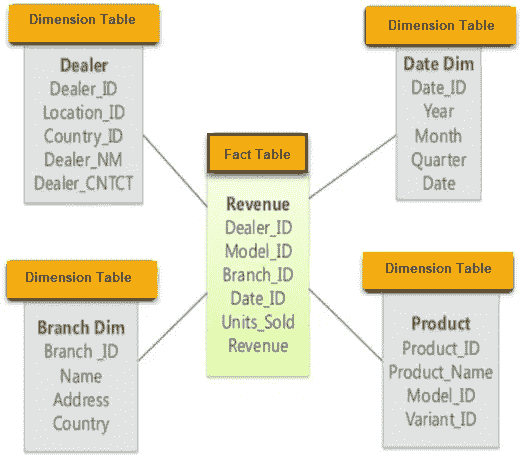

# SQL 视图:它们是什么以及如何创建它们

> 原文：<https://medium.datadriveninvestor.com/sql-views-what-they-are-and-how-to-make-62229b2f0fd7?source=collection_archive---------3----------------------->

“Views” - Drake album cover

# 动机

考虑下面概述的物理模式(如果你不熟悉星型模式，请查看[我的文章](https://medium.com/@marcosanchezayala/data-modeling-the-star-schema-c37e7652e206)！):

[https://www.guru99.com/star-snowflake-data-warehousing.html](https://www.guru99.com/star-snowflake-data-warehousing.html)

如果我想知道每种产品在本年度的总收入，那么每当我想检查它时，我就必须运行这个查询(或类似的东西)。

如果 SQL 能记住这个查询就好了，因为它对我来说很重要。这就是观点的来源！

# 什么是视图？

视图是一个非常有用的 SQL 工具，不幸的是，它与加拿大说唱歌手德雷克没有任何关系(尽管我很乐意在其他时间讨论他)。它们允许我们轻松地管理和查询来自基表的聚合信息。它们有两种类型:视图和物化视图，我将在本文中讨论这两种视图。

在更细粒度的级别上，视图是从数据库中的表的存储查询中动态计算的虚拟表。对于“虚拟”表，我们的意思是视图实际上并不成为物理模式的一部分。定义视图的查询实际上是在每次**视图被另一个查询引用时运行**。然而，物化视图是一个例外。****

# **为什么是视图而不是表？**

**您可能认为在数据库中创建一个包含所需聚合的新表是有意义的，但是您应该负责保持该表的同步。这可能涉及大量的代码和测试，甚至还会考虑到潜在的漏洞。**

**与表相比，视图具有以下优势:**

*   **视图会自动与用来创建它们的基础表同步。**
*   **它们可以代表底层数据的子集，因此可以用来限制底层信息向某些用户公开的程度。**
*   **它们占用很少的存储空间，因为数据库只存储视图的定义，而不是其中所有数据的副本。**
*   **它们非常容易制作。**

** [## 将定义 2020 年就业前景的五大数据科学和机器学习趋势|数据驱动…

### 数据科学和 ML 是 2019 年最受关注的趋势之一，毫无疑问，它们将继续发展…

www.datadriveninvestor.com](https://www.datadriveninvestor.com/2020/02/19/five-data-science-and-machine-learning-trends-that-will-define-job-prospects-in-2020/) 

# 如何创建视图

基本语法是:

我们基本上只是声明我们想要创建一个视图，给它一个名称，然后用一个典型的`SELECT`语句跟随它。

在本文开头的例子中，我们将创建这样的视图。

然后，我们可以使用一个简单的`SELECT` 语句来访问该视图中的数据。

每次编写引用视图的查询时，数据库管理系统(DBMS)都会将其作为子查询执行。在上面的例子中，视图定义中的`product_revenue`被替换为`SELECT`查询。

您还可以像使用任何`SELECT`语句一样，在上述查询中添加其他条件。

# 如何改变或删除视图

改变一个视图只需要`**ALTER VIEW** view_name (alter command)`。

删除一个视图就像`**DROP VIEW [IF EXISTS]** view_name`一样简单。我们可以添加`IF EXISTS`，因为试图删除一个不存在的视图会抛出一个错误。

# 关于视图的附加注释

可以从其他视图创建视图。这使得第二范式以上的数据库规范化简单得多。

视图中的行缺乏排序，就像其基表中的行一样。因此，`ORDER BY`子句在`CREATE VIEW`语句中是没有用的。事实上，SQL 标准甚至不允许在`CREATE VIEW`语句中使用`ORDER BY`子句，就像在`CREATE TABLE`语句中一样。

视图可以是只读的，也可以是可更新的。其思想是，只有可更新的视图才允许数据库系统将视图模式反向映射到底层表的模式，从而允许进行`INSERT`、`UPDATE`和`DELETE`操作。不同的 DBMSs(例如 Oracle、MySQL 和 PostgreSQL)有不同的视图实现。我强烈建议查阅适当的文档，以确保您所做的都是针对您的 DBMS 的。

我们还可以创建**物化视图**，这是预执行的非虚拟视图，通常用于数据仓库和商业智能应用程序。它们的工作方式与普通视图非常相似，但是它们的准确性取决于更新背后的触发机制的频率。同样，具体功能的实现取决于您的 DBMS，所以请查阅您的文档！** 

**在过去的几个月里，我与几位数据工程师交谈过，他们对视图和物化视图赞不绝口。它们显然一直都在被使用！我仍在寻找我的第一份数据工作，所以我自己还没有机会使用它们，但我想我至少应该尝试一下学习它们背后的理论。它们显然提供了普通桌子的许多优点，并且易于制作。我绝对计划在我的下一个项目中使用它们作为练习！**

# **来源**

*   **[PostgreSQL 文档](https://www.postgresql.org/docs/12/sql-createview.html)**
*   **[观点(SQL) -维基百科](https://en.wikipedia.org/wiki/View_(SQL))**
*   **[牛逼栈溢出答案](https://dba.stackexchange.com/questions/23280/why-not-use-a-table-instead-of-a-materialized-view)**