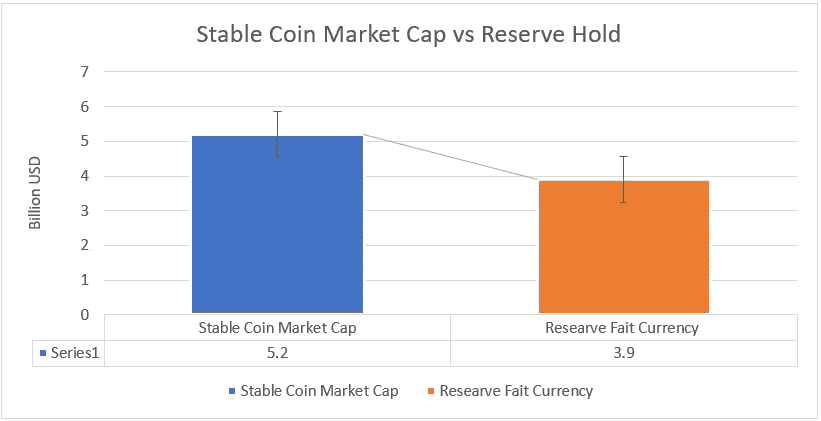

# 稳定的硬币——资本流动分析

> 原文：<https://medium.datadriveninvestor.com/stable-coins-a-capital-flow-analysis-b2241c491e16?source=collection_archive---------8----------------------->

Photo by [André François McKenzie](https://unsplash.com/@silverhousehd?utm_source=unsplash&utm_medium=referral&utm_content=creditCopyText) on [Unsplash](https://unsplash.com/s/photos/bitcoin?utm_source=unsplash&utm_medium=referral&utm_content=creditCopyText)

稳定硬币被引入加密货币世界，以减轻与加密货币交易中的频繁波动相关的风险。稳定的硬币通常被称为与稳定的法定货币挂钩，如美元、欧元或日元，从而为我们在比特币交易中看到的大幅波动提供必要的对冲。一些领先的稳定硬币供应商经常声称，他们的代币由他们作为支持银行或信托机构的一部分持有的储备提供良好支持。这些公司以自己的信托方式持有储备，或者与银行建立伙伴关系，如泰瑟有限公司(USDT)，Deltec 银行的主要稳定硬币供应商之一。比特币等其他加密货币不与法定货币或任何抵押品挂钩，通常会导致市场大幅波动。在这一分析中，我们集中在菲亚特抵押稳定硬币。

**比特币 1 年波动**

Source — cryptoslate.com

从图表中我们可以看到，比特币等加密货币在短时间内出现了大范围波动。在 4 个月的时间里，比特硬币在接近 4000 美元到 8000 美元之间波动，这清楚地表明了与稳定硬币相比，这些硬币的不稳定性。

**系绳 USDT 1 年波动**

Source — cryptoslate.com

从图中，我们可以推断，稳定的硬币，如 USDT，相对于固定货币波动，从而在很大程度上防止了加密交易的不确定性。

由于这些稳定的硬币大部分又与法定货币挂钩，所以维持它们的公司必须用实际的货币储备来支持这些硬币。这将在现金流方面对自由市场经济产生广泛影响。

**Market Cap of Top 10 Stable Coins**

由于市场上所有主要稳定硬币的总市值为 52 亿美元，因此支持这一马克上限的后备储备需求很高，没有这一储备，稳定硬币的概念将会崩溃。随着稳定的硬币市场上限每年增加约 5 %至 10 %，固定货币的数量也将增加。这将导致现金从自由市场经济流向秘密经济，从而使银行保持货币流动性。许多银行与稳定硬币公司合作，成为稳定硬币的一部分。

 [## 加密货币行业是死是活？数据驱动的投资者

### 九月初，我们在 X-Order 内部就代币市场的未来进行了一场辩论。有趣的是，我们的观点是…

www.datadriveninvestor.com](https://www.datadriveninvestor.com/2019/12/12/will-the-cryptocurrency-industry-be-dead-or-alive/) 

经济中的许多玩家，并不持有 1:1 的储备比率来稳定硬币。与 Tether 的情况一样，根据估计，该公司持有 0.7 至 0.8 美元的稳定硬币(USDT)。其他稳定的硬币公司也可以观察到类似的趋势。

Stable Coin Market Cap vs Reserve Hold

由于缺乏对稳定硬币价值链的审计，很难确定公司持有的实际准备金率。

根据各种分析师在该领域发布的稳定硬币报告的状态，如 square space、prime chain tech 等。准备金率并不总是固定在 1:1 的比率，而且该比率往往会随着运营期的推移而降低，这主要是由于这些公司的运营支出和资本支出以及违约意识的降低。

回报率是市场上代币数量、运营年数、用户基数和代币价格的函数

**RR = f(N，y，x，p)**

在哪里，

N -> I(令牌数)，y-运营年数，x-令牌价格，p-订户

因此，我们可以推断，稳定硬币市场的新进入者将更有可能保持 1:1 的比率，随着代币数量开始增加，导致市场份额增加，保持更高储备比率的预期下降。这可能不是一个理想的做法，但由于缺乏中央银行的直接控制，在市场经济的情况下，准备金率不能强制稳定的硬币玩家。

从表中，我们可以推断出每个代币的价格等于保持的回报率，并且在每个代币 0.75 美元到 0.65 美元的范围内。因此，稳定硬币的实际价格比加密市场的价格低 30 %左右。

随着越来越多的知名企业进入这个市场，如摩根大通、IBM 等。，将对稳定的硬币价格产生直接影响，并在未来带来更大的稳定性和标准化。预计，由于稳定的硬币为我们提供了各种好处，如方便的跨境交易、对冲当地货币疲软等，全球各国将计划在该市场引入标准和控制，为更好的硬币与法伊特货币/抵押品挂钩铺平道路。

**参考:**

【https://coinmarketcap.com/all/views/all/ 

[https://cryptoslate.com/cryptos/stablecoin/](https://cryptoslate.com/cryptos/stablecoin/)

[https://coinmarketcap.com/](https://coinmarketcap.com/)

[https://www.bis.org/cpmi/publ/d187.pdf](https://www.bis.org/cpmi/publ/d187.pdf)

[https://blog . good audience . com/game-of-stable coins-谁应该拥有最多的储备-69a51bad3e47](https://blog.goodaudience.com/game-of-stablecoins-who-shall-have-the-most-reserves-69a51bad3e47)

[https://www . primechaintech . com/library/stable coin/2019% 20 state % 20 of % 20 stable coins . pdf](https://www.primechaintech.com/library/stablecoin/2019%20State%20of%20Stablecoins.pdf)

[https://www . coin desk . com/stable coin-crisis-could-wreck-global-finance-fed-warns-in-new-report](https://www.coindesk.com/stablecoin-crisis-could-wreck-global-finance-fed-warns-in-new-report)

 [## 摩根大通创造用于支付的数字货币

### 摩根大通

创造用于支付的数字货币|摩根大通 Morganwww.jpmorgan.com](https://www.jpmorgan.com/global/news/digital-coin-payments)