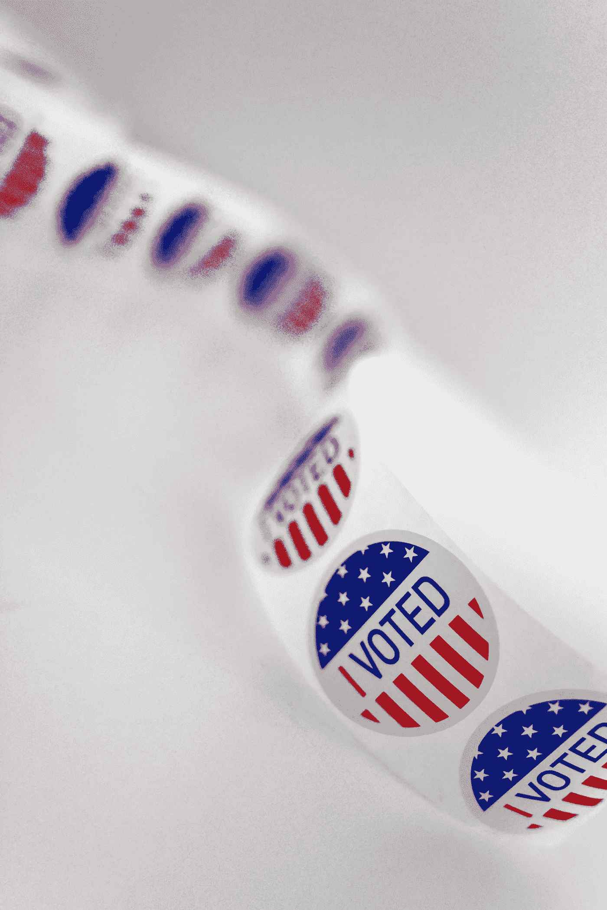

# 斯泰西·艾布拉姆斯:不要生气，要报复

> 原文：<https://medium.datadriveninvestor.com/stacey-abrams-dont-get-mad-get-even-96e2459b9e21?source=collection_archive---------3----------------------->

## 艾布拉姆斯帮助佐治亚州登记了 80 万新选民

Photo by Element5 on Unsplash

斯泰西·艾布拉姆斯在 2018 年挑战佐治亚州国务卿布莱恩·坎普竞选州长时，并不只是出现在舞台上。Stacey 获得了 190 万张选票，超过了佐治亚州历史上任何一位民主党人，但 Kemp 获得了 55，000 多张选票，成为了佐治亚州的州长。

肯普很难光明正大地获胜。作为国务卿，他在选举期间继续担任这一职务，他解释这些规则。他确保自己在竞选中拥有一切优势，尤其是压制少数族裔的选票，这是佐治亚州的长期传统。在 2012 年至 2016 年期间，Kemp [从佐治亚州的选民名册](https://www.brennancenter.org/our-work/analysis-opinion/whats-matter-georgia)中删除了 150 万人，原因是他们在上次选举中没有投票，或者他们的签名没有“完全匹配”，或者存在标点符号问题。这些政策极大地影响了少数民族。对肯普推行的政策的任何挑战都是由。。。坎普。

斯泰西·艾布拉姆斯在佐治亚州众议院开始了她的职业生涯，在那里她成为了民主党领袖，同时也是一名登记选民，尤其是少数族裔选民的活动家。她最初受到的阻力来自潜在选民本身。他们很清楚佐治亚州压制选民的历史，因为根据第十五修正案，黑人有权投票。斯泰西把重点放在了医疗保健上，这是一个对她的观众来说非常重要的问题。她解释说，医疗保险没有在佐治亚州扩大的原因是州长拒绝扩大。如果他们想要更好的医疗保健，他们需要一个新的州长。

在竞选过程中，Stacey 证明了自己是一个出色的候选人，深谙各种问题，并不断揭露 Kemp 的利益冲突和对选票的持续压制。她差一点就成功了，但最终，坎普阻止了至少几十万选民投票，这足以让他取得统计上的胜利。艾布拉姆斯从不让步；她只承认自己没有成功的可能。

*“看到一个声称代表本州人民的民选官员，公然把他的当选希望寄托在压制人民的民主选举权上，实在令人震惊。因此，要明确的是，这不是一个让步的演讲。让步意味着承认一个行为是正确的、真实的或恰当的。作为一个有良知和信仰的女人，我不能让步。但我估计法律目前不允许进一步可行的补救措施。”*

也许人们期望斯泰西·艾布拉姆斯在选举后溜走，而格鲁吉亚继续做它一贯做的事情。相反，Stacey 不只是生气；她报复了。即使在坎普获胜后，佐治亚州继续实施新政策来压制选票，但斯泰西继续登记选民，为下次选举做准备。

她在聚光灯下的角色使她在民主党内有很高的知名度。Stacey 被认为是可能的总统候选人，后来被提名为副总统候选人。她最终拒绝竞选前者，也没有入选后者。她守口如瓶，但继续努力通过她担任首席执行官的组织 [Fair Fight](https://fairfight.com/about-fair-fight/) 招募更多的佐治亚州选民，努力在 2020 年大选前招募 80 万新选民。

通过全州范围内的新政策，比如艾布拉姆斯支持的驾照更新时自动提供选民登记，以及她继续推动选民登记，她的 80 万目标得以实现。令共和党和民主党都难以置信的是，乔·拜登在佐治亚州的总统竞选中领先。然而，取代坎普的新国务卿已经表示将会有一场决选。这可能是史黛西帮助选举了下一任美国总统，并为格鲁吉亚人将两个参议院席位拱手让给民主党创造了条件。Stacey 本人已经在谈论内阁职位或作为 2022 年州长的候选人。在这一点上，她可以做任何她想做的事情。继续看！

 [## 谁不应该为拜登的胜利邀功

### 那些知道特朗普是谁并投票给他的人

medium.com](https://medium.com/datadriveninvestor/who-shouldnt-take-credit-for-a-biden-victory-d919ea2cbbd4)  [## 选举日和就职日之间的 78 天

### 唐纳德·特朗普会怎么做？

medium.com](https://medium.com/datadriveninvestor/the-78-days-between-election-day-and-inauguration-day-1580afadfe2)