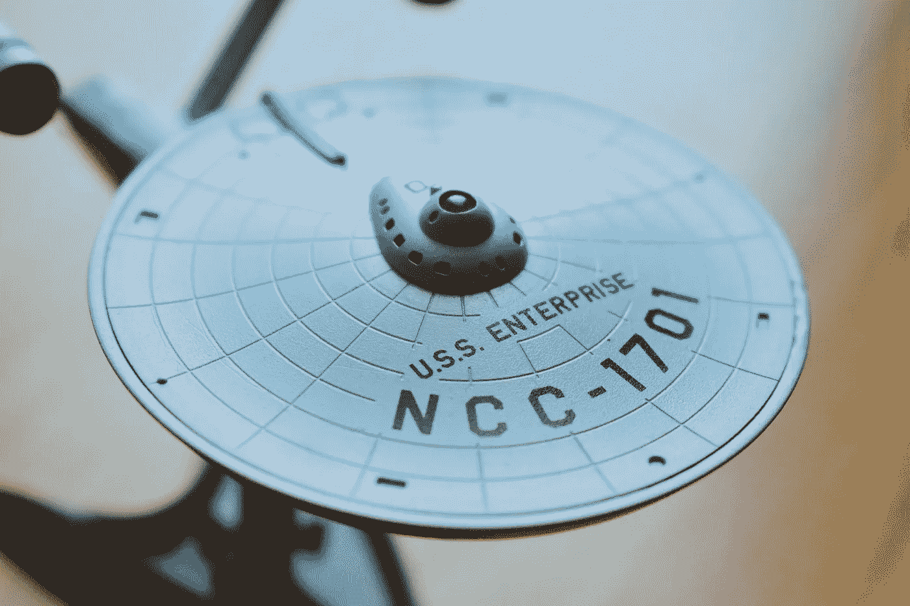

# 星际迷航:所有的后代

> 原文：<https://medium.datadriveninvestor.com/star-trek-all-the-future-generations-876032d08be8?source=collection_archive---------31----------------------->

## 《星际迷航》宇宙承诺的，以及我们真正拥有的

Photo by Stefan Cosma on Unsplash

## 全世界的徒步旅行者联合起来！

如果你和我一样，在你成为《T2》星球大战或超级英雄粉丝之前，你是《星际迷航》的粉丝。*《星际迷航》*展现了一个非常不同的世界，一个对从我们起源的摇篮中解放出来的人类的心理评估更加微妙、多样和奇妙的世界。

当你想到“联邦”时，很容易意识到人类目前还有很长的路要走，才能达到社会里程碑，如平等、亲情、接受科学和技术，最重要的是，在所有这些领域的创新。然而，正在取得进展。

虽然我们在 2021 年将自己带入一个不确定的未来，但审视一下我们现在已经到达的许多问题和冲突领域，以及一些正在发展的社会和技术创新，以帮助我们度过难关，可能是有益的。

这里是其中的几个领域，由一个只在重播中长大的中年“星际迷航”以及*星际迷航下一代*和之后的每一个系列进行了审查。

## 金钱

我们必须从联邦本身开始。星际舰队军事化训练学员。然而,*企业*，是一个探索性的任务，但是很明显，许多星际世界和实体正在寻求利润，资源，甚至掠夺。很容易把克林贡人和罗慕伦人想象成追逐财富和权力的贪婪资本家。

有趣的是，虽然柯克和船员正在寻找“奇怪的新世界”，但并没有大力强调寻找矿产和资源。它更多地被描绘成一项人类学使命，来看看谁“在那里”。

联邦——更准确地说是行星联合联邦——发行联邦信用。这种货币单位取代了货币、硬币或任何其他古代商业和交换手段的概念。它出现在 22 世纪后半叶(离现在不到 80 年)，在最初的系列中经常被引用。

例如，通信官员乌呼鲁用 10 个信用点购买了一个 Tribble。在其他剧集中，星际漫游企业家哈里·穆德被悬赏 10 万联邦信用点。

今天，资本主义、贫富差距和日益严重的不平等危机让许多人重新审视关于金钱的革命性观点。其中包括普遍基本收入、为受压迫人民提供服务和商品补偿、重建和修复故土，以及在更清洁、更环保的基础设施、农业、交通和能源领域的大量投资。

对于“统治阶级”的概念和需要改革的精英主义有一种非常戏剧性的推拉作用。最基本的是，当我们看到黑人的命也是命和灭绝叛乱这样的运动时，我们就看到了这一点。当然，现在每天都有更多这样的斗争和组织涌现出来。

毫不夸张地说，我们要求对全球货币体系进行彻底改革，而且这种改革可能已经到了时候。这将我们直接引入联邦模型提供的另一个问题。

 [## 移动网络 O2 发布英国首个无人驾驶汽车实验室测试使用 5G 和…

### 随着时间的推移，技术越来越强大。我们不仅成功地登上了月球，我们现在…

www.datadriveninvestor.com](https://www.datadriveninvestor.com/2020/11/24/mobile-network-o2-launch-uks-first-driverless-car-lab-testing-driverless-cars-using-5g-and-satellite-technology/) 

## 平等

想想吉恩·罗登伯里构思的第一部电视剧，很明显，即使在 20 世纪 60 年代，人们仍然坚持白人男性是主要角色的观点。

柯克绝对是个大男人，紧随其后的是斯波克、骨头和斯科特。

女人在很大程度上被视为养眼的东西、战利品和/或蛇蝎美人。

众所周知，在原版系列中，所有女性都衣着暴露、美丽动人，不像勇敢和有男子气概的男性那样打动人心。

这些角色通常由男性扮演，因为科幻小说的经典时代并不青睐女性。当然，随着剧集移到 1980 年代，这种情况发生了变化，但即使在这里，尽管女性仍然是偶尔的医生或官员；不可否认，她总是美丽、年轻、健康，而且出奇地“完美”

拥有和男性一样多的女性角色，直到几十年后才被描绘出来。此外，我们还可以看到种族态度是如何被重新解释和描绘的。

罗登伯里在允许多样性的想法上是革命性的。必须指出的是，尽管我们在事后看到了许多明显的不平等，但在 20 世纪 60 年代，让男性、女性、黑人、亚洲血统的人，甚至冷战后的俄罗斯人加入剧组是非常新的，这一点也得到广泛的认可。

也就是说，柯克因在银河系中穿梭而臭名昭著，他不断地追求和伤害绿皮肤、黑皮肤、棕色皮肤，尤其是白种女人的心。斯波克是每个极客女孩的第一个迷恋对象，因为他很聪明，小心翼翼地对待情感，关注“鲁莽”的行为。Bones 只是个坏脾气的乡村医生。斯科特是一名工程师的工程师，嫁给了他心爱的星舰。

事实上，在最初的系列中，只有乌呼鲁的能力和船上的计算机(由 Majel Barrett-Roddenberry 扮演)(他还出演了护士 Christine Chapel)似乎与男性不相上下。

这在很大程度上反映了 20 世纪 60 年代，而不是未来的几个世纪。白人统治着这个世界，尽管罗登贝里意识到了这一点，但他无法完全改变它。

我对当前十年的心理感受是，社会不平等正迅速被撕裂。如果在你周围，在地球的每个角落，在全球化的进程中，都有冲突发生，你可以确信变革即将来临。

当然，我们不能确定的是结果。

传统、角色，尤其是等级制度正受到前所未有的质疑。

对我们许多人来说，唯一真正的问题是，我们会得到一个更平等、更普遍的合作，比如联邦，还是会在未来几个世纪里保持两步走、一步退的模式？

目前，地球的统一和多样性仍在许多人的星际旅行宇宙梦想中前方。

## 技术和创新

今天早上，我读到了 SkyDrive 制造的电动飞行器。到 2023 年，它计划投入市场。对于我们这些几年前就迫不及待想拥有飞行汽车的人来说，这很酷。

显然，考虑到我们对破坏性化石燃料的依赖，这种技术和创新正被渴求。这种车辆只是城市规划、人员流动、低排放替代方案以及我们驾驶它们所需的许多计算机的巨大交通革命的一小部分。

人工智能和机器人工人也在工作中，正如我们在金钱和平等部分所讨论的那样，这些创新将彻底改变我们对经济、工作场所和平等本身的看法。

毕竟，全世界的工人都有责任生产资本。资本主义正从各个角度被重新审视。

最后，我们有监控技术、社交媒体和基因工程，甚至连骨头——麦考伊博士——都没有很好地理解。

就我个人而言，我认为我们文化中最大的变革是我们的食物获取、农业生产、产出和分配。

如果说 2020 年教会了我们什么，那就是我们需要如何创新，以获得安全的食品供应，同时避免动物传染病蔓延的风险。它告诉我们，当经济不景气，物流解决方案不到位时，食物会被囤积，甚至被浪费掉。最后，也是最重要的，随着洪水、火灾和风暴肆虐全球，我们必须解决化石燃料如何影响所有生产、污染等问题。

这些问题在《星际迷航》中没有太多的讨论，这是一个真正的遗憾。

当企业号船员接入食物复制器时，食物很容易出现，而且一点也不乱。对我们来说不幸的是，物质-能量转换技术不太可能在短期内实现鸡块和牛油果吐司。

相反，我们必须解决影响这些目标的社会动荡——如贫困——其中包括砍伐森林和过度捕捞等粮食枯竭。

我们也在研究基因修补、垂直城市花园、食物沙漠以及作为公共健康问题的营养本身。

## 我们未来的成果

我们离光速旅行、把你的身体一个分子一个分子地重新组装起来的运输工具以及抵御银河海盗还有很长的路要走。

然而,《星际迷航》中提到的社会剧变是真实的，并且正在发生。当你看到越来越多的社会接受社会平等，要求结束种族主义，以及我们在 LGBTQ 权利等方面努力争取的进步时，这一点是最明显的。

就创新而言，你会注意到，尽管我们选择的路线很可怕(无视大多数气候危机的迹象，拒绝适应即将到来的灾难)，但事实上，我们正在从错误中学习。

我们从未预料到的是，现代世界的大部分将远离科学。登月的一代人对我们能建设一个多么美好的世界充满热情。尽管如此，世界上的极客们永远不会放弃，创新、合作的快乐和创造力不会消失。

我们能否及时获得平等、联合技术和完全重建的全球社会秩序是个大问题。

## 访问专家视图— [订阅 DDI 英特尔](https://datadriveninvestor.com/ddi-intel)