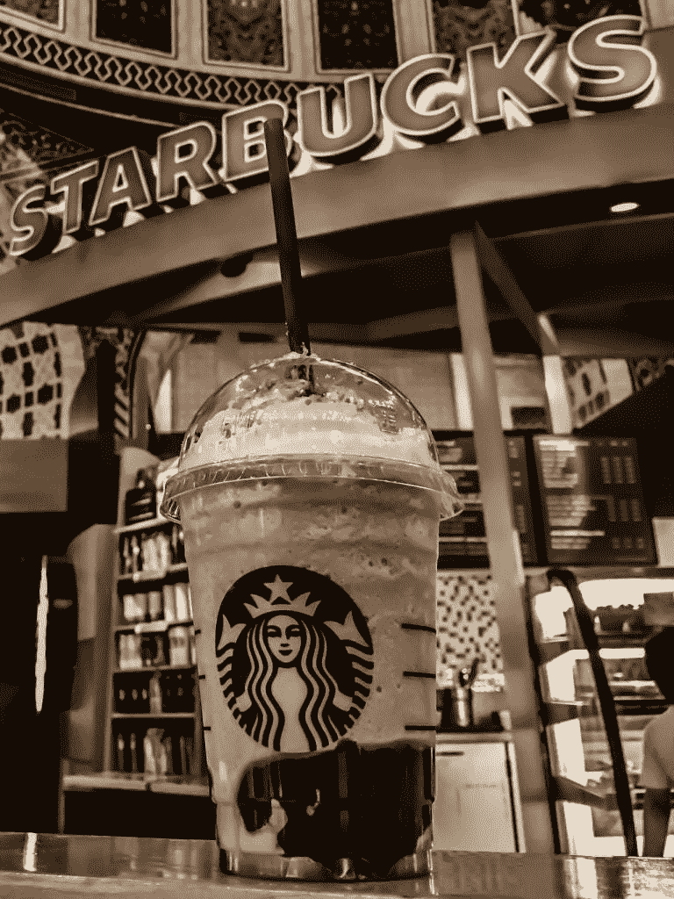

# 星巴克在疫情市场疯狂时期成长

> 原文：<https://medium.datadriveninvestor.com/starbucks-grows-during-a-pandemic-market-mad-house-2e845d3bac80?source=collection_archive---------29----------------------->

星巴克(SBUX) 在疫情期间经历了令人印象深刻的增长。例如，在截至 2020 年 9 月 30 日的季度，星巴克的季度收入增长了 19.81 亿美元。

具体来说，星巴克报告 2020 年 6 月 30 日的季度收入为 42.22 亿美元，2020 年 9 月 30 日的季度收入为 62.03 亿美元。然而，在 2020 年，星巴克的季度收入从 2020 年 12 月 31 日的 70.97 亿美元萎缩。

此外，星巴克的季度毛利从 2020 年 6 月 30 日的 27.38 亿美元增长到 2020 年 9 月 30 日的 42.26 亿美元。令人印象深刻的是，星巴克的季度营业收入从 2020 年 6 月 30 日的-7.039 亿美元增长到 2020 年 9 月 30 日的 5.584 亿美元。

相反，星巴克的营业收入从 2020 年 12 月 31 日的 12.20 亿美元缩水。因此，星巴克的收入增长是巨大的。

# 星巴克(SBUX)在增长吗？

相反，星巴克的收入增长率已经连续三个季度萎缩。

例如，Stockrow 估计，在截至 2020 年 3 月 31 日的季度中，星巴克的[收入增长率为-4.92%](https://stockrow.com/SBUX/financials/income/quarterly) 。该收入增长率在截至 2020 年 6 月 30 日的季度中降至-38.12%，并在 2020 年 9 月 30 日增长至-8.05%。

因此，我认为星巴克的增长正在收复在 2020 年伟大的柯维德·疫情期间失去的失地。这使得星巴克成为一只好股票，因为它反弹得很快。

此外，我认为收入增长表明对星巴克产品的需求仍然很高；咖啡、三明治、拿铁、冰茶等。因此，星巴克可能是 COVID proof 股票，这是一个有趣的发展。

# 星巴克是一家现金充裕的公司吗？

**星巴克(SBUX)** 可能是一家现金充裕的公司，因为它在 2020 年 9 月 30 日报告了 14.91 亿美元的季度运营现金流。

季度运营现金流从 2020 年 6 月 30 日的-3.68 亿美元上升至 2020 年 3 月 31 日的-13.61 亿美元。有趣的是，星巴克在 2019 年 12 月 31 日以 18.36 亿美元的季度运营现金开始了 2020 年。

星巴克报告称，截至 2020 年 9 月 30 日，季度末现金流为 3.85 亿美元。季度末现金流从 2020 年 6 月的 13.94 亿美元下降到 2020 年 3 月 31 日的-13.61 亿美元。截至 2019 年 12 月 31 日，星巴克从 2020 年开始，季度运营现金流为 18.36 亿美元。

# 星巴克有大量的现金

2020 年 9 月 30 日，**星巴克公司(纳斯达克股票代码:SBUX)** 拥有 46.32 亿美元的现金和短期投资。2020 年，星巴克的现金和短期投资从 2019 年 12 月 31 日的 59.0 亿美元上升。

2020 年 9 月 30 日，星巴克公司(纳斯达克股票代码:SBUX) 拥有 46.32 亿美元的现金和短期投资。2020 年，星巴克的现金和短期投资从 2019 年 12 月 31 日的 59.0 亿美元上升。

值得注意的是，星巴克可以偿还巨额债务，该公司报告称，2020 年 9 月 30 日的季度融资现金流为-7.797 亿美元，2019 年 12 月 31 日为-11.23 亿美元。

因此，星巴克可以产生大量的现金和发行大量的债务。因此，我认为星巴克是一家现金充裕的公司。

 [## 疫情期间临床试验的一线希望|数据驱动的投资者

### 没有书本而学医的人航行在未知的大海上，但是没有病人而学医的人却不去…

www.datadriveninvestor.com](https://www.datadriveninvestor.com/2020/12/14/the-silver-lining-for-clinical-trials-during-the-pandemic/) 

# 星巴克有什么价值？

**星巴克(SBUX)** 凭借其巨大的足迹和世界上成功的知名品牌之一，提供了巨大的价值。

例如，Statista 估计**星巴克(SBUX)** [在 2019 年](https://marketmadhouse.com/starbucks-grows-during-a-pandemic/#:~:text=World-famous%20coffeehouse%20chain,%20Starbucks,to%2015,041%20and%2016,202,%20respectively.)全球拥有 31256 家门店。此外，Statista 估计星巴克 2019 年在美国有 15，041 家门店。

而且，星巴克是很多人一想到咖啡就会想起的第一个词。星巴克是一个有价值的品牌，因为它的管理层主导了一部分人的意见。

星巴克保持其声誉的一个方法是使用授权而不是特许经营。例如，《企业家》报道[星巴克不出售特许经营权](https://www.entrepreneur.com/article/311377)，而是出售允许公司使用其品牌的许可证。

星巴克保持其声誉的一个方法是使用授权而不是特许经营。例如，《企业家》报道[星巴克不出售特许经营权](https://www.entrepreneur.com/article/311377)，而是出售允许公司使用其品牌的许可证。

此外，特许经营使星巴克能够利用其他公司的资源。当星巴克在**克罗格(KR)** 超市和**塔吉特(TGT)** 购物广场授权开店时，星巴克从克罗格和塔吉特的广告和店铺中赚钱。星巴克的管理层已经学会了如何从其他零售商的顾客身上赚钱。

# 星巴克是一项价值投资

我认为**星巴克(SBUX)** 是一项价值投资，因为市场先生在 2020 年 12 月 22 日将其公平定价为 102.32 美元。

此外，星巴克的股票价值在 2020 年有所增长。市场先生在 2020 年 1 月 2 日为星巴克支付了 89.35 美元，在 2020 年 12 月 18 日支付了 103.28 美元，在 2020 年 12 月 22 日支付了 102.32 美元。因此，星巴克是一家收入和股价都在增长的公司。

此外，星巴克是一个伟大的股息股票。星巴克股票在 2020 年 11 月 10 日支付了 45 英镑的季度股息。季度股息从 2020 年 8 月 6 日的 41 英镑。因此，星巴克支付的红利越来越多。

如果你正在寻找快餐业的好股票，星巴克公司(SBUX)值得考虑。这个强大的品牌赚钱，支付丰厚的股息，保持其价值，并在疫情产生大量的现金。

*原载于 2020 年 12 月 22 日*[*【https://marketmadhouse.com】*](https://marketmadhouse.com/starbucks-grows-during-a-pandemic/)*。*

## 访问专家视图— [订阅 DDI 英特尔](https://datadriveninvestor.com/ddi-intel)