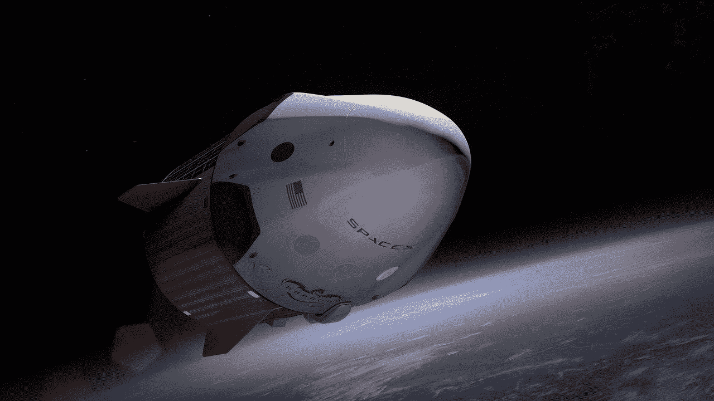
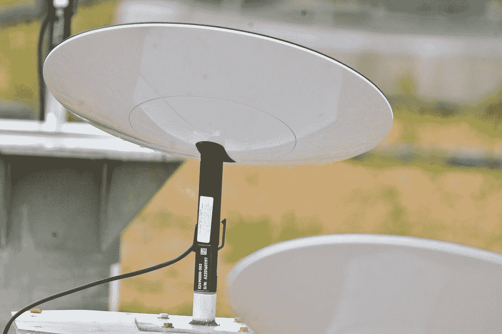

# Starlink —连接互联网的新方式

> 原文：<https://medium.datadriveninvestor.com/starlink-new-way-to-connect-to-the-internet-fe4a2adbe5f?source=collection_archive---------22----------------------->

Starlink 是 SpaceX 公司在低地球轨道上的卫星星座，目的是为全世界提供互联网服务。据 SpaceX 称，Starlink 将提供超低延迟和大于 100 Mbps 的下载速度。

SpaceX 雄心勃勃的计划是发射近 12，000 颗卫星，以提供宽带服务。SpaceX 于 2019 年 5 月发射了该星座的首批 60 颗卫星，此后发射了多颗卫星。到目前为止，SpaceX 已经在轨道上发射了 700 多颗卫星。

今年夏天，SpaceX 开始了 beta 测试，注册用户和员工使用 Starlink internet 来测试下载速度和连接延迟。他们正在进行标准的速度测试，并评估将数据从卫星传送到客户，然后返回到互联网的其余部分所需的总时间。SpaceX 对最初的结果相当满意。

 [## Starlink 投资失败的 4 个原因|数据驱动型投资者

### 乔治·桑塔亚纳 2015 年埃隆·马斯克提出全球互联网卫星通信的下一次革命。这个…

www.datadriveninvestor.com](https://www.datadriveninvestor.com/2019/11/26/4-reasons-why-starlink-is-a-terrible-investment/) 

如何使用 Starlink 互联网服务？

我们不能直接将我们的设备连接到卫星信号，Starlink 将通过地面终端提供接入。终端看起来会像一根棍子上的又细又平的圆形不明飞行物。它配备了一个电机，可以自动调整光学角度来观察天空，它很容易安装在屋顶或墙上。

**每月要花多少钱？**

每月费用还不知道。SpaceX 总裁 Gwynne Shotwell 说，许多消费者为蹩脚的服务支付 80 美元，这就是为什么我们会成功。

2015 年，马斯克提出了为终端提供免费服务的想法，这种服务只需支付大约 100 至 300 美元。

【Starlink 互联网什么时候可以使用？

Starlink 开始了私人测试，并将很快开始公开测试。该公司澄清说，测试将首先提供给加拿大和美国北部地区的居民。2021 年，该计划将扩展到世界其他地区。

**Starlink vs 5g**

5g 使用许多小型手机信号塔直接连接到您的手机。5g 很可能会达到比 4g 快 20 倍的网速。4g 给我们 10 Mbps 的下载速度，5g 给我们 200 Mbps 的速度。而 Starlink 宣称的下载速度为 100 Mbps，是 4g 速度的 10 倍。因此，就速度而言，5g 显然是赢家，速度是 Starlink 的 2 倍。

5g 在人口密集和城市地区很好，但在农村地区不好，那里较少的塔覆盖更大的区域。从经济上来说，建立一个完整的 5g 塔网络是不合理的。对于农村地区，Starlink 比 5g 更有优势，因为它是一个太空互联网，我们可以通过使用屋顶上的天线轻松访问它。

**进入专家视角—** [**订阅 DDI 英特尔**](https://datadriveninvestor.com/ddi-intel)