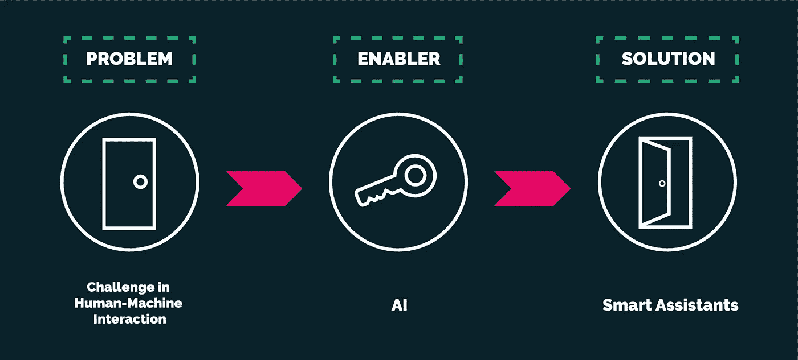

# 从问题开始，而不是从 AI 开始

> 原文：<https://medium.datadriveninvestor.com/start-with-the-problem-not-with-ai-e68395a988d7?source=collection_archive---------16----------------------->

*作者:* [*米兰塔·贾亚蒂拉卡*](https://medium.com/u/9be8b9ff653d?source=post_page-----c206158e53fa----------------------) *和* [*贾纳克博士*](https://medium.com/u/e18d5e5578f3?source=post_page-----c206158e53fa----------------------)

Photo by [Pixabay](https://www.pexels.com/@pixabay?utm_content=attributionCopyText&utm_medium=referral&utm_source=pexels) from [Pexels](https://www.pexels.com/photo/black-and-white-blank-challenge-connect-262488/?utm_content=attributionCopyText&utm_medium=referral&utm_source=pexels)

在这篇文章中，我们考虑了人工智能项目中用户研究的重要性，并在 [Mindwave](https://www.mindwaveventures.com/) 中描述了我们的方法。

**艾是新电**

这是经常从技术先驱那里听到的一句话。它意味着从医疗保健到制造业，从物流到零售的行业转型。但是，我们可以从过去几年的电力经验中吸取一个明确的教训——电力是一个使能因素。并非所有用电的产品或解决方案都改变了我们今天的生活方式。但有些人真的做到了。

从目前出现的成功案例来看，人工智能的影响相当明显。以智能助手为例，亚马逊 Echo、Google Home 等设备。几年前，手动编写一个软件系统来有效地解释人类对话的各种变化似乎是一个遥不可及的目标。但最近自然语言处理(NLP)中的人工智能技术已经使软件具备了这种能力，并且这些应用很快就进入了我们的生活。如今，智能助理已经改变了我们在网上搜索、听音乐甚至购物的方式。

 [## 人工智能和监督资本主义|数据驱动的投资者

### 大科技，总是现在:人工智能推动的大科技，已经使购物，搜索，在你的…

www.datadriveninvestor.com](https://www.datadriveninvestor.com/2020/03/04/on-artificial-intelligence-and-surveillance-capitalism/) 

但重要的是要了解是什么推动了这项新技术的采用。是技术本身固有的可承受性还是其他因素？我们认为，智能助手大受欢迎的主要原因在于它们如何改变了我们与机器沟通的基本方式。口头对话是我们相互交流的最自然的方法，因此它也成为人机界面的最佳方法。因此，我们做出了明确的区分——产品的成功是因为解决了人机交互中的一个主要挑战，而人工智能只是促成因素。

**问题识别——人工智能开发工作流程的第一步**

问题识别应该成为任何人工智能开发工作流程的第一步。我们想强调两种不同的途径，在这两种途径中，给定的最终产品可能会出现问题。

**一、用户与产品之间的问题**

产品的采用通常是由用户体验和围绕它的许多方面驱动的。因此，这是一个需要适当的用户研究和反馈生成的领域。

举一个例子，这个想法是开发一个虚拟的精神病医生来治疗有精神和情感挑战的病人。这里的目标是根据患者关于他/她的精神和人口统计状况的输入提供最合适的建议。看一个精神病医生和病人互动的场景，诊断和治疗的有效性很大程度上取决于病人在描述他/她的感受时的表达能力。这里的一个挑战是，如何通过软件界面促进这种微妙的互动？—这应该成为该产品开发工作流程的首要关注点。

**二。现有产品的低效和改进问题**

通常，自动化解决效率低下和创新挑战的机会可能会出现在现有产品中。

考虑一个电影推荐系统的用例。一种实现方式是执行传统的执行，根据用户过去的选择产生一组新的推荐。在这种情况下，指令由系统的设计者硬编码。但是更先进和有效的策略将是理解整个系统的用户在过去如何对推荐做出反应，从历史数据中学习并且自动改进关于用户群的推荐。这是将我们引向下一点的挑战识别。

**评估人工智能是否是解决方案的促成因素**

在确定了问题和潜在的解决方案之后，评估开发解决方案的可能方法并确定人工智能是否会充当推动者是至关重要的。

与上述虚拟精神病医生用例连接——提高虚拟精神病医生系统中用户表达能力的一种方法可能是允许用户向系统中输入自由文本，解释他/她的问题。现在，为了处理和检索对诊断重要的文本元素，自然语言处理技术成为一项要求。在这里，我们选择人工智能作为使能器。

让我们考虑关于身体健康状况的虚拟预诊断的另一个用例。在这种情况下，必须通过来自患者的离散输入来确定具体情况，例如年龄、症状、严重程度等。这里，产生结果的更传统的编程方法会更合适。就过程的准确性和透明度而言，在这种情况下，明确编程以做出决策的软件优于现有的人工智能方法。

**最后的想法**

Jeff Catlin 在他的 [Forbes 文章](https://www.forbes.com/sites/forbestechcouncil/2018/05/21/using-ai-to-solve-a-business-problem/#30e44758597e)中提出了一个坚定的观点，即在考虑人工智能项目的技术方面之前，先确定需求和期望的结果。他认为，为人工智能建立一个商业案例与为任何其他商业问题建立一个商业案例没有太大区别。对可行性和投资回报的准确研究将推动人工智能的采用，并充分利用该技术。 [Robert Pearl](https://www.forbes.com/sites/robertpearl/) 继续提到[人工智能如何能够实现其在医疗保健行业的大肆宣传](https://www.forbes.com/sites/robertpearl/2020/02/24/ai-hype/#1c861dba458e)，在那里他强调了科技公司如何经常专注于技术，而经常忽视人工智能可能导致的人类恐惧和沮丧。解决伦理和安全等需求可以为人工智能在[备受期待的医疗保健领域](https://www.ncbi.nlm.nih.gov/pmc/articles/PMC6616181/)带来新的机会和增长领域

在 Mindwave，我们遵循上述方法来开发医疗保健领域的人工智能，通过深入的用户研究和反馈来仔细识别问题。我们评估使用人工智能解决已识别问题的可行性，并关注强有力的评估策略来衡量它们的影响。

我们认为，为了技术而使用人工智能，而没有正确理解它如何解决实际问题并影响我们的生活，可能会导致时间和金钱的投资失败。它会损害对技术的信任，并消除可能对所有人都有利的潜在长期结果。

如果您有任何反馈或想就以上任何一点进行交流，请通过[janak@mindwaveventures.com](mailto:janak@mindwaveventures.com)发送电子邮件给 Janak