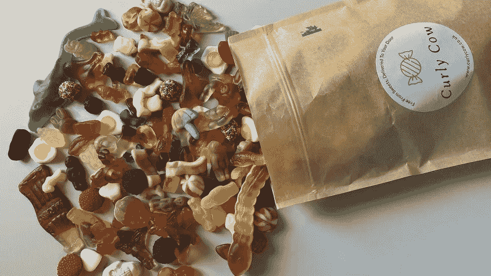
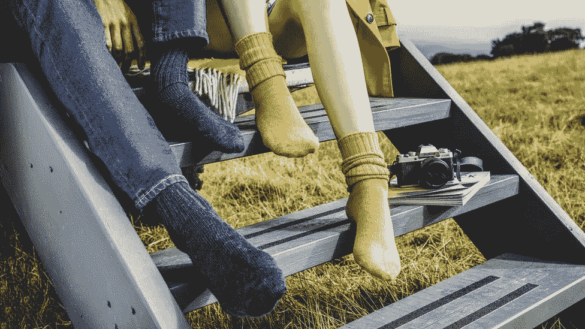
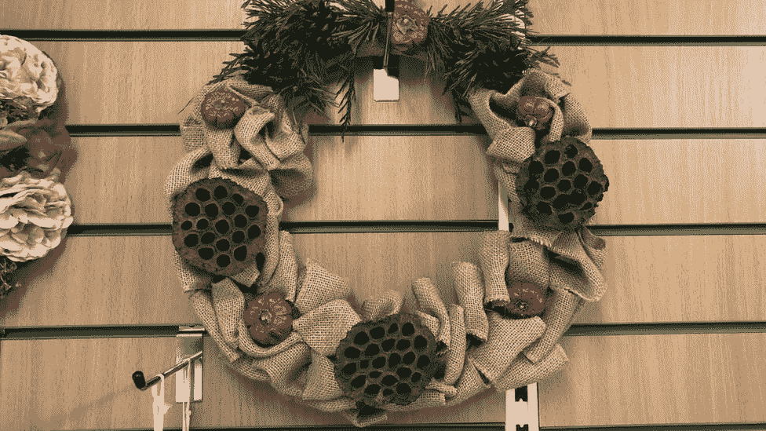

# Covid 期间创业？他们已经做到了

> 原文：<https://medium.datadriveninvestor.com/starting-a-business-during-covid-they-have-done-it-b63f4cfc1dac?source=collection_archive---------13----------------------->

## 现在可能是迈出这一步的最佳时机。

Photo by [Mika Baumeister](https://unsplash.com/@mbaumi?utm_source=medium&utm_medium=referral) on [Unsplash](https://unsplash.com?utm_source=medium&utm_medium=referral)

有没有想过开创自己的事业？有这么多的人呆在家里，比以往更多的屏幕时间和电子商务的爆炸式增长，现在可能是创业的最佳时机。

人们正在想方设法将当前的形势转化为新的机遇。尽管疫情带来了挑战，但我们仍在反弹，继续前进。

他们设法兼顾家务和照顾孩子，同时建立成功的企业。非常令人印象深刻，如果你问我！

这里有一些例子，你可以从中得到一些启发。

# #1:在线销售无麸质糖果

A [Curly Cow gluten-free pouch](https://www.bbc.co.uk/news/business-54527193) — *“The UK’s first and original completely gluten-free sweet company.”*

莎拉·弗内斯的灵感来自她患有乳糜泻的女儿。作为许多企业家故事的典型，Sarah 感到沮丧的是，她无法找到根据自己的情况安全治疗女儿的解决方案。

就在那时，她决定自己动手，推出[卷毛牛](https://www.curlycow.co.uk/)，填补市场空白。

我们[谈到了](https://clementbourcart.medium.com/steal-this-template-to-choose-the-right-business-idea-8cf79602530d#39f0)真诚关心你正在销售的产品的必要性；激情是创业的关键因素。当你自己的女儿是第一个顾客，而你已经围绕她的需求设计了解决方案，那就谈什么关心了！

正如莎拉描述的那样:

> “我希望能够为每个人提供服务，确保没有人被遗漏。”

这种驱力给了她一个使命:创造“适合所有人”的糖果。

现在，生意越来越大，每周运送出 50 到 100 袋可堆肥的糖果。脱帽致敬！

莎拉也正在解决有意识消费的趋势，包装是可堆肥的，从而减少浪费。此外，无麸质产品支持健康的免疫过程和提高能量水平。不喜欢什么？

# #2:向世界运送奢华袜子

Premium, long-lasting socks from [Pairs Scotland](https://www.pairs-scotland.co.uk/)

随着《疫情》的热播，两个朋友变成了商业伙伴，安娜·威尔森和爱丽丝·麦克法兰成立了 Pairs Scotland。

这家公司销售耐用的羊驼毛和马海毛袜子，为“慢时尚”运动做出了贡献。优质产品(零售价 20 英镑一对)采用优质材料和多彩色调制成，兼具耐用性和时尚性。

安娜和爱丽丝建议像她们一样的妈妈们利用她们的技能，在这个不确定的时期建立自己的东西:

> “我非常鼓励母亲们创办企业。我认为对他们来说保留一些自己的东西真的很重要。有大量有技能的女性劳动力，她们为了孩子放弃了自己的事业，在禁闭期间后退了一步……这些技能不能丢失，这真的很重要。

这是一个鼓舞人心的信息，展示了通过良好的时间管理和适当的奉献可以实现的目标！

# #3:让房子成为家

A door wreath from [Scentsations Floristry](https://www.scentsationsfloristry.com/)

索菲·索思伍德(Sophie Southwood)在她的航空公司获得了无薪休假的选择——在她服务了 15 年的长途航班和家庭时间之后。

虽然她想在旅游业复苏时继续营业，但在疫情期间，她已经将一项爱好变成了真正的生意:花艺。

从前门花环和工作室开始，她现在在网上和当地商店出售一系列她的作品。她的使命是“让房子成为家”。整洁！

早在 2020 年 3 月/4 月封锁开始时，DIY 兴趣在[激增，这可能是一个利用的好机会。越来越多的人想把他们的房子变成一个家…当你花大部分时间，如果不是全部时间，这是有意义的！](https://trends.google.com/trends/explore?date=today%205-y&q=DIY)

我希望你已经被这些关于韧性、决心和充分利用这段时间的动力的故事所鼓舞。尽管随之而来的是不确定性和挑战，但总会有机会将坎坷变成伟大的冒险。

***想保持联系并收到更多有用的内容？加入我的双周刊快讯*** [***这里***](https://clementdbourcart.typeform.com/to/iqdgd8oU) ***。***