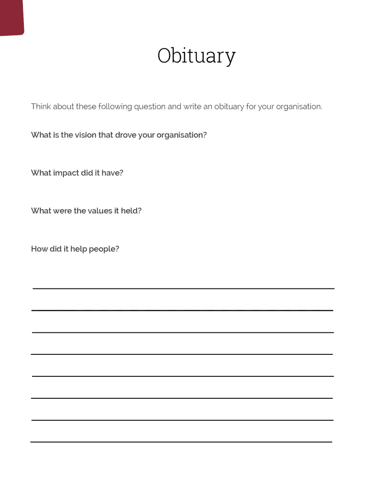

# 写一篇商业讣告可以理清你的视野

> 原文：<https://medium.datadriveninvestor.com/starting-at-the-end-a8f2dea9d45d?source=collection_archive---------25----------------------->

# 从心中的目标开始

Photo by CreativeNature on Envato Elements

## 讣告有助于向你展示生命中什么是重要的

当人们在做人生规划时，心理学家和教练经常要求人们做的一件事就是写讣告。

这听起来很病态，但事实并非如此。它的作用是清理浮木。讣告有助于向你展示生命中什么是重要的。它阐明了价值观和你想要达到的目标。

斯蒂芬·柯维写了一句著名的话“以目的为出发点”

这是几乎所有事情的好建议。你必须先在头脑中创造一些东西，然后才能把它变成现实。

这就是我们将要开始的地方——在最后。

Dr. Stephen Covey presents the 7 Habits of Highly Effective People | YouTube

# 如何撰写商业讣告

想象一下，你的企业已经不在了，但在它的时代，它实现了一些有意义的事情。那是什么？

**驱动你的组织的愿景是什么？**

**它产生了什么影响？**

它的价值是什么？

**它是如何帮助人们的？**

这是一个思考和反思你想要达到的目标的练习。不管你是刚开始跑步还是已经跑了很长时间，它都是有效的。

在我们深入思考这些问题之后，我们可以确定关键主题。从这一点来看，它是关于创建主题(价值)被传递的例子。

**涌现出来的价值观有哪些？**

花几分钟时间想想你希望你的组织留下什么遗产。这将有助于为今后的战略提供信息。

[下载此讣告模板](https://mvmm.com.au/wp-content/uploads/Obituary.pdf)

> **“人们高估了自己一年能做的事，却低估了自己十年能做的事。”*比尔·盖茨***

# 十年后你的组织

然后，我们将考虑十年、五年和一年后的组织。

反思讣告，可以看到其中浮现的价值观和主题。让我们想想这如何转化为实际的里程碑。

十年后，我的组织是:__________________________

五年是中间点。为了实现十年目标，组织应该处于什么位置？

在五年内，我的组织是:__________________________

现在，我们需要它在一年内达到什么程度？

在一年内，我的组织是:___________________________

# SMART 目标

有目标是一种动力，可以明确我们的关注点。

目标应该是可以实现的，但是有点牵强。我们需要保持专注和纪律，但它们应该触手可及。

当我们写下目标，并把我们的意识和潜意识集中在这些目标上时，我们就自然而然地朝着实现这些目标前进。

SMART 是具体、可衡量、可实现、相关和有时限的缩写。

换句话说，目标应该非常明确，与我们的愿景相关。它也需要有一个期限。

例如:

截至 2030 年 6 月 30 日，该组织已实现 2000 万美元的净利润。

这是一个具体的目标(2000 万美元)。它是可测量的，而且是有时间限制的(2021 年 6 月 30 日)。

由你来选择目标。理想情况下，他们将有一个财务组成部分，但也增加了一个社会或慈善目标。因为它与您的组织相关。

这是另一个例子。

截至 2015 年 6 月 30 日，该组织在总部为在职父母开设了一个早期儿童保育设施。

该组织每月向 X 地区的慈善机构捐赠每周 5 小时的 X 技能。

# 如果你是单干，设定目标

许多人痛苦是因为目标在他们的组织中根本无法实现。或者他们给自己定了不切实际的目标。他们可能没有所需的时间、金钱或技能。发展能力本身可能会成为一个目标。

你的愿景可能是学习 web 开发。

让我们把它分成几块。你想学什么编程语言？

WordPress？HTML 5？Ruby on Rails？具体点。

需要多长时间？你可能不确定。你的目标可能是在六个月内每周花一个小时进行在线 WordPress 培训。这是一个聪明的目标。

如果你是一名个体企业家，你的 SMART 目标也可能与你正在创造的生活方式有关。作为一个起点，看看钱。

1.  你想赚多少钱？
2.  你想工作多少小时？
3.  每小时需要收费多少？
4.  这现实吗？是不是太多了，太少了？你考虑过经营企业和营销企业所需的工作吗？一般来说，你可以用一半的时间来经营和管理一项业务。
5.  我需要做什么来收取这笔费用？
6.  你还想怎么做贡献？

每周工作 25 小时，每周挣 2000 美元。

从这里你可以看到你需要每计费小时赚 80 美元。

填写你的十年、五年和一年愿景。定义 SMART 目标，让你实现一年愿景。

考虑一下你每周想要完成的三项任务，以便坚持下去。

# 最后的想法

写讣告是一个简单的练习，可以用来制定人生计划以及商业计划和愿景。

我们可以看到某些主题和价值观是如何出现的。这些可以直接融入我们的目标陈述。

然后，我们可以创建 SMART 目标来实现这一愿景的里程碑。

*原载于 2020 年 6 月 9 日*[*【https://mvmm.com.au】*](https://mvmm.com.au/starting-at-the-end/)*。*