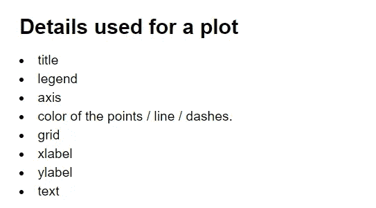
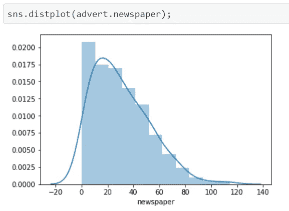

# 从 Matplotlib 和 Seaborn 开始！

> 原文：<https://medium.datadriveninvestor.com/starting-with-matplotlib-and-seaborn-cba16c7beabf?source=collection_archive---------15----------------------->

在开始之前，我建议你去看看我在 [**NumPy**](https://vibchess123.medium.com/starting-with-numpy-7f6540af082f) 和 [**Pandas**](https://vibchess123.medium.com/starting-with-pandas-dbd169030326) 上的博客，因为我们将使用这些库进行数据创建和分析。

> **简介:**

我们已经看到 **NumPy** 和 **Pandas** 如何帮助我们分析给定的数据或创建我们自己的数据。现在我们将使用 ***Matplotlib*** 和 ***Seaborn*** 来图形化地表示这些数据，以便更好地理解它。这些库在数据可视化中非常有用，几乎每个数据分析师/科学家都在工作中使用它们来更好地演示和表示。


# **Matplotlib :**

让我们从 Matplotlib 开始，这个库的主要目的是以直方图、饼状图、条形图、散点图等形式表示数据。，只需要几行代码。

> **安装:**

```
pip install matplotlib
```

只有在 local_machine 中工作时才运行上面的命令，对于 colab 用户来说，不需要担心安装问题。

> **导入库:**

```
import numpy as np 
import matplotlib.pyplot as plt
```

我们将使用 matplotlib 的 [**pyplot**](https://matplotlib.org/tutorials/introductory/pyplot.html) api 进行演示。



> **基本绘图:**

```
plt.axis([0,5,0,20]) *#[xmin, xmax, ymin, ymax]*
plt.title("My first Plot")
x = np.array([1,2,3,4])
plt.plot(x,x**2,'ro') *# r -> red color, o -> circle points.*
plt.xlabel("x axis")
plt.ylabel("y axis")
plt.legend(["Square of x ($x^2$)"],loc = 2) *#using $...$ to put latex text.*
plt.grid(**True**)
```


> **添加文本到情节:**

```
x = np.array([1,2,3,4,5])
y = x**2
plt.plot(x,y,'bo:')
plt.axis([0,6,0,30])
plt.grid(**True**)
plt.text(1,2,"$1^2$")
plt.text(2,5,"$2^2$")
plt.text(2.8,10,"$3^2$")
plt.text(3.8,17,"$4^2$")
plt.text(5,26,"$5^2$")
plt.title("Plot of $x^2$")
plt.xlabel("x-axis")
plt.ylabel("y-axis")
plt.legend(["Just Adding text to this plot"],loc = 2)
```


> **绘制一些随机方程:**

```
plt.axis([0,4.5,0,100])
plt.grid(**True**)
plt.title("Mix plot")
plt.xlabel("x-axis")
plt.ylabel("y-axis")
x = np.array([0,1,2,3,4])
y1 = x**2
y2 = 1.5*x**3
y3 = x**2.5
y4 = np.array([0,30,50,60,65])
plt.plot(x,y1,'ro:') *#adding circles using (o)*
plt.plot(x,y2,'bs--') *#adding stars using(*)*
plt.plot(x,y3,'g*-') *#adding squares using(s)*
plt.plot(x,y4,'m^-.') *#adding triangles using (^)*
vec = ["y = $x^2$",'y = 1.5$x^3$','y = $x^**{2.5}**$',r'y = $Random$']
plt.legend(vec,loc = 2)
```


这是 matplotlib 的一些基本功能和绘图表示。要获得完整教程，请访问官方文档:

[](https://matplotlib.org/tutorials/introductory/pyplot.html) [## Pyplot 教程- Matplotlib 3.3.3 文档

### pyplot 接口介绍。是使 matplotlib 像 MATLAB 一样工作的函数的集合。每个…

matplotlib.org](https://matplotlib.org/tutorials/introductory/pyplot.html) 

# **Seaborn 的探索性数据分析:**

Seaborn 是另一个有效用于数据可视化的库。形式定义

> **“Seaborn**是基于 matplotlib 的 Python 数据可视化库。它提供了一个高级界面，用于绘制有吸引力且信息丰富的统计图形。”

它提供了一个比 matplotlib 更高级的有吸引力的接口。虽然 matplotlib 很容易使用并且有它自己的好处。

> **安装:**

```
pip install seaborn
```

只有在 local_machine 中工作时才运行上面的命令，对于 colab 用户来说，不需要担心安装问题。

[](https://www.datadriveninvestor.com/2020/11/19/how-machine-learning-and-artificial-intelligence-changing-the-face-of-ecommerce/) [## 机器学习和人工智能如何改变电子商务的面貌？|数据驱动…

### 电子商务开发公司，现在，整合先进的客户体验到一个新的水平…

www.datadriveninvestor.com](https://www.datadriveninvestor.com/2020/11/19/how-machine-learning-and-artificial-intelligence-changing-the-face-of-ecommerce/) 

> **导入库:**

```
import seaborn as sns
```

> **加载数据集:**

为了演示这个库，我加载了一些外部数据集，我们将查看 seaborn 如何帮助我们可视化每个特性的分布。

```
advert = pd.read_csv('Advertising.csv')
advert.head()
```


```
advert.info()
```


所以我们每列有大约 200 个条目。让我们看看每一列的分布性质是什么。


Normal Distribution



Left Skewed Normal Distribution

> **关系 b/w 我们的输入功能(报纸、广播和电视)和我们的目标销售栏目:**


看看用 seaborn 和 matplotlib 可视化数据有多容易。今天说得够多了，更多内容将在以后的博客中讨论。

进行结帐:

[](https://seaborn.pydata.org/) [## seaborn:统计数据可视化——seaborn 0 . 11 . 1 文档

### Seaborn 是一个基于 matplotlib 的 Python 数据可视化库。它为绘图提供了一个高级接口…

seaborn.pydata.org](https://seaborn.pydata.org/) 

***感谢您的配合🙌，请随意在下面写下任何建议…如果你觉得你获得了一些知识，别忘了鼓掌👏***

访问专家视图— [**订阅 DDI 英特尔**](https://datadriveninvestor.com/ddi-intel)