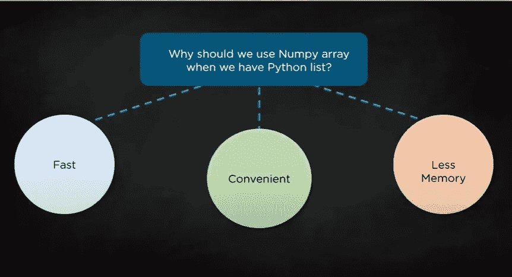

# 从 NumPy 开始！

> 原文：<https://medium.datadriveninvestor.com/starting-with-numpy-7f6540af082f?source=collection_archive---------27----------------------->

> **简介:**

在初始阶段，我们都从 python 开始，接触一些基本函数、变量、关键字、循环、列表等。但这是基本的，并进一步开始探索 AI/ML，同时探索发现在开始的 eg 中导入了一些重要的包/库。

```
import numpy as np
import pandas as pd
import matplotlib as plt
```

这样的例子不胜枚举。每个都有它自己的用途，将会在接下来的博客中进一步讨论。

我们来谈谈 **NumPy** ，让我们来看看@它的正式定义:

> NumPy 是 Python 编程语言的库，增加了对大型多维数组和矩阵的支持，以及对这些数组进行运算的大量高级数学函数

在 NumPy 中，我们通常使用数组+一些很棒的内置函数，这在使用时非常方便。现在你一定在想🤷‍♂️:我们已经有了 Python 列表，为什么还要使用 NumPy 数组？



3 reasons NumPy is better than Pyhton List

让我们从代码开始，看看它的一些基本功能和特性。

[](https://www.datadriveninvestor.com/2020/11/19/how-machine-learning-and-artificial-intelligence-changing-the-face-of-ecommerce/) [## 机器学习和人工智能如何改变电子商务的面貌？|数据驱动…

### 电子商务开发公司，现在，整合先进的客户体验到一个新的水平…

www.datadriveninvestor.com](https://www.datadriveninvestor.com/2020/11/19/how-machine-learning-and-artificial-intelligence-changing-the-face-of-ecommerce/) 

> **NumPy 安装:**

如果你正在使用 google colab，你可以跳到下一节。

```
pip install numpy
```

> **导入 NumPy 并创建 NumPy 数组:**

```
Output :
[100 200 400 500]
```

> **创建二维、三维数组:**

```
Output :[[1 2 3 4]
 [5 6 7 8]][[[1 2 3]   [3 4 5]   [5 6 7]]]
```

> **NumPy 的基本内置功能:**

```
Output :[[[1 2 3]
  [3 4 5]
  [5 6 7]]]
Shape: (1, 3, 3)
Array dimension:  3
Array DataType:  int32
Array size in bytes:  36
Item no:  4
```

> **创建特定数据类型的数组:**

```
Output :
int16
int32
int64
```

> 李兴:

```
Output :[[ 1  2  3  4  5]  
 [ 6  7  8  9 10]] 
[1 2 3 4 5] 
[2 7] 
[1 6] 
[5 6] 
[4 5 6 7] 
[1 2 3] 
[1 3 5 7]
```

> **使用不同种类的数组:**

```
Output :[[0\. 0\. 0\. 0.]
 [0\. 0\. 0\. 0.]
 [0\. 0\. 0\. 0.]]
[[1\. 1.]]
[[1\. 0.]
 [0\. 1.]]
[[93.93 93.93]
 [93.93 93.93]]
[[98\. 98.]
 [98\. 98.]]
```

> **生成随机值:**

```
Output :[[5.37397201 6.41856947 5.49235422 3.61058394]  [9.00237242 1.86604672 0.79720052 6.96586463]  [1.48384032 6.48606696 7.09039555 5.67795358]  [9.20801846 9.83116586 3.85970229 2.69796988]]
```

这些是一些基本的函数和它们的用法，可以让你在使用 NumPy 时有一个良好的开端，并且让你可以轻松地使用它。

进行结帐:

[](https://numpy.org/doc/stable/user/quickstart.html) [## 快速入门教程-NumPy 1.19 版手册

### 在阅读本教程之前，你应该了解一点 Python。如果你想刷新你的记忆，看看…

numpy.org](https://numpy.org/doc/stable/user/quickstart.html) [](https://www.geeksforgeeks.org/vectorization-in-python/) [## Python - GeeksforGeeks 中的矢量化

### 我们知道大多数应用程序都必须处理大量数据集。因此，非计算优化…

www.geeksforgeeks.org](https://www.geeksforgeeks.org/vectorization-in-python/) 

***感谢您的宝贵时间🙌，请随意在下面写下任何建议…如果你觉得你获得了一些知识，别忘了鼓掌👏***

**访问专家视图—** [**订阅 DDI 英特尔**](https://datadriveninvestor.com/ddi-intel)