# 从公开 CV 开始！

> 原文：<https://medium.datadriveninvestor.com/starting-with-open-cv-47baeea0de9e?source=collection_archive---------6----------------------->

现在我们已经熟悉了 python 的基础库:NumPy、Pandas、Matplotlib 和 Seaborn。是时候让我们的学习更上一层楼了。在今天的博客中，我们将使用 opencv，一个非常著名的用于计算机视觉分析的库。

> **简介:**

主要是每个数据科学家/分析师使用它进行计算机视觉和图像处理。它可以处理图像和视频，以识别物体、人脸或任何其他感兴趣的区域，并相应地进行实验。

我会推荐你去看看 [**NumPy** 教程](https://vibchess123.medium.com/starting-with-numpy-7f6540af082f)，因为当我们把 open-cv 和 NumPy 结合起来时，它会调整它的功能，变得更加强大。

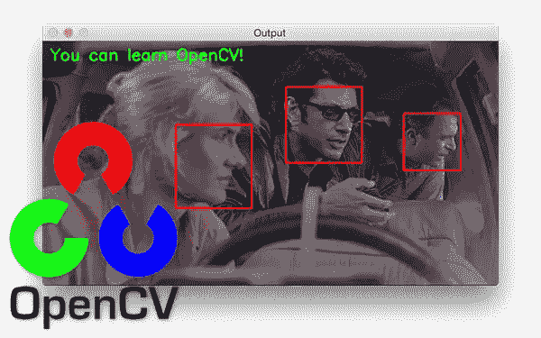

让我们从一些代码开始，探索一下它本身包含了什么秘密？

> **安装:**

```
pip install opencv-contrib-python
```

以上不仅安装了 opencv 的基本模块，还安装了贡献模块。

> **导入库:**

```
**import** **cv2** **as** **cv** **from** **matplotlib** 
**import** pyplot **as** plt
**import** numpy **as** np
```

> **加载图像:**

```
image=cv.imread("starry_night.jpg")
cv.imshow('image_1',img)
plt.imshow(image)*#matplotlib uses RGB format*
```

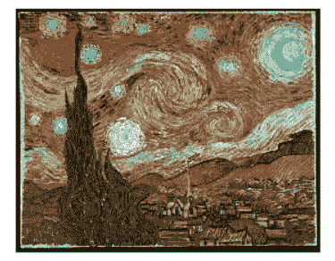

> **保存图像:**

上面的图像将通过下面的代码以灰度模式保存到工作目录中。

```
image_gray = cv2.cvtColor(image, cv2.COLOR_BGR2GRAY)
cv2\. imwrite('image_gray.png', image_gray)
```

现在我们知道了一些基础知识，让我们画一些自己的图像。

> **图纸:**

*   **线**

```
canvas = np.full((300, 300, 3), fill_value=255, dtype = "uint8")  
***# Setting dtype to uint8 is required***_=cv2.line(img=canvas, pt1=(0, 50), pt2=(300, 300), color=(0, 0, 255), thickness=5, lineType=cv2.LINE_AA)
plt.imshow(cv2.cvtColor(canvas, cv2.COLOR_BGR2RGB))
```

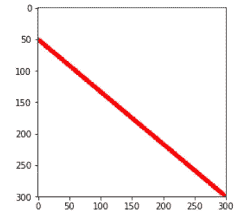

*   **带线条的矩形:**

```
_=cv2.rectangle(img=canvas, pt1=(0, 200), pt2=(100, 300), color=(0, 255, 0), thickness=5, lineType=cv2.LINE_AA)_=cv2.rectangle(img=canvas, pt1=(200, 0), pt2=(300, 100), color=(0, 255, 0), thickness=-1, lineType=cv2.LINE_AA)plt.imshow(cv2.cvtColor(canvas, cv2.COLOR_BGR2RGB))
```

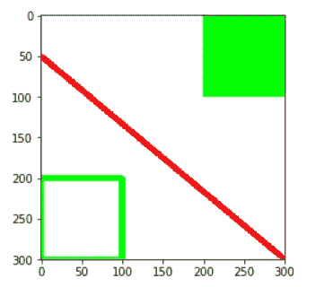

*   **现在用圆圈:**

```
_=cv2.circle(img=canvas, center=(150, 150), radius=50, color=(255, 0, 0), thickness=-1, lineType=cv2.LINE_AA)
plt.imshow(cv2.cvtColor(canvas, cv2.COLOR_BGR2RGB))
```

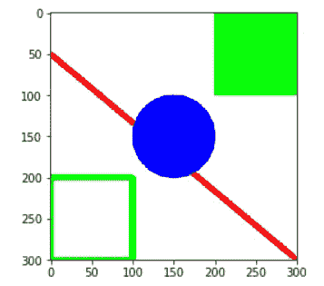

> **过滤和模糊:**

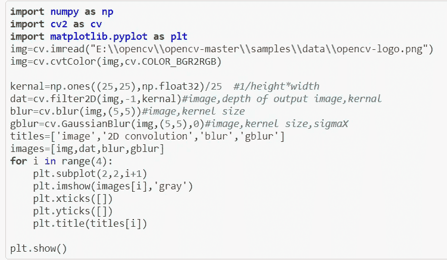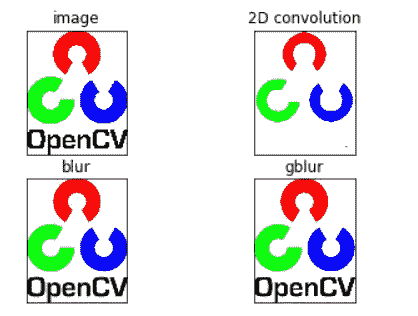

> **边缘检测:**

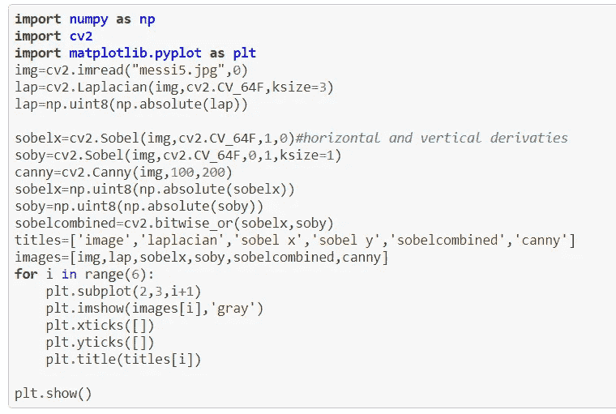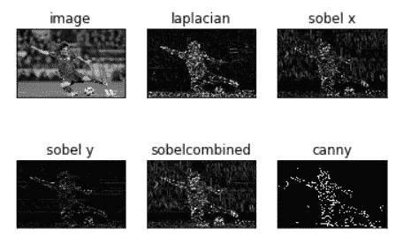

> **扩张、侵蚀和形态学**

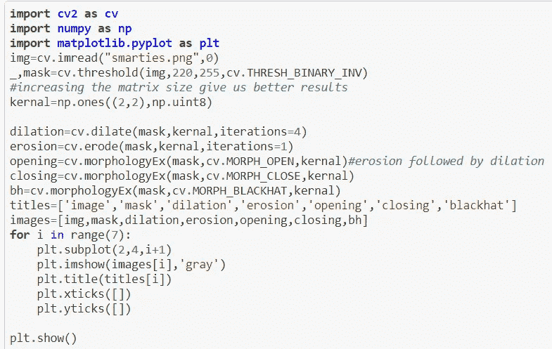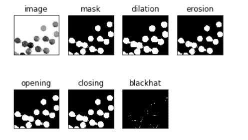

很神奇吧，这些是 opencv 展示的一些基本功能，只是为了让你对它感到舒服。确保结帐:

[](https://www.geeksforgeeks.org/opencv-python-tutorial/) [## OpenCV Python 教程- GeeksforGeeks

### OpenCV 是一个巨大的开源库，用于计算机视觉、机器学习和图像处理。OpenCV 支持一个…

www.geeksforgeeks.org](https://www.geeksforgeeks.org/opencv-python-tutorial/) [](https://docs.opencv.org/master/d9/df8/tutorial_root.html) [## OpenCV: OpenCV 教程

### 编辑描述

docs.opencv.org](https://docs.opencv.org/master/d9/df8/tutorial_root.html) 

***感谢您的宝贵时间🙌，请随意在下面写下任何建议…如果你觉得你获得了一些知识，别忘了鼓掌👏***

**访问专家视图—** [**订阅 DDI 英特尔**](https://datadriveninvestor.com/ddi-intel)