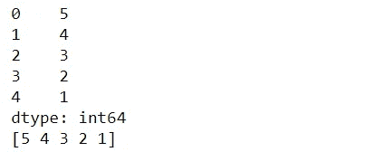
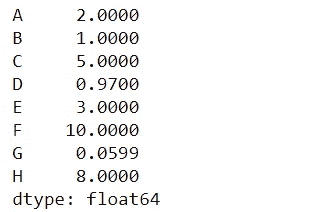
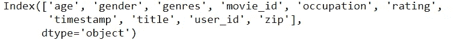
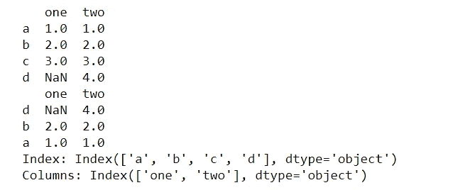
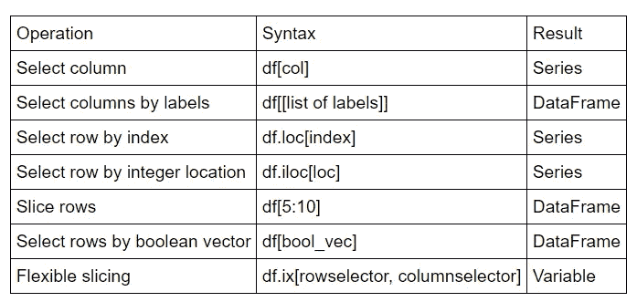
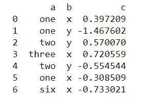
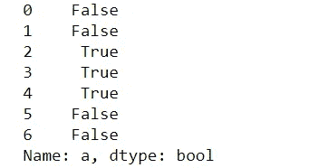

# 从熊猫开始！

> 原文：<https://medium.datadriveninvestor.com/starting-with-pandas-dbd169030326?source=collection_archive---------51----------------------->

在搬到熊猫之前，你可以结帐

[](https://vibchess123.medium.com/starting-with-numpy-7f6540af082f) [## 从 NumPy 开始！

### 简介:

vibchess123.medium.com](https://vibchess123.medium.com/starting-with-numpy-7f6540af082f) 

> **简介:**

Pandas 是一个非常著名的用于数据操作和分析的库。像 NumPy 这样的数据科学家和分析师很常见。如果您正在处理“**数据**，这将非常方便，因为它的各种内置功能使我们的工作变得容易。

它非常适合处理不同类型的数据:

*   **具有异构类型列的表格数据**(类似于 EXCEL、R 或关系数据库)
*   **时间序列数据**
*   **带行列标签的矩阵数据**(同类或异类)
*   任何其他形式的**观察** / **统计**数据集。


它包含一些高级数据结构和操作工具，使 Python 中的数据分析变得快速而简单。

*让我们了解它的基本功能，以及它在代码中隐藏了什么秘密！*

```
**import** **pandas** **as** **pd** *#I am importing pandas as pd*
**from** **pandas** **import** Series, DataFrame *# Series and Data Frame are two data structures available in python*
```

# 系列

Series 是一个类似一维数组的对象，包含一个数据数组(任何 Numpy 数据类型)和一个关联的数据标签数组，称为其索引。

```
mjp = Series([5,4,3,2,1])*# a simple series*
print mjp        *# A series is represented by index on the left and values on the right*
print mjp.values *# similar to dictionary. ".values" command returns values in a series*
```

输出:



> **索引数据:**

```
values = np.array([2.0, 1.0, 5.0, 0.97, 3.0, 10.0, 0.0599, 8.0])
labels = ['A', 'B', 'C', 'D', 'E', 'F', 'G', 'H']
ser = pd.Series(data=values, index=labels)*#values and labels must have the same dimension*
print (ser)
```

输出:



> **将字典传递给我们的系列:**

```
movie_rating = {
    'age': 18,
    'gender': 'M',
    'genres': 'Drama',
    'movie_id': 1193,
    'occupation': 10,
    'rating': 5,
    'timestamp': 12:14,
    'title': "Wonder Woman 1984",
    'user_id': 1,
    'zip': '48067'
    }
ser = pd.Series(movie_rating)
ser.index
```

输出:



# 数据帧:一系列系列

pandas 数据帧是一个带有潜在不同类型列的二维标记数据结构。与…类似

*   电子表格
*   关系数据库表
*   系列词典

[](https://www.datadriveninvestor.com/2020/11/19/how-machine-learning-and-artificial-intelligence-changing-the-face-of-ecommerce/) [## 机器学习和人工智能如何改变电子商务的面貌？|数据驱动…

### 电子商务开发公司，现在，整合先进的客户体验到一个新的水平…

www.datadriveninvestor.com](https://www.datadriveninvestor.com/2020/11/19/how-machine-learning-and-artificial-intelligence-changing-the-face-of-ecommerce/) 

**创建数据帧**

数据框可以通过以下方式创建

*   级数的字典
*   ndarrays 的字典
*   结构化或记录数组
*   从字典列表中
*   从元组字典中
*   来自一个系列

> **系列词典:**

```
d = {'one' : pd.Series([1., 2., 3.], index=['a', 'b', 'c']),
    'two' : pd.Series([1., 2., 3., 4.], index=['a', 'b', 'c', 'd'])}
df = pd.DataFrame(d)
print (df)
print (pd.DataFrame(d,index=['d','b','a'])) *# create data frame with index subset*
print
print ("Index:", df.index)
print ("Columns:", df.columns)
```

输出:



> **索引/选择:**



> **布尔掩码和 where() :**

```
df2 = pd.DataFrame({'a' : ['one','one','two','three','two','one','six'],                  
'b' : ['x','y','y','x','y','x','x'],                  
'c' : np.random.randn(7)}) print (df2) 
where_check = df2['a'].map(**lambda** x: x.startswith('t')) 
print (where_check)
```

输出:



这些是一些基本的功能和它的用途，让你对熊猫感到舒适。*还有更多功能，你可以在*上查看所有功能

 [## 重要的基本功能-熊猫 1.2.0 文档

### 在这里，我们讨论了熊猫数据结构的许多基本功能。首先，让我们创建一些…

pandas.pydata.org](https://pandas.pydata.org/pandas-docs/stable/user_guide/basics.html)  [## 入门教程-熊猫 1.2.0 文档

### 编辑描述

pandas.pydata.org](https://pandas.pydata.org/docs/getting_started/intro_tutorials/index.html) 

***感谢您抽出时间🙌，请随意在下面写下任何建议…如果你觉得你获得了一些知识，别忘了鼓掌👏***

**进入专家视角—** [**订阅 DDI 英特尔**](https://datadriveninvestor.com/ddi-intel)