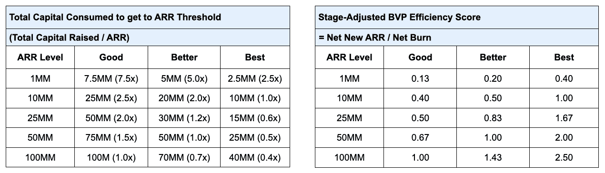
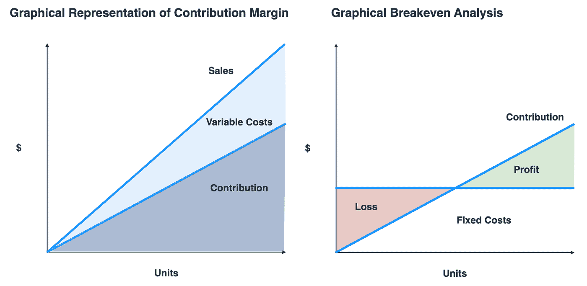

# 初创公司的创始人要当心——“不惜一切代价实现增长”不再流行

> 原文：<https://medium.datadriveninvestor.com/startup-founders-beware-growth-at-all-costs-is-no-longer-in-vogue-b2d5e9ac3619?source=collection_archive---------3----------------------->

## 如果你真的想成功，效率就是关键。

长期以来，初创企业创始人一直依赖于一个大概可以自由流动的风险资本龙头，喝着“不惜一切代价实现增长”的苦艾酒。

当然，增长是一个重要因素，但它不应该是初创公司创始人的唯一关注点——尤其是在后 COVID 时代。

不到 5%的初创公司发展足够快，规模足够大，有机会在以后调整业务效率低下的问题，并取得成功。然而，对于大多数初创公司来说，增长并不能解决巨大的客户获取成本或流失，或者创始人必须注意并设法开辟盈利道路的其他无数指标。

随着新冠肺炎疫情开始后的低迷继续在全球市场造成动荡，此前泛滥的风险资本正变得更加谨慎和有选择性。

相信我，我的日常工作就是帮助初创公司发展、壮大和繁荣。为了增长而增长而增长，而没有对效率、可持续性或盈利能力进行健全的检查，会带来融资风险，因为它假设资本在持续亏损的情况下仍可随时用于进一步增长。正如沃伦·巴菲特曾经说过的，“只有当潮水退去，你才会发现谁在裸泳。”

 [## 夏普比率悖论:为什么还要投资风险资本？数据驱动的投资者

### 夏普比率是一种基于风险量化回报的方法，具体来说，它是超过…

www.datadriveninvestor.com](https://www.datadriveninvestor.com/2020/03/29/the-sharpe-ratio-paradox-why-still-invest-in-venture-capital/) 

在我们当前清醒的融资环境中，在一系列黯淡的科技 IPO 和我们的 COVID 引发的衰退之后，以震撼风投界的顿悟为标志，**投资者将特别愿意为资本效率、单位经济、边际贡献和盈利能力支付溢价**。创始人应该为这种重点转移做好准备，而不是一厢情愿地认为他们可以通过成长走出任何陷阱。

# **资本效率**

## *初始建立和扩大业务所需资本的相对衡量标准*

比较两家假设的公司，两家公司都创造了 100 万美元的年度经常性收入。然而，公司 1 通过花费 200 万美元产生了 100 万美元的 ARR，而公司 2 通过花费 500 万美元+产生了 100 万美元的 ARR。前者的资本效率肯定更高，有效地让投资者获得了更大的回报。假设公司 1 正在解决其市场中的问题，而后者是一家将产品推向市场的初创公司。

然而，资本投资和收入之间的关系应该始终与企业类型以及企业所处的阶段一起判断。

在初创公司的早期，很难实现高水平的资本效率，因为在公司能够产生可观的收入之前，需要大量的前期投资来开发产品，实现产品与市场的匹配，并建立销售团队。然而，后来，随着公司进入扩张模式，其销售团队应该按照定义明确的走向市场剧本全力以赴地运作，业务可以开始受益于明显的规模经济。因此，资本效率指标最终应该朝着正确的方向发展，显示更高水平的资本配置财务回报(收入)。

衡量资本效率有两种方式，当然是一个硬币的两面。

方法 1 给出了自开始以来筹集的总资本的长期视图，以达到不同的 ARR 阈值。后者更侧重于短期，分析每增加一美元净消耗，公司会产生多少新收入。作为一名创始人，你应该密切跟踪资本效率，并确保指标总是在改善。这将使你的筹款工作容易得多。

Source: Fuel Venture Capital

为了控制资本效率，在全力投入之前，实现产品与市场的匹配、确定可扩展的业务模式并建立可重复的销售流程至关重要。在你确定发动机运转正常之前，不要把所有的汽油都加进去。如果你这样做了，你实际上是在消耗宝贵的资本，只是为了制造增长，让你的企业成为一台烧钱机器，假设在最坏的情况下，风险资本的降落伞会在那里。

# **单位经济学**

## *衡量盈利能力与获取客户成本的指标。*

创始人有时会以糟糕的单位经济为代价来追求爆炸式增长。通过明智地投资一种产品并将该产品营销给合适的受众来加速增长的支出是我们的生计。但用我们的风投资金通过补贴用户成本来推动收购数量，从而亏损运营，这是没有道理的。

显而易见的是，如果一家公司不得不降低价格来赢得顾客，那么他们的公司就没有为顾客创造足够的价值。这些客户通常不会停留很长时间，需要花很多时间来留住或带回客户，这导致了高流失率，并随着时间的推移推高了成本。

单位经济学帮助你了解你是否从客户那里获得了足够的价值，以保证你在获得和保留他们以及创造和服务你的产品上所花费的成本。创业单位经济学中最受欢迎的指标是:

*   终身价值/客户获取成本比率(LTV/CAC) —一个长期指标，显示客户终身价值(LTV)超过客户获取成本(CAC)的次数。 *LTV 指的是客户在整个关系期间对企业的总价值*。
*   CAC 回收期——一个短期指标，定义您收回客户获取成本的速度。

**经验法则的目标是终身价值(LTV)至少是客户获取成本(CAC)的 3 倍，并在 18 个月内收回 CAC。这些流行的原则是有原因的。如果 LTV 只有 CAC 的 1 倍，那就意味着它只能覆盖我们获得该客户所花的钱。因此，我们的客户没有支付我们的任何其他业务费用，包括支付构建和维护产品的工程师的费用，这显然是不可持续的。CAC 回报背后的基本原理同样植根于可持续性。**

# **边际贡献**

## *衡量一笔销售收入的指标，一旦与该笔销售相关的所有可变成本被剔除，该指标将有助于支付固定成本*(图 1)

随着销量的增加，边际贡献上升，并向右移动，最终与固定成本线交叉(图 2)。

Source: Fuel Venture Capital

如果我们将一个单位定义为售出的一件商品，而不是以每个客户为基础，那么边际贡献就成为单位经济的衡量标准。

如果你的边际贡献是负的，你每笔交易都在赔钱。如果你的边际贡献永远不会超过固定成本，你的公司就不会有营业利润。

在达到增长数字以显示产品符合市场需求和筹集下一轮资金的压力下，创始人经常忘记暂停和处理数字。如果他们这样做了，许多人会发现他们现在以 90 美分的价格卖 1 美元。

实现单位经济是至关重要的，或者至少要尽快看到实现正单位经济的方法，因为单位经济是支撑企业发展的基础。

我们希望创始人从一开始就证明他们的初创公司的边际贡献是正的，即使只是轻微的，并展示公司如何随着时间的推移以更大的规模和运营效率增加边际贡献。

# **开辟盈利之路**

许多创业公司认为增长和盈利是相互排斥的。我们认为这是一种平衡行为，必须贯穿于公司的整个生命周期。你不能只选择一个——你要把两个都扛在肩上，根据不断变化的优先级来改变你的平衡。两者都必须朝着同一个方向前进，以建立一个真正成功和可持续发展的公司。

对于处于早期阶段的公司来说，增长和证明单位经济盈利能力的压力会更大，而不是公司盈利能力。

企业早期的盈利能力并不能转化为长期的成功。当员工难以置信地精简时，做一个有利可图的生意并不困难，而且公司得到了一个足以支付所有费用的试点项目。事实上，当刚刚起步的初创公司在会议上吹嘘盈利时，我觉得很有趣，因为他们几乎没有组建销售团队，也没有与可靠的客户签订可观的合同。令人印象深刻的是，一旦你跨越了许多州、国家，甚至是大洲，你的客户群膨胀到看似不可想象的水平，你就能绘制出盈利图表。

公司越成熟，创始人在资本阶梯上爬得越远，投资者就越关注底线，并要求看到一条清晰的盈利道路，因为那时你才能真正确定你是否在运行一台运转良好的机器。

对于后期阶段的公司，40%规则特别用于 SaaS 公司，以在可接受的盈利水平(或亏损)和增长之间建立某种关系。简单地说，40%法则认为公司的年增长率加上营业利润率应该等于 40%。

对于任何在当前充满挑战的环境中寻求融资的创始人来说，重要的是要知道投资者在低迷时期总是会仔细审查烧钱和盈利能力。你应该很好地掌握燃烧机制，这需要了解成本，并确定哪些是一次性的，哪些是持续的，哪些是暂时膨胀的，哪些可以随着规模的扩大而减少，这样你就可以在不同的下行场景中使用杠杆。如果你的初创企业现金流为正，你将拥有相当大的杠杆，因为你的公司的直接生存不依赖于投资者的资本。如果你的初创公司还没有成立，你的融资计划应该包括一份详细的运营计划，目标是实现盈利。

# **关键要点**

*   资本效率、单位经济和边际贡献应该从一开始就进行估算、衡量甚至改进，无论是在市场选择、新产品开发还是机会评估中，都应该加以考虑。
*   创始人应该同时关注增长和盈利能力，在他们的模型中建立弹性，从一开始就为他们创造的价值收费，并着眼于长远。
*   归根结底，这一切都归结于创始人的心态。我们喜欢与那些尽最大努力从每一笔投资中创造最大价值，并且每年创造的收入超过支出的创始人合作。我们发现，资本约束对于一个年轻的团队来说是一个非常有用的工具，可以用来测试他们有效运作的能力。这迫使他们创造性地、合乎逻辑地思考他们想要进行的投资。资本过剩会导致糟糕的决策，或者抑制足智多谋和创造力。

*本文作者是燃料风险投资公司总经理* *合伙人兼首席投资官 Maggie Vo，CFA。Maggie 管理投资活动，领导对潜在投资的尽职调查，并对现有投资组合公司进行估值分析。要联系玛姬，发电子邮件到 maggie@fuelventurecapital.com。在社交媒体上关注 Fuel 风投，via*[*insta gram*](https://www.instagram.com/fuelventurecapital/?hl=en)*，*[*Twitter*](https://twitter.com/FuelVC)*和*[*LinkedIn*](https://www.linkedin.com/company/fuelventurecapital/)*。*

# ***交底***

本文提供的信息仅用于教育和说明目的。所提供的材料代表燃料风险投资公司截至本报告日期的观点。所提供的信息和观点是从据信可靠的来源获得或得出的；但是，我们不能保证此处表达的信息的准确性和完整性。观点如有变更，恕不另行通知，Fuel Venture Capital 不承担更新或修改此处包含的任何信息或观点的责任。请记住，过去的业绩并不代表未来的结果，也不能保证基金将取得类似的结果，实现其投资目标，实施其投资战略或避免损失。

*本协议中的任何规定均不构成出售任何证券的要约，也不构成购买由 Fuel Venture Capital 或其关联公司赞助或建议的任何证券或任何其他产品的要约，也不构成以其他方式提供投资咨询服务的要约或要约。任何此类出售要约或购买要约的邀约只能通过正式要约文件进行，其中包括保密要约备忘录、有限合伙协议和相关认购文件。此类正式发行文件包含本文件中未列出的附加信息，包括与某些投资风险相关的信息，这些信息对任何投资决策都至关重要。此处提供的业绩数据仅用于说明目的，不代表未来回报，也不保证未来结果。本文所述类型的投资可能涉及高度风险，且此类工具的价值可能高度不稳定。投资者可能会损失部分或全部投资。本简要声明并未披露与此处列出的投资类型相关的所有重要方面/风险，包括相关风险因素以及适用于它们的任何法律、税务和会计考虑因素。*

**访问专家视图—** [**订阅 DDI 英特尔**](https://datadriveninvestor.com/ddi-intel)