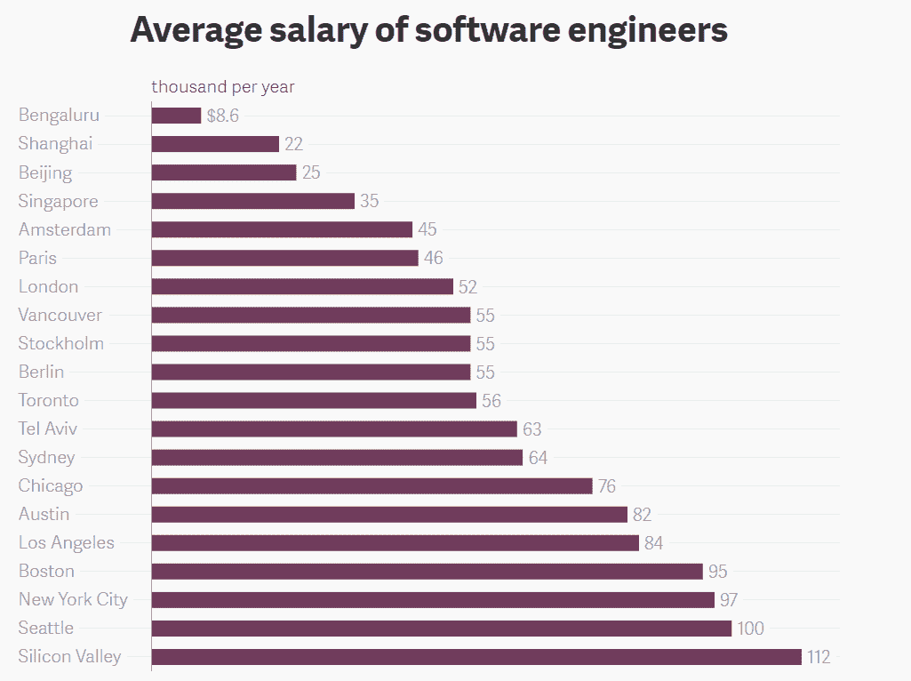
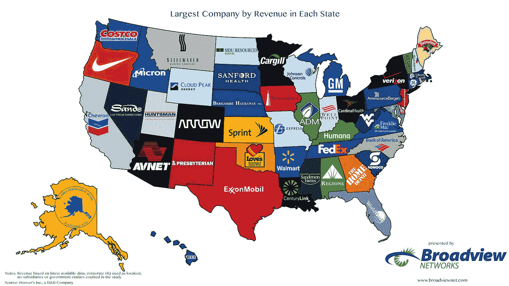
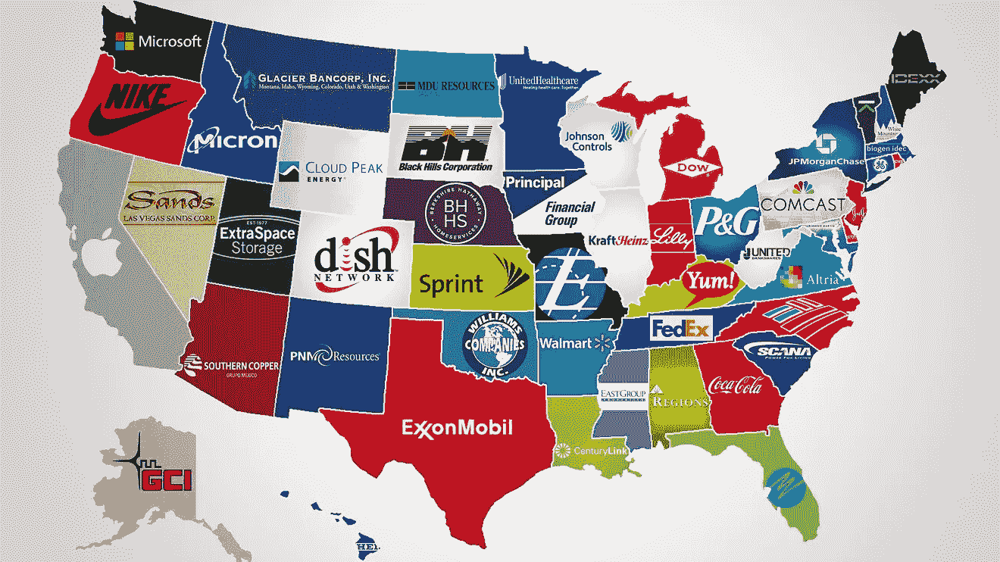
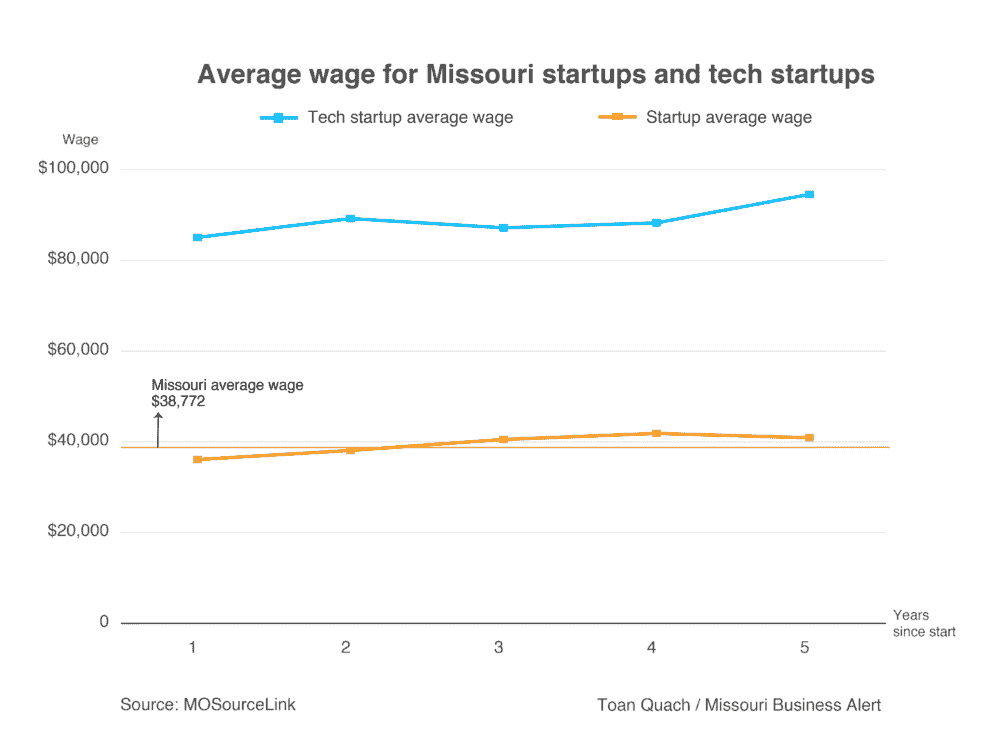

# 在科技中心外创业？3 个论据

> 原文：<https://medium.datadriveninvestor.com/startup-outside-a-tech-hub-3-arguments-for-it-61d5ce547207?source=collection_archive---------22----------------------->

所以你不在像旧金山、纽约、伦敦、北京、特拉维夫或班加罗尔这样的顶级创业生态系统中？许多投资者会告诉你，你的公司将在招聘、业务发展和文化方面受到影响，这是有道理的。但故事的另一面往往在叙述中没有说出来，这就是为什么这篇文章将重点关注重大的好处。

**1)招聘** —是的，人才库可能会变小，但成本也会变小。即使在同一个国家，这种差异也是非常显著的——在美国，像奥斯汀或辛辛那提这样的中心仍然是区域性的经济中心，但却只有硅谷的 2/3。鉴于生活成本也不同，薪资是一个有争议的指标，但作为一个快照，2018 年全球创业生态系统报告的数据如下。

窄漏斗的另一个优势是你的创业公司的市场性。例如，在生态系统 A 中，你是竞争 1000 名工程师的 100 家创业公司之一，但在生态系统 B 中，你是竞争 200 名工程师的 10 家创业公司之一。那么，如果你处于早期阶段或者正在建立一个分布式团队，你为什么不在 B？在这个例子中有一些假设，最大的假设是正态分布，即 A 和 B 有相似的天赋范围。但关键是，如果你还不需要很多工程师，那么 B 就相当有吸引力。

**2)业务发展**——大多数风投在科技中心，但大多数客户不在，这造成了认知失调。如果你的业务实际上是销售科技产品，比如企业销售，位于一个主要的枢纽是一个很大的优势。但这几乎不是其他垂直行业的答案，尤其是在像美国这样的大国。媒体倾向于洛杉矶和纽约。农业科技在中西部。石油和天然气是关于得克萨斯州，尤其是休斯顿。建立在提供者基础上的商业模式与人口密切相关，因为医院本质上是地方性的。但建立在制药基础上的商业模式更适合波士顿和新泽西，而对于支付者来说，纽约和芝加哥尤为突出。可视化这种专业化的框架是美国各州收入和市值最大的公司:

还有一点要说的是，在地理上更接近你的潜在客户，不仅是在访问上，而且在理解他们的心态上。事实上，如果你正试图决定与哪些投资者合作，评估他们对与你的初创企业相关的特定经济集群的了解是一个非常好的试金石。

 [## 金融科技初创公司正在颠覆全球银行业|数据驱动的投资者

### 传统的实体银行从未真正从金融危机后遭受的重大挫折中恢复过来…

www.datadriveninvestor.com](https://www.datadriveninvestor.com/2018/10/20/fintech-startups-are-disrupting-the-banking-industry-around-the-world/) 

文化——在一个较小的科技生态系统中问任何一位 CEO，他们都会强调更高的忠诚度，也就是说，他们没有因为其他创业公司或公司而流失太多员工。小池塘里的大鱼也能为更高的动力创造条件，因为你是镇上最大的游戏。一个很好的例子是，与 2018 年所有初创公司相比，密苏里州的科技初创公司一直支付两倍以上的薪酬:

毕竟，当你身处更成功的公司的后院时，士气和业绩往往会被稀释。相对于科技中心的同行，大学城的初创公司也可以与学术界建立更紧密的联系。显然，你所在的地方不会决定你的文化，这是许多因素之一，但即使在一个全球即时通信的扁平世界，这也可能是一种与众不同的资产。

*原载于* [*数据驱动投资人*](https://www.datadriveninvestor.com/2020/03/15/startup-outside-a-tech-hub-3-arguments-for-it/) *，“我很乐意在其他平台上辛迪加。我是*[*Tau Ventures*](https://www.linkedin.com/pulse/announcing-tau-ventures-amit-garg/)*的管理合伙人和联合创始人，在硅谷工作了 20 年，涉足企业、创业公司和风险投资基金。这些都是专注于实践见解的有目的的短文(我称之为 GL；dr —良好的长度；确实读过)。我的许多文章都在*[*https://www . LinkedIn . com/in/am garg/detail/recent-activity/posts*](https://www.linkedin.com/in/amgarg/detail/recent-activity/posts/)*上，如果它们能让人们对某个话题产生足够的兴趣，从而进行更深入的探讨，我会感到非常兴奋。如果这篇文章有对你有用的见解，请对这篇文章和 Tau Ventures 的 LinkedIn 页面***发表评论和/或给予赞，感谢你对我们工作的支持。这里表达的所有观点都是我自己的。**