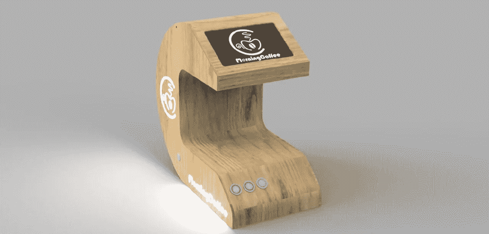

# 启动:制作完美咖啡的机器！

> 原文：<https://medium.datadriveninvestor.com/startup-the-machine-that-makes-perfect-coffee-1fbe06cc6741?source=collection_archive---------15----------------------->

最后，有一家初创公司找到了获得完美咖啡的方法！

每天，世界上大多数人至少喝一杯咖啡。不管是浓缩咖啡、双份咖啡还是美式咖啡。真正的问题是，“我喝的咖啡做得对吗？”。

为了回答这个问题，并发现这种创新咖啡机中的技术类型，我对利纳斯·卡尔卡诺(初创公司“早晨咖啡”的创始人)和鲁本斯·莱内利(UX &营销顾问，“早晨咖啡”团队的成员)进行了首次采访。这家初创公司总部设在意大利，他们的野心太大，无法覆盖全球。

([点击这里](https://anchor.fm/thereview_byehia/episodes/Startups---Morning-Coffee-e-Il-Caff-Perfetto-ejmft7)在我的播客上听完整的采访！)

***意大利采访，可登陆** [**我的博客**](https://www.ytechb.it/post/morning-coffee-il-caff%C3%A8-perfetto) **和**[**Linkedin**](https://www.linkedin.com/pulse/startup-morning-coffee-e-il-caff%C3%A8-perfetto-yehia-el-taher/)**。**

## 让我们开始采访:

## Yehia:“欢迎 Linas，请多告诉我们一点关于你的项目。”

**Linas** :谢谢 Yehia，我的创业公司叫做 Morning Coffee，这是一款创新的咖啡机。这是一款物联网设备，不仅能让我们做出比竞争对手更好的咖啡，还能让我们充分受益于饮料本身。

## 叶海亚:“我看到你非常自信，你的咖啡机比竞争对手做的咖啡更好。”

Linas 说:“当然可以，因为我们的咖啡机与众不同。通过物联网(物联网)，机器连接到互联网，通过一个应用程序甚至集成显示器，您可以全面监控我们每天的咖啡消费量以及我们喜欢喝哪种类型的咖啡。

我和我的团队对各种品牌进行了调查和研究，出于明显的隐私原因，我没有提到它们的名字，我发现一些品牌使用低成本材料以牺牲质量来增加利润。你当然不能指望一个 50€咖啡机的专业咖啡。"

## 叶海亚:“那什么能做出完美的咖啡呢？”

每个品牌和类型的咖啡都有它自己的温度，这对于一杯纯正地道的咖啡来说是必不可少的。目前几乎所有的咖啡机都没有根据咖啡豆的种类来调节温度的选项。晨咖啡刚刚想到解决这个问题，以创造一个优秀的咖啡，因此尽可能纯净，更“完美”的话。

3D Render of the Morning Coffee Machine

## Yehia:“之前你说它是物联网机器。更好地解释你的意思。”

**Linas** :“所谓物联网，我们是指机器使用互联网技术与各种应用程序以及制造商(即我们)进行通信。早咖啡还配备了自我诊断功能，允许自动检查情况，保证用户最大限度地关注其状况。

此外，当您要用完某个组件时，例如，我们总是会提前收到通知，以便更换磨损的部件，这样设备就会一直工作，不会有用户某天醒来发现机器不工作，它还配备了计算设备平均寿命的技术，以便进行 360°监控。

对于智能，我还包括你可以用亚马逊 Alexa 语音助手和 Google Home 控制你的设备。我们也在研究与苹果 Homepod 的集成，但由于它有一个相当保留的家庭自动化系统，我们仍在研究这个选项。还将有更新，将实现新的功能，新的咖啡品牌，谁知道甚至可能是新产品使用”。

## 叶海亚:“但是如果我们谈论隐私呢？如你所知，在欧洲他们对此非常严格。”

**里纳斯**:我们也照顾到了那边。每台机器都有一个随机识别码，它会告诉我们这台机器是否运转良好。不会记录其他敏感数据。

## 叶海亚:“但让我们言归正传，从技术角度来看，这台机器内部是什么样的？”

Linas :“这台机器由一台微型计算机组成，它管理所有的传感器和部分执行器(泵和锅炉)。有问题的迷你电脑是一个树莓，一个低成本但功能强大的电脑，所以也适合机器的大小。该设备中的物理按钮将不复存在，我们打赌这一定是一个技术和创新的设备。

它配备了一个 7 英寸的全触摸液晶显示器，对于咖啡机来说是相当大的尺寸，但它的用处在于它可以给我们提供的信息量。此外，它配备有精确的安全系统，以便了解例如锅炉何时超过温度极限，并因此立即干预以防止某些事情发生，从而具有永久安全的机器。作为一台技术机器，我们也非常关注受运动、听力或视力问题影响的人对它的使用。

如果一个耳聋的人正在使用它，当咖啡准备好的时候，早晨咖啡标识将会跳动以警告他/她饮料准备好了。因此，如果盲人正在使用它，该设备配备有能够发出听觉信号的扬声器，以提醒用户他们可以享受咖啡了。"

## Yehia:“这些细节非常令人兴奋，尤其是“所有”用户都可以使用它。但是现在，如果你允许，我想把话传给鲁本斯。嗨，鲁本斯，请告诉我们一些关于你每天都在如何改进这家初创公司的情况？”

鲁本斯(Rubens):“基本上像任何项目一样，你从一个想法开始，这个想法变成一个概念，然后发展，最后变成一台机器。

大多数时候，你会意识到项目的优势不在于机器本身，而在于通过它提供的服务。在这种情况下，我们可以以特斯拉为例；他们的强项不是汽车本身，而是超级充电器。他们实际上已经在世界各地的充电点放置了电源，有时是免费的，而且他们充电的速度比其他汽车快得多。

在这种情况下,“早晨咖啡”诞生于咖啡机的概念，但它演变为该领域的一种革命性机器，它设法用插入的咖啡类型制作完美的饮料。而且对于智能部分，也会有杯子的认可。例如，如果消费者 Marco 使用蓝色杯子，一旦杯子被放置，Morning Coffee 就会识别他是谁，并根据他的喜好建议他喝什么类型的咖啡。"

## Yehia:“那用户体验呢？”

**鲁本斯**:“就用户体验而言，我们已经研究了很多，以保证用户的独特体验。正如 Linas 之前解释的那样，它是一台智能机器，所以它必须智能，反应灵敏，最重要的是它必须做用户想立即做的事情。

我们还将引入监控剩余咖啡量的可能性，以便建议何时订购咖啡更好，以免没有咖啡。此外，这种监测有助于制造商向你推荐与你已经喝过的咖啡相似的新型咖啡。

例如，如果一个用户喝了一杯阿拉比卡咖啡，有问题的生产商会推荐一种与他的口味有关的新产品，进行更直接的营销。"

## 叶海亚:“我觉得是相当浓郁的 UX 葡萄酒。但这台机器只做咖啡？”

我接受这个命令，鲁本斯。它不仅能煮咖啡。它还可以通过薄饼泡茶，还可以煮开水，可以在 25 秒内将水加热到 100 摄氏度，这是茶壶永远无法达到的记录。最后，它也像其他先进机器一样制造蒸汽。对于其他饮料，由于我们将要安装的升级，很可能会有其他未来的集成。

## 叶海亚:“但是设计呢？你是如何设想它是一台创新机器的？”

**Linas** :我和我的团队一直在寻找一种创新的形式，不要走得太远。生产所需的材料是木材，但我们仍在评估这种类型的材料，也有一些高温变形的风险。我可以肯定的是，与市场上的其他产品相比，它将采用全新的材料生产。

Credits: Morning Coffee

## 叶海亚:“伙计们，最后两个问题，然后我就结束了，我想我的问题也让你们有点烦了。有哪些咖啡冲泡选择，你能用牛奶制作浓咖啡玛奇朵或其他变化吗？第二个问题:我可以用这个触摸屏做什么？”

**Linas** :“这款咖啡将会为美国咖啡爱好者提供经典浓缩咖啡、双份咖啡和个性化的大杯咖啡。因为 mil 的实施仍有待评估和验证，但将来可能会有更新。

**鲁本斯**:“我为‘屏幕’作答。它将倾向于通过显示器给出比一般信息更多信息。他将能够准确地告诉我们当天的天气，并提供一些建议；例如，我们是否应该带一把伞，随着未来的更新，一旦他在早上从我们的杯子中认出我们，他将能够显示我们当天的约会。我们第一次可以说，技术也能制造咖啡，而且会让它变得更完美！”

## 我想感谢这些伟大的人。这个项目每天都在变得越来越大，我很高兴有人不仅想改善我们对世界上最广泛消费的饮料的体验，还想改善公司不总是考虑的残疾人的体验。

> 我建议所有的企业家，而不是，去做你想做的事情，你需要决心，技能，但最重要的是热情。你所拥有的激情不能作为技能来获得，没有它，我们永远也不会达到我们所认为的目标。
> -鲁本斯·莱内利和林纳斯·卡尔卡诺-

