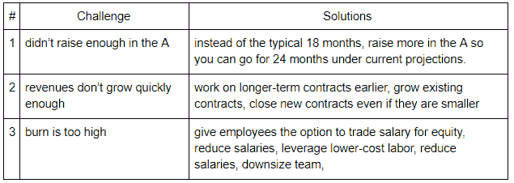

# 创业公司和 A1 系列陷阱

> 原文：<https://medium.datadriveninvestor.com/startups-and-the-series-a1-trap-e546940d117e?source=collection_archive---------7----------------------->

Image Credit: redpepper

在获得 A 后的一年内达到神奇的 100 万美元，但不确定是否应该获得 B？按照目前的烧钱速度，你的现金还能再维持 6 个月，因为你实际上已经筹集了 18 个月的资金？并且不确定应该把这一轮叫做 A1，A*，pre B，还是别的什么？

我称之为 A1 陷阱——因此才有了《星球大战》中对阿克巴上将的敬意。在我们进一步讨论之前，让我们先澄清一个框架。

**框架—圆形术语的真正含义是什么**

术语变得非常混乱——为什么一家公司融资 1000 万美元叫做种子，而另一家公司融资 500 万美元叫做 A 轮？下面的框架基于这样一种想法，即你所说的一轮融资不是关于金额，而是你用现金做什么:

*   种子前期:Powerpoint
*   种子:原型
*   系列 A:产品-市场匹配
*   B 系列:商业模式牵引

通常 A 轮和 B 轮之间是你开始赚钱的时候，投资者特别关注的是一阶导数，即增长率。

**陷阱——三大挑战及其解决方案**

具有强大消费者元素的企业通常可以避免提出扩展，因为期望更多地是关于增长的市场份额而不是收入。但企业或任何与 SaaS 有业务往来的企业，都因让企业陷入这一阶段而臭名昭著。如果您所在的垂直行业销售周期较长，如健康或汽车，通常为 9-18 个月，那么风险甚至更高。

陷阱的出现主要是因为以下三个挑战的结合。原则上也有简单的方法来减轻或完全避免它:

不言而喻，减少烧伤的方法是按照疼痛增加的顺序排列的，对士气和生产力有很大的影响。这就是为什么最好避免问题(#1)或尽早缓解问题(#2)，而不是强行解决问题(#3)。如果你在筹资方面陷入困境，并且已经用尽了上述所有解决方案，那么考虑出售部分或全部业务。

 [## 金融科技初创公司正在颠覆全球银行业|数据驱动的投资者

### 传统的实体银行从未真正从金融危机后遭受的重大挫折中恢复过来…

www.datadriveninvestor.com](https://www.datadriveninvestor.com/2018/10/20/fintech-startups-are-disrupting-the-banking-industry-around-the-world/) 

**你被困住了，现在怎么办？**

A 之后的 1 年是真正的分水岭，因为典型的投资谈判需要 3 个月。如果你预见不到能在这个时间框架内做到这一点，那么可能需要三个月的时间才能让公司准备好部分或全部出售。这就是为什么 A1 陷阱的一个很好的缓解方法是有目的地追求投资和并购的双轨。

最后，你可以称它为你最喜欢的术语，但一般来说，如果它是相同术语的延伸，那么 A*是更常见的术语，上一轮是 A1，下一轮的可转换债券是 pre B。也就是说，涂了口红的猪仍然是猪——精明的投资者很快就能看穿行话，最好直言不讳，以节省时间。如果你现有的投资者支持你，通常只进行一轮内部投资会更容易。如果你能让一个新的投资者领导得更好。一个常见的叙述是关于战略进入，这也加速了伙伴关系，即更多的收入进入 b。关键是尽快走出陷阱，即使这意味着走一条次优的道路，因为否则它真的会成为一个自我实现的预言，是最常见的路线，走向低迷，资本重组甚至公司关闭。

*原载于* [*数据驱动投资人*](https://www.datadriveninvestor.com/2020/01/19/startups-and-the-series-a1-trap/) *，《我很乐意在其他平台上辛迪加。我是*[*Tau Ventures*](https://www.linkedin.com/pulse/announcing-tau-ventures-amit-garg/)*的管理合伙人和联合创始人，在硅谷工作了 20 年，涉足企业、创业公司和风险投资基金。这些都是专注于实践见解的有目的的短文(我称之为 GL；dr —良好的长度；确实读过)。我的许多文章都在*[*https://www . LinkedIn . com/in/am garg/detail/recent-activity/posts*](https://www.linkedin.com/in/amgarg/detail/recent-activity/posts/)*上，如果它们能让人们对某个话题产生足够的兴趣，从而进行更深入的探讨，我会感到非常兴奋。如果这篇文章有对你有用的见解，请评论和/或给文章和* [*Tau Ventures 的 LinkedIn 页面*](https://www.linkedin.com/company/tauventures) *点赞，感谢你对我们工作的支持。这里表达的所有观点都是我自己的。*