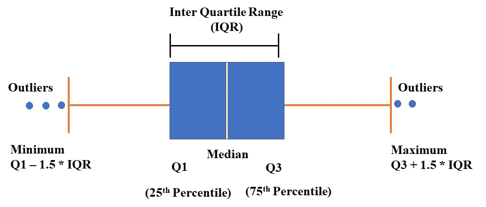
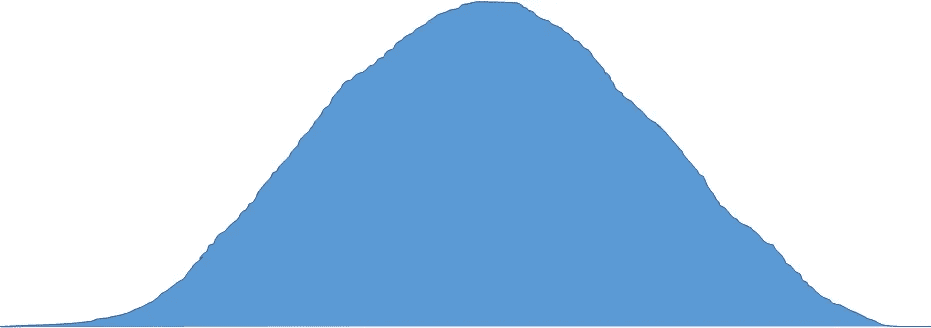
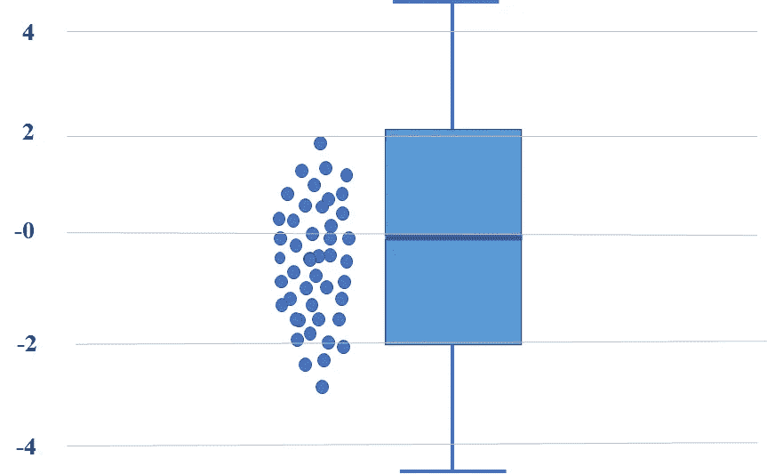
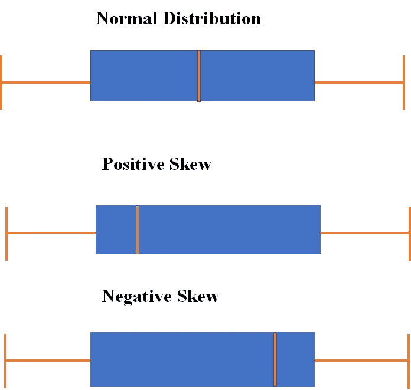

# 统计分析第 1 部分:理解数据分布的盒须图

> 原文：<https://medium.datadriveninvestor.com/statistical-analysis-part-1-box-and-whisker-plot-for-detecting-outliers-5a260f09cb01?source=collection_archive---------3----------------------->

Box and Whisker Plot [Image by Author]

H ello 世界！我的数据科学社区博客。在数据分析中，大多数分析将基于数据的分布来完成。在这篇博客中，我们将讨论盒须图来理解数据的分布。如果你对盒须图的数据分布分析感兴趣，那么这个博客是为你准备的。

 [## 将定义 2020 年就业前景的五大数据科学和机器学习趋势|数据驱动…

### 数据科学和 ML 是 2019 年最受关注的趋势之一，毫无疑问，它们将继续发展…

www.datadriveninvestor.com](https://www.datadriveninvestor.com/2020/02/19/five-data-science-and-machine-learning-trends-that-will-define-job-prospects-in-2020/) 

# 关于一个数据，分布告诉你什么？

数据集(或总体)的分布是显示数据的所有可能值的列表或函数，这些值经常出现。当分类数据的分布被组织起来时，我们可以看到每个组中个体的百分比。当组织数字数据的分布时，我们可以看到它们通常从最小到最大排序，分成合理大小的组(如果合适)，然后放入图形和图表中，以检查数据的形状、中心和可变性。

Normal Distribution [Image by Author]

# 什么是盒须图？

我们使用不同的图来分析给定的数据集。有各种各样的图表，如柱状图、条形图、折线图等。同样，我们使用盒须图来分析给定数据的模式。它分析数据集的传播和分布，专门用于探索性数据分析(EDA)。随后，我们可以使用盒须图查看和比较给定数据集中不同类别的不同四分位数范围。

Box and Whisker Plot with data points[Image by Author]

**第一个四分位数(Q1/第 25 个百分位数)**:最小数(不是“最小值”)和数据集中位数之间的中间数。

**第三个四分位数(Q3/75 个百分点)**:数据集的中值和最高值(不是“最大值”)之间的中间值。

**四分位范围(IQR)** :第 25 到第 75 百分位。

**胡须(显示为蓝色)**

**异常值(显示为绿色圆圈)**

**最大值** : Q3 + 1.5*IQR

**最低** : Q1 -1.5*IQR

如何定义异常值，“最小值”或“最大值”可能还不清楚。下一节将试图为您澄清这一点。

# 盒须图如何解释数据的扩散和分布？

1.  正如我们所讨论的，盒须图分析并解释了给定数据集的描述性统计数据。
2.  盒子的长度告诉我们数据的可变性，穿过盒子的线为我们提供关于居中数据的信息。
3.  假设样本数据足够大，可以进行测试，那么根据框内线条的位置所取的两个胡须(左侧和右侧)的相对长度也可以给我们一个样本数据分布的大致概念。
4.  这些方框还可以让我们对数据点的标准差和方差有一个大致的了解。

例如，如果顶部或右侧须比左侧或底部须长得多，并且中心线倾向于底部或左侧，则样本分布是右偏的，否则是左偏的。

如果两个晶须的长度相当均匀，且线几乎位于中心，那么我们可以将这种分布测量为朝向中心的对称分布。

Data Distribution in Box and Whisker Plot [Image by Author]

# 结论

在这篇博客中，我们讨论了盒须图，以及它如何通过分布、扩散、偏斜和检测异常值来帮助理解数据。

我希望这有助于探索其他测试和方法。

另外，让我知道我是否错过了**框和须状图**概念中的任何东西。

*如果你喜欢这篇文章，请给我掌声，并帮助其他人找到它。*

与我联系:- [LinkedIn](https://www.linkedin.com/in/dheerajkumar1997/)

与我联系:- [Github](https://github.com/DheerajKumar97)