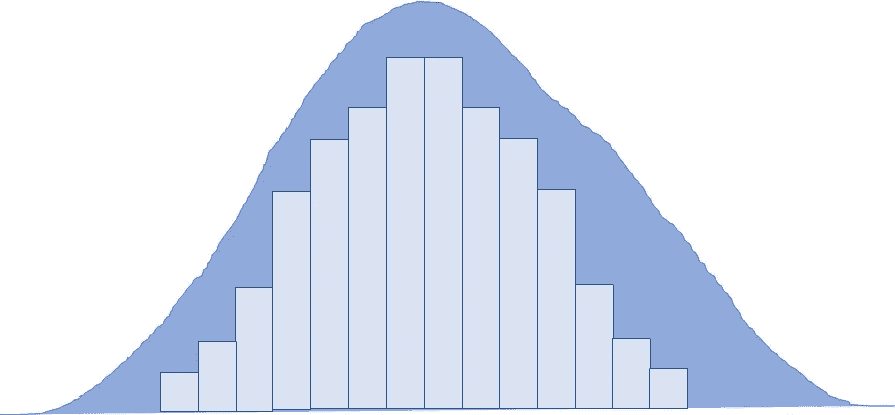
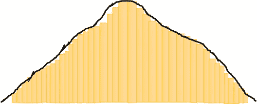
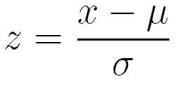
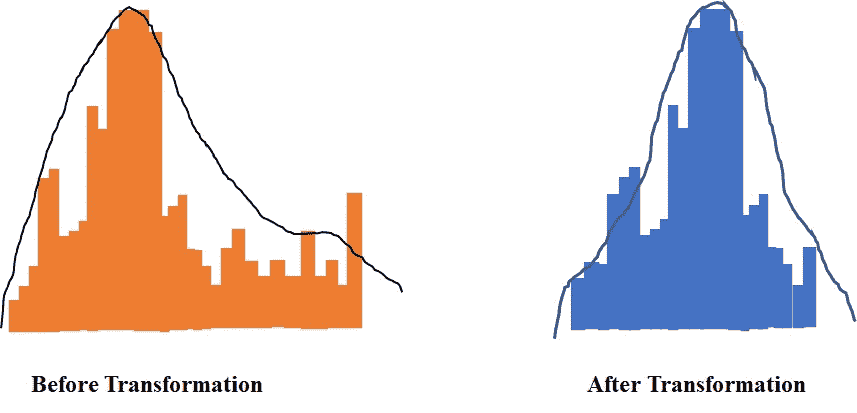
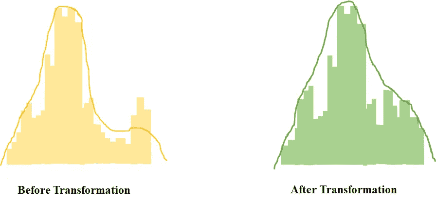
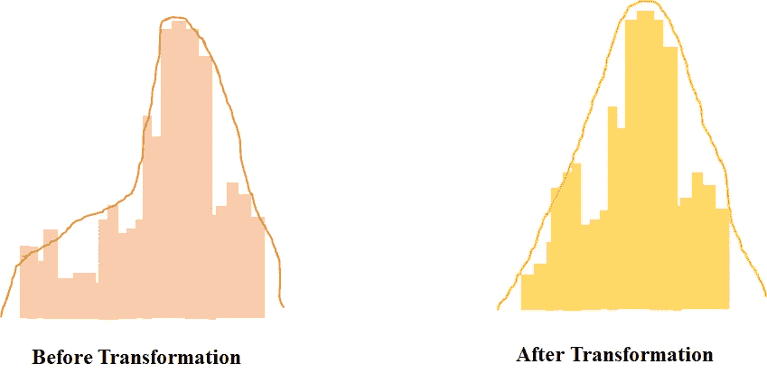
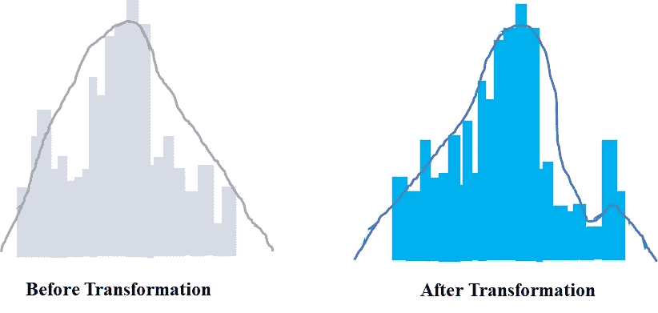
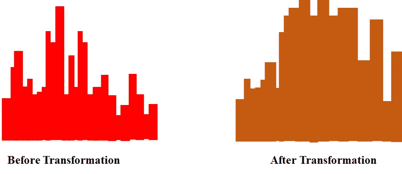
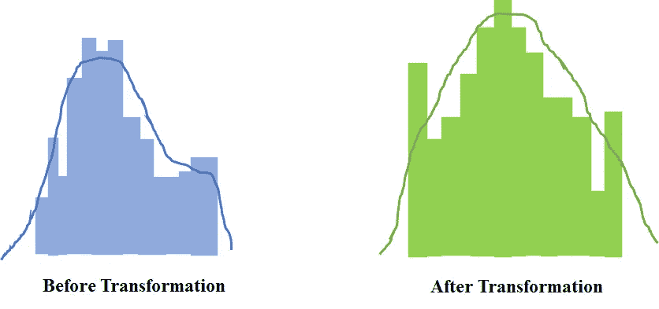

# 统计分析第 2 部分:数据科学中高斯分布的数据转换！

> 原文：<https://medium.datadriveninvestor.com/statistical-analysis-part-2-data-transformation-to-the-gaussian-distribution-in-data-science-41225983bdb2?source=collection_archive---------2----------------------->

# 正态分布是数据科学中的一个重要假设吗？



Normal Distributuin [Image by Author]

数据科学家声称正态性是数据科学领域中数据的第一个假设。在本文中，我们将讨论高斯分布以及将数据转换为高斯分布的方法。如果您正在尝试理解高斯数据转换，那么这篇文章就是为您准备的。

# 什么是高斯或正态分布？

你见过钟形曲线吗，



正态分布是一种具有钟形曲线的连续概率分布，这意味着所有值都聚集在中心峰值周围，如果样本的平均值、众数 a 和中位数相等，则变量具有正态分布，正态分布中的值将完全随机。



Normal Distribution Formula

# 为什么是高斯分布？

正态分布很重要，因为有中心极限定理。简单来说，如果你有任何独立变量，它可能会产生各种分布，这些变量的集合将趋于正态分布。

高斯分布利用叠加和缩放的性质，使得分析线性系统变得容易。你不必担心结果分布的形状，只需要担心它的集中趋势(均值)和分散性(方差)。

[](https://www.datadriveninvestor.com/2020/02/19/five-data-science-and-machine-learning-trends-that-will-define-job-prospects-in-2020/) [## 将定义 2020 年就业前景的五大数据科学和机器学习趋势|数据驱动…

### 数据科学和 ML 是 2019 年最受关注的趋势之一，毫无疑问，它们将继续发展…

www.datadriveninvestor.com](https://www.datadriveninvestor.com/2020/02/19/five-data-science-and-machine-learning-trends-that-will-define-job-prospects-in-2020/) 

回归分析假设我们的数据具有 Y=α+βX+ϵ形式，我们知道在回归分析中，响应变量应该是正态分布的，以获得更好的预测结果。如果残差具有高斯分布，那么很容易做到这一点，因为我们知道我们的残差和响应变量是间接相关的。大多数点靠近直线，而较远的点平滑而对称地下降。

# 高斯分布数据转换的不同方法

## 什么是数据转换？

数据转换无非是通过应用数学函数将数据从一种格式转换为另一种格式，使数据看起来呈正态分布。

## 数据转换的类型

1.  对数变换
2.  平方根变换
3.  反正弦变换
4.  相互转化
5.  博克斯-考克斯变换
6.  Yeo Johnson 变换

让我们深入一点，

# 对数变换

对数变换是分析在区间尺度上测量的正连续数据的一个简单但有争议的步骤。t 检验、方差分析和协方差分析广泛应用于区间尺度的连续正数据。对这些简单的参数方法的最简单的修改之一是预先使用对数变换。

```
import numpy as np
log_val = np.log1p(data)
```



# 平方根变换

大多数读者对这一过程都很熟悉，当应用平方根变换时，每个值的平方根都被计算出来。然而，由于不能得到负数的平方根，如果变量有负值，则必须添加一个常数，以将分布的最小值移动到 0 以上，最好是 1。

```
square_val = data**(1/2)
```



# 反正弦变换

反正弦变换(也称为反正弦平方根变换或角度变换)的计算方法是两倍于比例平方根的反正弦。在某些情况下，结果不是乘以 2(Sokal 和 Rohlf 1995)。乘以二使得反正弦标度从零到π；不乘以 2 会使标度停止在π/2。

```
Arcsine_val = np.arcsin(data)
```



# 相互转化

**倒数变换**定义为 x 到 1/x 的变换，该变换对分布的形状影响不大，将符号相同的值顺序颠倒。转换只能用于非零值。

```
reciproc_val = 1/data
```



# 博克斯-考克斯变换

Box-Cox 变换用于将一组数据的分布形状修改为更正态分布，以便可以适当地使用要求正态性的检验和置信限。它不能纠正所有数据错误。例如，包含异常值的数据可能无法通过这种技术正常化。Box-Cox 变换具有以下数学形式𝑌𝑌 = (𝑋𝑋 + 𝛿𝛿)

```
from scipy.stats import boxcox
Trans_val, Fitted_Val= boxcox(data)
```



# Yeo Johnson 变换

这是一种较老的变换技术，非常类似于 Box-cox 变换，但不要求值严格为正。幂变换是参数化的单调变换，用于使数据正常。

```
from sklearn.preprocessing import PowerTransformer
pt = PowerTransformer(method='yeo-johnson', standardize=True,) 
data = pt.fit_transform(data)
```



# 结论

在这篇博客中，我们讨论了各种数据转换技术，将倾斜数据转换为高斯分布，以获得更好的正态拟合。我已经在这篇博客中介绍了所有的转变。

我希望这有助于探索其他测试和方法。

此外，让我知道我是否错过了这个的概念。

与我联系:- [LinkedIn](https://www.linkedin.com/in/dheerajkumar1997/)

与我联系:- [Github](https://github.com/DheerajKumar97)