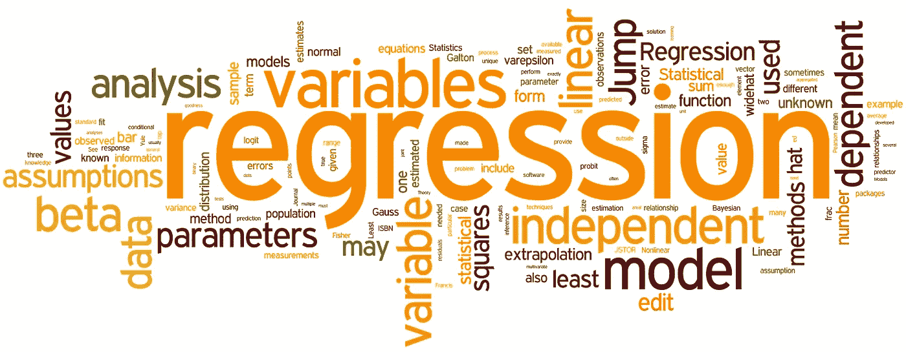
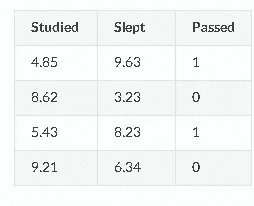
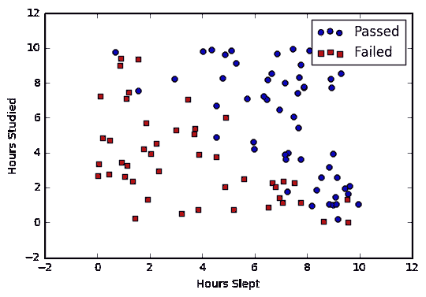
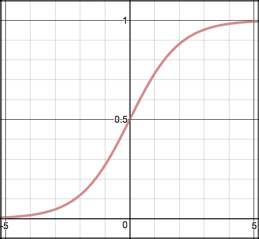

# 统计回归及其类型

> 原文：<https://medium.datadriveninvestor.com/statistical-regression-and-its-types-580b6b5fc136?source=collection_archive---------10----------------------->

这是我的第二个关于统计的博客，我非常兴奋能够从统计回归的概念开始。统计学中有不同类型的回归(T1 ),但在讨论它们的细节之前。下面我们来了解一下 ***什么是统计回归？*** 回归是统计学科的分支，在预测分析数据中起着重要作用。它还用于计算因变量与单个或多个预测变量之间的联系。回归的主要目的是拟合给定的数据，使它们必须存在于最少的异常值。

回归是受监督的机器学习方法，也是预测模型不可或缺的一部分。换句话说，回归意味着以特定方式穿过 X-Y 图的所需数据点的曲线或直线，使得垂直线和所有数据点之间的距离被认为是最小的。点和线之间的距离指定了样本是否有强连接，然后称为校正。

回归分析主要用于以下分析:

*   预测变化的影响。
*   因果分析。
*   预测趋势。

回归的应用使它对销售、市场研究、股票预测和其他方面都有好处。以几种**类型的回归**方法为基础，表示自变量的数量以及这些变量之间的联系。不同的**回归类型**有:

# 回归的类型

目录

# 线性回归

它是用于分析回归基础的基本回归样本。如果我们有一个单一变量(X)和其他变量(Y ),那么这个**类型的回归**可以用来显示彼此之间的线性关系。这被称为线性回归。如果有一个以上的预测因子，那么这可以被称为多元线性回归样本。线性回归可以定义为:

**y=ax+b+e**

其中 a =直线斜率，b = y 轴截距，e =误差项。

该线可用于确定参数 a 和 b 的值，系数 x 和截距可通过最小二乘法来预测，该最小二乘法使给定样本数据内的平方误差最小化。计算值 Y 和预测值 Y 之间的差异称为预测误差，表示为:

**Q =σ(Y-Y)**

# **逻辑回归**

逻辑回归是一种分类算法，用于将观察值分配给一组离散的类。与输出连续数值的线性回归不同，逻辑回归使用逻辑 sigmoid 函数转换其输出，以返回一个概率值，该概率值可映射到两个或多个离散类。

# [与线性回归的比较](https://ml-cheatsheet.readthedocs.io/en/latest/logistic_regression.html#id18)

给出学习时间和考试分数的数据。[线性回归](https://ml-cheatsheet.readthedocs.io/en/latest/linear_regression.html)和逻辑回归可以预测不同的事情:

*   **线性回归**可以帮助我们在 0-100 的范围内预测学生的考试成绩。线性回归预测是连续的(一个范围内的数字)。
*   逻辑回归有助于预测学生是否通过考试。逻辑回归预测是离散的(只允许特定的值或类别)。我们还可以查看模型分类下的概率得分。

# [逻辑回归的类型](https://ml-cheatsheet.readthedocs.io/en/latest/logistic_regression.html#id19)

*   二进制(通过/失败)
*   多(猫、狗、羊)
*   序数(低、中、高)

# [二元逻辑回归](https://ml-cheatsheet.readthedocs.io/en/latest/logistic_regression.html#id20)

假设我们得到了关于学生考试成绩的数据，我们的目标是根据学生的睡眠时间和学习时间来预测他们是否会通过考试。我们有两个特征(睡眠时间，学习时间)和两个类:通过(1)和失败(0)。

在图形上，我们可以用散点图来表示我们的数据。

# [乙状结肠激活](https://ml-cheatsheet.readthedocs.io/en/latest/logistic_regression.html#id21)

为了将预测值映射到概率，我们使用了 [sigmoid](https://ml-cheatsheet.readthedocs.io/en/latest/activation_functions.html#activation-sigmoid) 函数。该函数将任何实数值映射到 0 和 1 之间的另一个值。在机器学习中，我们使用 sigmoid 将预测映射到概率。

数学

s(z)= 11+ezs(z)= 11+ez

注意

*   s(z)s(z)= 0 和 1 之间的输出(概率估计值)
*   zz =函数的输入(算法的预测，例如 mx + b)
*   ee =自然对数的基数

图表

# 多项式回归

这在某种程度上类似于多元线性回归。在这些**类型的回归**中，变量 X 和 Y 之间的关系被表示为多项式 X 的第 k 次。它适用于非线性样本的数据，也适用于估计量的线性样本。可以利用最小二乘法进行拟合，但是需要对高度相关的单个单项值进行解释。因变量 Y 的假设值可通过以下等式建模:

**y = a1 * x1+(a2)* x2+(a_3)⁴*x_3……)。a_n*X_n + b**

通过这些点的线可能不是直的，但它可以是弯曲的，因为它取决于 x 的幂。通过在观察到的曲线中引入更多的振荡，可以容易地计算多项式的最高次数，并且它可能具有较低的插值器属性。使用现代方法，多项式回归可以用作支持向量机算法的核心。

# 里脊回归

我们可以说，这是另一种**类型的回归**，是线性回归的稳健版本，不太适合过度拟合的值。样本提供了回归系数平方相加的一些惩罚或约束。最小二乘法可以估计最小方差的参数值。如果预测变量被高度校正，则偏差因子可以参与缓解问题。为了消除这个问题，岭回归将一个小的平方偏差因子加到变量上:

**min || Xw — y || + z|| w ||**

运筹学

**min || Xw — y ||**

其中 X 定义特征变量，w 定义权重，y 定义基本事实。

使用偏差矩阵方法对最小二乘方程求和，最后加上平方可以最小化并执行低方差参数的值。偏差矩阵对于需要选择最佳值的标量多重相同矩阵也很重要。

# 套索回归

LASSO 代表最小绝对收缩选择器运算符。是**类型的回归**是岭回归的替代。唯一的区别是这是用来惩罚回归系数的大小。使用惩罚方法，估计的系数向零值收缩，这是用岭回归方法不可能的。

然而，lasso 不使用岭回归等平方偏差，而是使用绝对值偏差:

**最小|| Xw — y || + z|| w ||**

这种技术有助于将其用于特征选择，其中为样本构造选择变量或集合和参数。它采用相关的零和具有不相关值的特征，用于避免过度拟合，并使学习更快成为可能。既是正则化样本，又是特征选择。

# 弹性网络回归

它是岭回归和 LASSO 的混合，增加了线性惩罚值 L1 和 L2，在一些应用中可以优先于这两种技术。它可以通过以下方式计算:

**min | | Xw—y | |+Z1 | | w | |+z2 | | w | |**

脊和套索之间这种折衷的实际好处是，这种方法允许在旋转值下继承脊的稳定性。

关于 ElasticNet 回归的几点:

*   它用于鼓励相关变量的效果，而不是像 LASSO 一样将值归零。
*   它对所选变量的数量没有限制。

# 结论

这个博客提供了 6 种**回归类型**，包括线性、脊形、套索等等。所有这些都用于在多重共线性和维度的情况下分析不同的变量集。

我们希望你正在学习。这是我关于数据分析统计学的第二篇博客。在下一篇博客中，我将会谈到统计学更重要的方面。因此，如果你有任何问题或意见，如果事情不清楚，请告诉我！

感谢阅读。
:)*而且，❤好像这是一本好书。尽情享受吧！*