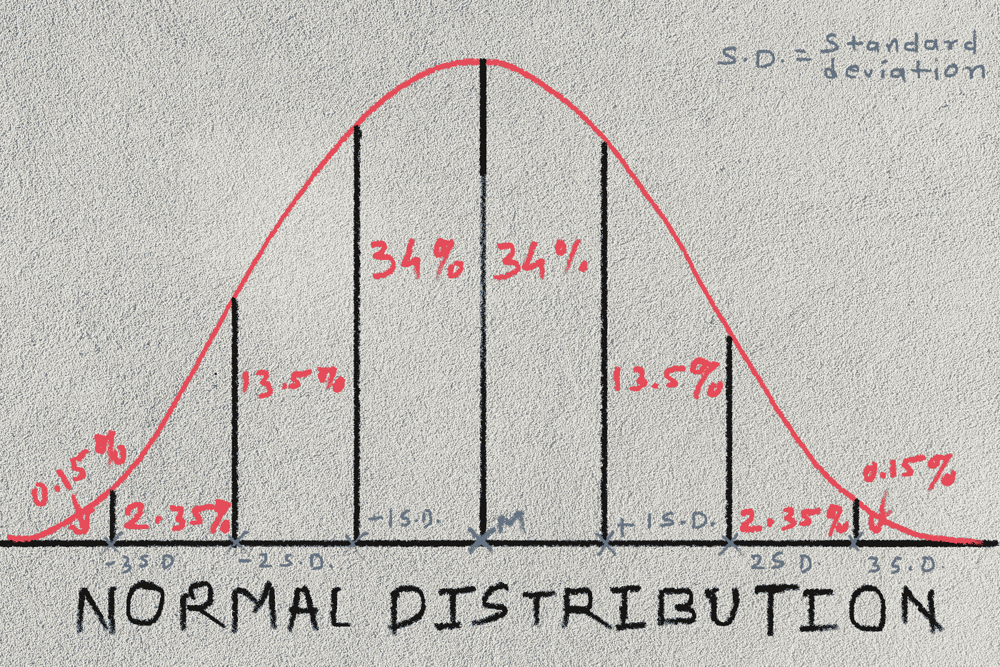
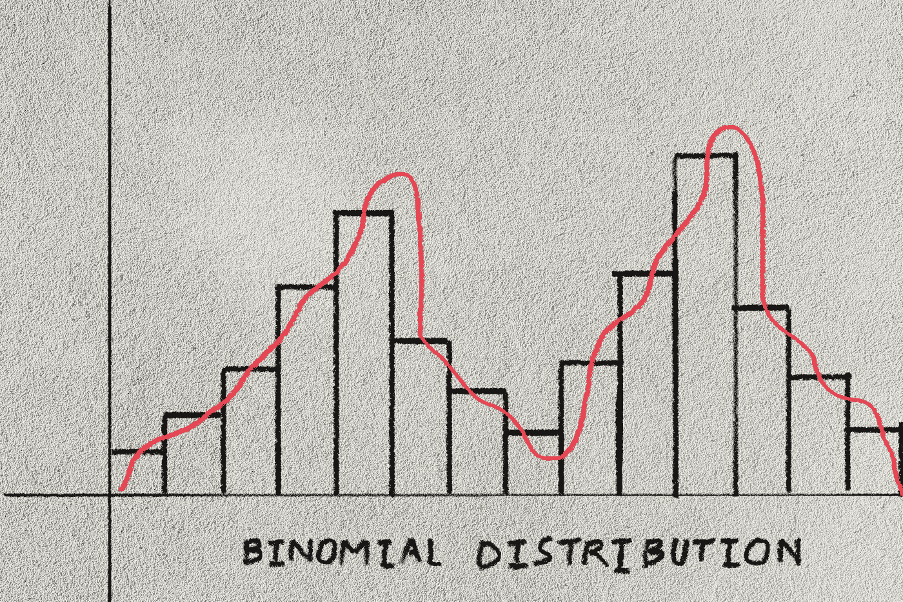
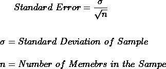
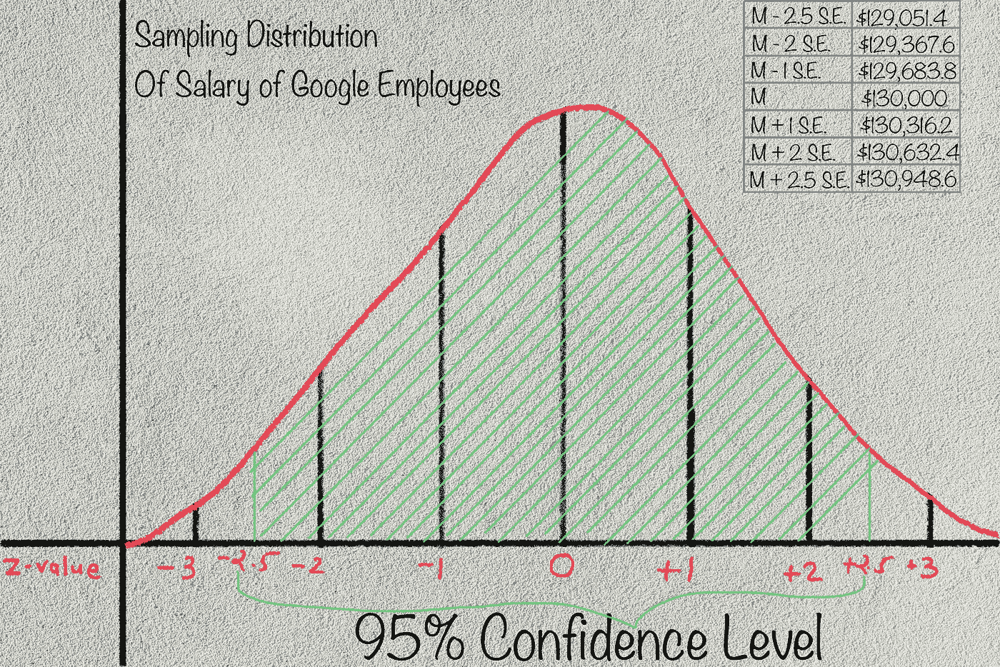
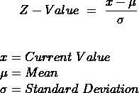

# 统计学 101:统计推断

> 原文：<https://medium.datadriveninvestor.com/statistics-101-statistical-inference-37c9ed1ed2d9?source=collection_archive---------8----------------------->

## 从样本的定义到总体到统计推断，学习你需要知道的一切。

Photo by [Ruthson Zimmerman](https://unsplash.com/@ruthson_zimmerman?utm_source=medium&utm_medium=referral) on [Unsplash](https://unsplash.com?utm_source=medium&utm_medium=referral)

这些将是文章的流程:

*   问题陈述
*   什么是人口？
*   什么是样本？
*   什么是正态分布？
*   什么是抽样分布？
*   样本均值与总体均值的关系？
*   什么是统计学？
*   什么是参数？
*   什么是统计推断？
*   问题陈述的答案

在整篇文章中，为了使这个概念更容易理解，我将引用一个例子。

# 问题陈述:

假设我只有 1000 名随机谷歌员工的数据，他们是我在山景城的某个随机咖啡馆遇到的。我们的主要目标是最大程度地确定所有谷歌员工的平均工资(注意，我们永远不可能 100%确定，但我们肯定会尽力而为！)只有 1000 名员工的数据。

# 什么是人口？

人口不一定指一群人。群体是指必须对其进行分析的一组成员。

例如，所有这些可以被认为是一个**群体**:

*   全世界所有 COVID 阳性患者
*   X 大学的所有学生
*   所有安卓手机
*   由特定公司制造所有笔记本电脑
*   X 国的所有鸡

在我们的问题陈述中，所有谷歌员工都是我们的人群集合。

# 什么是样本？

如你所知，在现实世界中，我们无法收集整个人口的数据。这就是为什么我们从真正代表人口的一些人口成员那里获取数据。这组成员叫做**样**。注意，样本的成员必须是随机选择的**，每个成员都应该有**均等的机会被选中**。**

**在我们的问题陈述中，1000 名谷歌员工(还记得吗，我在咖啡馆遇到的！！！)是我们的样本。**

**根据样本的定义，样本的成员必须是随机选择的。但是在我们的问题陈述中，我在某个咖啡馆遇到了来自一个城市的所有员工。现在，这种数据收集将导致我们有偏见的结果，因为我们没有考虑在办公室工作的员工，他们可能是工资级别更高的高级员工！此外，可能会有一些员工因公出差，我甚至没有考虑到他们！**

**所以，这些是我们问题定义中的一些错误，在现实生活中，当我们从样本中收集数据时，这是不应该发生的。但是为了便于理解，我们将忽略这一点。(然而，相反，你也可以将定义改为*所有在家为山景城办公的谷歌员工的平均工资！*)。所以无论何时你收集样本，都要记住这一点。**

# **什么是正态分布？**

**当我们使用正态分布时，我们假设我们的数据是正态分布的(图 1)。请注意，正态分布是理想的曲线，在现实世界中，数据永远不会呈正态分布，但大多数时候它会接近正态分布曲线。**

****

**Figure 1: Normal Distribution**

**图的中心是样品的平均值，从中心到左侧的检验点分别表示平均值-1 标准差(标准偏差)、平均值-2 标准差、平均值-3 标准差，从中心到右侧分别表示平均值+1 标准差、平均值+2 标准差、平均值+3 标准差。**

**这里有一些例外。假设，你收集了贝克街某一天的事故数量数据，那么图表就会是这样的。(图 2)**

****

**Figure 2: Skewed Distribution**

**这被称为歪斜图，其中大部分数据位于两侧。(不是很明显一天内发生 5 起事故的可能性很小吗！)**

**同样，请参见图 3。这被称为二项式分布。如果你在你的数据中发现了这种图形；这意味着在人群中存在两个不同的亚群体。**

****

**Figure 3: Binomial Distribution**

# **什么是抽样分布？**

**考虑一个假设的场景，我们有多个样本，每个样本中的成员数等于总体成员总数。**

**例如，如果总体有 1000 个成员，那么我们可能有 10 个样本，每个样本中有 100 个成员。所以，现在有了多个样本，我们也有了多个样本均值！**

**样本均值的正态分布称为抽样分布。**

**现在你可能会问，我怎么能说样本均值是正态分布的呢？为了回答这个问题，我强烈推荐这个网站。**

# **样本平均值与总体平均值有什么关系？**

**我们刚刚看到了什么是抽样分布。样本平均值等于总体平均值。**

**但问题是我们没有多个样本，我们只有一个样本！那我们是怎么得到多个样本的？我们来回答这个问题。**

**样本均值的标准差称为**标准差**。为了绘制正态分布图，我们需要两个部分:一个是平均值，第二个是标准差(在这种情况下，标准差)。由于我们没有多个样本，我们将使用此公式对标准误差进行估计。**

****

**Formula 1: Standard Error**

**让我们来回答我们之前看到的主要问题陈述。我们需要找到所有谷歌员工的平均工资，而我们只有 1000 名随机员工的数据。假设这 1000 名员工的平均工资为 13 万美元，标准差为 1 万美元。根据标准误差的公式(公式 1)，大约为 316.2 美元。**

****

**Figure 4: Sampling Distribution of Salary of Google Employees**

**这张图表回答了我们所有的问题。我们来看看怎么解读？你必须注意，我们永远不可能 100%确定总体均值，但我们肯定会提到我们对结果有多有信心。**

**最重要的部分来了，跟着我。请看图 4 和图 1。我们可以说**我们有 68%的信心，所有谷歌员工的平均工资将在 129683.8 美元到 130316.2 美元之间。**换句话说，无论何时我说 1 S.E，2 S.E，-3.5 S.E 等，所有谷歌员工的平均工资都有 68%的概率在 13 万美元-1 S.E 和 13 万美元+ 1 S.E 之间；这意味着我指的是 Z 值。Z 值的公式如下所示:**

****

**Formula 2: Z-Value**

**但这是 68%的信心水平吗？嗯，说实话，不是。在工业中，95%的置信水平和 99%的水平被认为是标准。那么，我们应该考虑 95%(平均值±2 标准差)还是 99%(平均值±2.5 标准差)的置信度呢？我们应该考虑的置信度严格取决于问题的敏感性。在这种情况下，我们可以有 95%的信心。置信度越高，范围越大。**

**如果您想考虑任何其他置信水平，请参考[正态分布](https://www.mathsisfun.com/data/standard-normal-distribution-table.html)表来确定范围。**

# **什么是统计学？**

**样本的均值、众数、中位数、标准差等成分称为统计量。**

**参照我们的问题陈述，那 1000 个谷歌员工的工资的均值、众数、中位数、标准差，叫做统计。**

# **什么是参数？**

**总体的均值、众数、中位数、标准差等组成部分称为参数。**

**在我们的问题陈述中，所有谷歌员工工资的均值、众数、中位数、标准差被称为参数。**

# **什么是统计推断？**

**正如我们所讨论的，我们的主要目标是仅基于一个样本对总体做出准确的预测。**

**从统计数据推断参数的过程称为统计推断。**

**因此，在我们的案例中，从 1000 名员工中得出所有谷歌员工平均工资的过程被称为统计推断。**

**你必须明白，它总是容易出错，我们无法阻止这一点，但是，我们最大的努力是确定我们可能有的不确定性水平。**

# **问题陈述的答案**

****我们有 95%的信心，所有谷歌员工的平均工资将在 129，367.6 美元至 130，632.4 美元之间****

****参考:****

**德里克·朗特里的《无泪统计》**