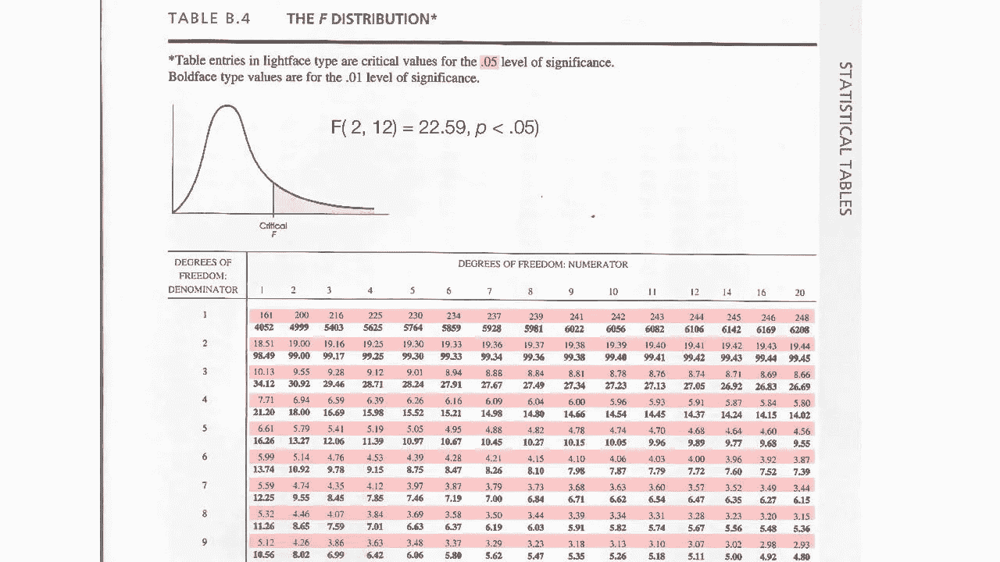

# 统计学:ANOVA(方差分析)

> 原文：<https://medium.datadriveninvestor.com/statistics-anova-analysis-of-variance-767dd0b9db03?source=collection_archive---------4----------------------->

image:SRM University

# **概述:**

统计学中的 Anova(此处特指单向 ANOVA)检验用于确定三个或三个以上独立(不相关)组的平均值之间是否存在任何统计学上的显著差异，并基于任何检验得出结论。

一个 **ANOVA** 测试是一种发现调查或实验结果是否有意义的方法。

让我们通过设置零假设和替代假设来理解方差分析

## **计算方差分析的步骤:**

假设我们想知道每组有三个学生时，每组阅读的书籍数量是否相同。

**第一步:求大平均值**

其两步过程:

**一个**。求每组的总和除以每组中值的总数。

**B** 。将所有组相加，然后除以组数，得到总平均值。

**第二步:计算组间和组内的 DOF(自由度)。**

**自由度(之间)**:K-1 = 3–1 = 2

其中 K 是组的数量

**自由度(以内):N-K = 9–3 = 6**

其中 N 是考虑所有组的值的总数

**第三步:找到要比较的 F(临界)值。检查下面的 F-分布表**

这里考虑的显著性水平是 0.05

**F(临界)** =F(DOF(间)，DOF(内))= **5.14**

**第四步:求平方和(** SStotal **)**

**第五步:求(SSw)组内的平方和**

**第 6 步** : **求(SSb)组之间的平方和**

**步骤 7:组间均方/方差&组内均方/方差**

**步骤 8:找到 F 统计值**

在**步骤 2 中计算的 f(临界)为 5.14**

## **F-统计< F(临界)= 0.058 < 5.14**

如果 F-Statistics 小于 F(临界),这里就是这种情况，**我们无法拒绝零假设。这意味着所有手段都是一样的。(每组读相同数量的书)**

**H0 : μ1=μ2 =μ3=⋯=μc**

**结论**:方差分析是统计学中非常重要的概念，在数据科学领域经常被用来验证测试/实验的方法。

 [## 将定义 2020 年就业前景的五大数据科学和机器学习趋势|数据驱动…

### 数据科学和 ML 是 2019 年最受关注的趋势之一，毫无疑问，它们将继续发展…

www.datadriveninvestor.com](https://www.datadriveninvestor.com/2020/02/19/five-data-science-and-machine-learning-trends-that-will-define-job-prospects-in-2020/) 

希望你喜欢我的文章。请鼓掌👏(50 次)激励我继续写下去。

想要连接:

链接进来:[https://www.linkedin.com/in/anjani-kumar-9b969a39/](https://www.linkedin.com/in/anjani-kumar-9b969a39/)

如果你喜欢我在 Medium 上的帖子，并希望我继续做这项工作，请考虑在**上支持我**