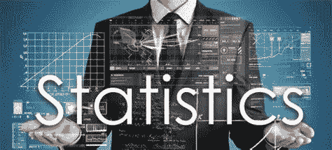
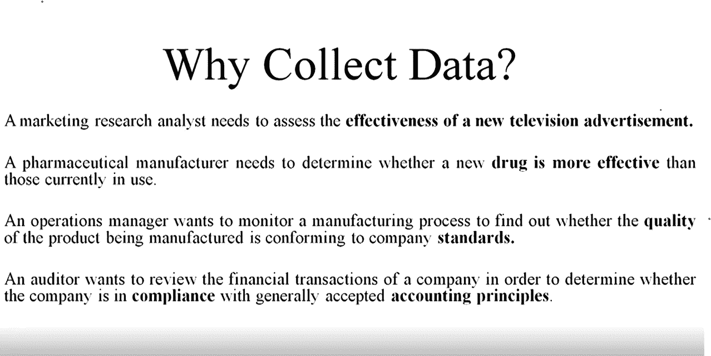

# 统计学:基本理解

> 原文：<https://medium.datadriveninvestor.com/statistics-blog-1-9531f7078580?source=collection_archive---------14----------------------->

> 这是我的第三个博客，也是我的第一个关于统计学的博客，我非常兴奋能够从统计学的基本概念开始。所以让我们先了解一下。

> 当执行数据科学(DS)的艺术时，统计学可以是一个强有力的工具。从高层次的角度来看，统计是使用数学对数据进行技术分析。一个基本的可视化，如条形图，可能会给你一些高层次的信息，但有了统计数据，我们可以以一种更加信息驱动和有针对性的方式来操作数据。今天，我们将探讨数据科学家需要了解的基本统计概念，以及如何最有效地应用这些概念！

## 我们为什么学习统计学？

决策者使用统计数据来:

*   正确展示和描述业务数据和信息。
*   使用从个体或项目的子集收集的信息，得出关于一大群个体或项目的结论。
*   对商业活动做出可靠的预测。
*   改进业务流程。

## **人口多少？**

在统计学中，群体是指我们有兴趣研究的个体、物体或事件的整个群体。我们希望描述或推断的是整个数据集。群体可以是有限的，也可以是无限的，它可以是一群人、动物、植物或任何其他具有某些共同兴趣特征的物体或事件。

例如，如果我们对某个国家的平均收入感兴趣，那么人口就是生活在这个国家的所有人。如果我们对研究特定药物对某种疾病的作用感兴趣，那么人群将是患有该疾病的所有患者。

## **是什么样的？**

人口的子集。

## **参数 v/s 统计:**

*   在统计学中，参数和统计量都是分别描述总体或样本的数值度量。
*   参数是描述总体特征的数值，如平均值或标准差。参数通常是未知的，并且使用从样本收集的数据来估计。
*   另一方面，统计是描述样本特征的数值，例如样本均值或样本标准差。统计学用于估计从中抽取样本的总体的相应参数。
*   参数和统计量的主要区别在于，参数指的是总体的特征，而统计量指的是样本的特征。参数通常是未知的，并且是从样本获得的数据中推断出来的，而统计数据是直接从样本中计算出来的。
*   例如，如果我们想估计一个国家所有人的平均身高，我们可以收集一个人的样本并计算样本平均身高。样本平均身高是一个统计量，可以用来估计相应的总体参数，即总体平均身高。
*   一般来说，统计用于估计参数，并根据样本对总体进行推断。推断的准确性取决于样本的质量和代表性。

## **什么是统计？**

统计学是数学的一个分支，涉及收集、分析、解释和呈现数据。它为理解数字信息提供了一个框架，以便根据这些信息得出结论或做出决策。

统计学应用于广泛的领域，包括商业、社会科学、自然科学、工程、医学等等。它用于描述和总结数据，进行预测或预报，检验假设和对总体进行推断，并根据数据做出决策。

统计学包括多种技术，如描述性统计(如均值、中值和标准差)、概率论、推断统计(如假设检验和置信区间)和回归分析。统计方法可用于模拟变量之间的复杂关系，识别数据模式，量化测量中的不确定性或可变性水平。

随着近年来数据可用性的急剧增加，统计的使用在现代世界变得越来越重要。从预测选举结果到确定医学治疗的有效性，统计在帮助我们理解我们周围的世界方面发挥着至关重要的作用。

## **为什么研究样本而不是人群？**

研究一个样本而不是整个群体在研究中有几个好处。研究样本而非总体的一些原因包括:

1.  成本效益:从整个人口中收集数据可能非常昂贵和耗时。通过研究样本，研究人员可以减少收集数据所需的成本和时间。
2.  可行性:在某些情况下，对整个人群进行研究是不可行的。例如，如果人口非常多或者分布在很大的地理区域，那么可能很难从每个人那里收集数据。在这种情况下，研究样本可能是一种更实用的方法。
3.  更高的准确性:在某些情况下，精心挑选的样本可以提供比研究整个人群更准确的结果。这是因为代表总体的样本可以提供对整个总体特征的洞察。
4.  伦理考虑:在某些情况下，研究整个人群可能是不道德的。例如，让整个人口暴露在有害或危险的干预下可能是不道德的。在这种情况下，研究样本可能是一种更符合伦理的方法。

总的来说，在许多研究背景下，研究样本可能是一种更实用、更经济、更准确的方法。然而，重要的是要仔细考虑取样方法，并确保样本代表感兴趣的人群，以确保调查结果的有效性。

## **创建样本的方法:**

根据研究问题、可用资源和总体特征，从总体中创建样本有几种方法。以下是创建样本的一些常用方法:

1.  简单随机抽样:这是一种方法，在这种方法中，人口中的每个成员都有平等的机会被选入样本。这可以通过使用随机数生成器、随机数表或从帽子里抽出名字来实现。
2.  分层随机抽样:这种方法根据某些特征(如年龄、性别或收入)将人群分为不同的阶层，然后从每个阶层中抽取一个简单的随机样本。这种方法确保每个阶层都在样本中得到代表，并能为总体人口提供更精确的估计。
3.  整群抽样:这种方法包括将人群分成多个群(如地理区域或学校)，然后随机抽取一个群样本来代表人群。当人口分布在一个大的地理区域时，这种方法更具成本效益和实用性。
4.  系统抽样:这种方法包括选择总体中的第 k 个成员，其中 k 是基于总体规模和所需样本规模的预定区间。例如，如果人口规模为 1000，所需的样本规模为 100，则将选择人口中的每 10 个成员。
5.  便利抽样:这种方法包括选择人群中最容易接近的成员，如志愿者、顾客或学生。这种方法不如其他方法可靠，因为它可能无法很好地代表总体，但在时间和资源有限的情况下，这种方法很有用。

根据研究问题、可用资源和人口特征选择适当的抽样方法是很重要的。在任何情况下，目标都是创建一个代表总体的样本，以便获得可靠有效的结果。

## **统计类型:**

在统计学中，有两种主要的统计类型:描述性统计和推断性统计。

1.  描述性统计:描述性统计用于描述数据的基本特征，如集中趋势的度量(如平均值、中值和众数)和可变性的度量(如范围、方差和标准差)。这些统计数据提供了数据的摘要，使我们能够了解数据的分布和模式。
2.  推断统计:推断统计用于根据数据样本对总体进行推断。它们允许我们得出结论，并对抽取样本的人群做出预测。推断统计学包括假设检验、置信区间和回归分析等技术。这些统计数据用于检验假设，并确定在样本中观察到的差异是否具有统计学意义，是否可以推广到更大的人群。

描述性统计和推断性统计在统计分析中都很重要。描述性统计提供了一种总结和描述数据的方法，而推断性统计提供了一种对总体进行预测和检验假设的方法。通过使用这两种类型的统计数据，我们可以更全面地理解数据，并从分析中得出有意义的结论。

## **数据来源:**

**a)主要来源**:数据收集者是使用数据进行分析的人。

*   来自一个政党的数据。
*   从实验中收集的数据。
*   观察到的数据。

**b)二手资料**:进行数据分析的人不是数据收集者

*   分析人口普查数据。
*   检查来自印刷期刊或互联网上发布的数据。

**元素**是收集数据的实体。

**变量**是对元素感兴趣的一个特征。

为特定元素收集的一组观察值称为**观察值。**

**数据集中数据值的总数**是元素数乘以变量数。

## **变量类型:**

**a)分类变量(定性)**其值只能放入“是”和“否”的类别中，例如:婚姻状况、定义的类别等。

**b)数值变量(定量)**具有代表数量的值。它有两种类型:

*   **离散:**计数项目，例如:孩子的数量，每个项目的缺陷。
*   **连续:**测量特性，例如:重量、电压。

**衡量尺度**:尺度决定了数据中包含的信息量。标度表示最合适的数据汇总和统计分析。

**定性标尺**:有两种。

*   名义上的:数据是用来标识元素属性的标签或名称。可以使用非数字标签或数字代码。
*   有序:数据具有名义数据的属性，数据的顺序是有意义的。

**定量秤**:有两种。

*   区间:数据具有有序数据的性质，观察值之间的区间用固定的度量单位表示。
*   比率:数据具有区间数据的所有属性，两个值的比率是有意义的。

## **我们为什么收集数据？**

## **举例:**

## 要点:

*   数据可以进一步分为定性和定量。
*   合适的统计分析取决于变量的数据是定性的还是定量的。
*   一般来说，当数据是定量的时，统计分析有更多的选择。

**横断面数据**:在相同或大致相同的时间点收集的数据。

例如:人口普查数据，详细说明印度每个地区 2017 年 6 月发放的许可证数量的数据。

因此，如果我们收集几个时间段的数据，那么这些横截面数据将被称为**时间序列数据**。

## **统计与概率:**

概率不是统计，反之亦然。概率涉及预测未来事件发生的可能性，而统计学涉及对过去事件发生频率的分析。

概率主要是数学的一个理论分支，它研究数学定义的结果，“而”统计学主要是数学的一个应用分支，它试图解释现实世界中的观察结果。

## 结论:

伙计们，我正在写一系列关于数据分析统计学的博客。在下一篇博客中，我将会谈到统计学更重要的方面。因此，如果你有任何问题或意见，如果事情不清楚，请告诉我！

感谢阅读！。 [**跟着**](https://medium.com/@vijay_choubey) 我上来了解一下。我也是一名自由职业者，如果有一些数据相关项目的自由职业工作，请随时联系 Linkedin。没有什么比做真正的项目更好的了！。如果你喜欢这篇文章，请在这个[**链接**](http://paytm.me/bb-jeH3)…给我买杯咖啡，快乐学习😉

点击订阅 DIntel [。](https://ddintel.datadriveninvestor.com/)

请访问我们的网站:[https://www.datadriveninvestor.com](https://www.datadriveninvestor.com/)

在这里加入我们的网络:【https://datadriveninvestor.com/collaborate 