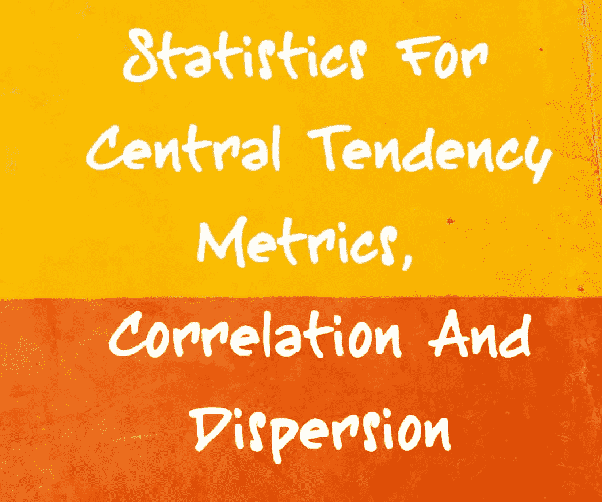
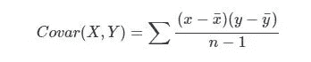
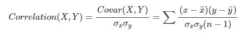
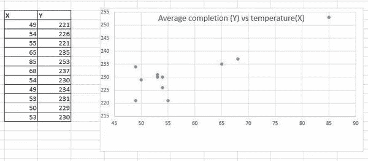

# 集中趋势度量、相关性和分散性的统计数据

> 原文：<https://medium.datadriveninvestor.com/statistics-for-central-tendency-metrics-correlation-and-dispersion-3938a1ac15f4?source=collection_archive---------1----------------------->

嗨，伙计们，我希望你们都很好。在今天的博客中，我们将学习集中趋势度量所需的统计数据，然后是分散性和相关性。

统计学是数学的一个非常广泛的分支，它处理与数据有关的一切，从数据的收集和组织到数据的分析、展示和解释。随着数据量的不断增加，统计已经成为每个领域中使用数据或处理数据的重要工具。

每当我们工作或处理少量数据时，就有可能从个人的角度来讨论数据项。然而，当我们处理或处理大型或大量的数据时，这些数据基本上是指现实世界中的问题场景，我们需要一些能够以期望的格式轻松表示数据的特性。

在本文中，我们将首先为单个变量引入这样的度量。比如说某个学校的学生体重。这些措施将包括集中趋势的措施和分散的措施。然后我们将看看理解两个不同变量之间关系的方法。例如，我们将尝试回答学生的身高和体重是如何相关的。为此，我们将引入两个变量之间相关性的概念。

# 集中趋势测量

均值、中值和众数等集中趋势的度量是给我们一些关于数据的[集中性](http://sorana.academicdirect.ro/pages/doc/Eng2015/CentralityMeasuresFinal.pdf)的概念的度量。让我们详细看一下每一个

# 平均

平均值是所有数据的总和除以数据点的总数得到的值。数学上，

让我们来看一组非常简单的数据，代表 10 个男性的体重，

55, 56, 56, 58, 60, 61, 63, 64, 70, 78.

平均重量计算如下:

平均重量=(55+56+56+58+60+61+63+64+70+78)/10

= 62.1

# 中位数

像均值一样，中位数是集中趋势的另一种度量。

定性地说，它指的是位于集合中间位置的数据。

在具有奇数个数据点的集合中，中值是最中间的值，而如果数据点数是偶数，则它是两个中间项的平均值。

在前一组中，由于数据的数量是 10(偶数)，第 5 和第 6 项对应于中间数据项。所以中位数是第五项和第六项的平均值，

中位数= (60 + 61)/2 = 60.5

# 方式

模式是指在给定的数据集中出现频率最高的数据项。在上面的数据集中，权重 **56** 出现两次，而所有其他的只出现一次。所以众数权重是 56。有时两个或更多的项目会出现最多的次数。在这种情况下，两个项目都是数据的模式，数据集是[多模式](https://en.wikipedia.org/wiki/Multimodal)。

现在让我们看看下一部分

# 散布

离差的度量量化了数据的分布。他们试图测量各种数据点之间的差异有多大。

# 范围

一个简单的测量方法是范围，它是最大和最小数据项之间的差值。对于我们之前的数据集，

范围= 78–55 = 23。

# 差异

离差的一个更复杂的度量是方差，

**方差表示数据项偏离均值的程度。**

1)较大的方差意味着数据项偏离平均值更多。

2)较小的方差意味着数据项更接近平均值。

现在让我们计算前一个数据集的方差，

*方差=**[(55–62.1)+(56–62.1)+(56–62.1)+(58–62.1)+(60-*

*62.1)+(61–62.1)+(63–62.1)+(64–62.1)+(70–62.1)+*

*(78–62.1)]/9。*

*= 466.9/9*

*= 51.88。*

# 标准偏差

它就是方差的**平方根。上式中， **σ** 为标准差， **σ2** 为方差。因此，在本例中，标准偏差为**

标准差= sqrt(51.88) = 7.20

# 相互关系

相关性是一种量化两个不同变量之间相互关系的方法。

示例:

假设我们有一个十个男性的身高和体重的数据集。通常我们认为一个人的体重和身高是相关的，也就是说，一个高个子比一个矮个子有更多的机会拥有更多的体重。相关性衡量这些类型的数据之间的关系。

# 协方差

其中一种方法叫做协方差，它衡量两个变量之间的差异。数学上它被定义为，

它被表示为两个，正和负协方差。

1) **正协方差**表示一个变量的较高值对应于另一个变量的较高值，对于较低的值也是如此。

2) **负协方差**另一方面，表示一个变量的较高值对应于另一个变量的较低值。

因此，协方差的符号向我们展示了两个变量之间的线性关系。

注:协方差非常接近零表示两个变量之间缺乏相关性。

# 最后总结文章的是相关系数

相关系数通过将**协方差**除以两个变量的**标准差**的乘积而获得。数学上它被定义为，

数值介于 **+1 和-1** 之间。

*+1 表示完美的递增线性关系(相关性)。*

*-1 表示完美的递减线性关系(反相关)。*

示例:

让我们计算以下数据集的相关性，该数据集显示了平均比赛完成时间(Y)与比赛期间平均温度(x)的关系:

Data of race completion time (Y) vs temperature (X)

对于上述数据集，协方差为 82.16，相关性为 0.855。由于相关性为 0.855，我们说这两个值正相关。我们可以得出结论，较高的平均温度值意味着需要更多的时间来完成比赛。

重要提示:请参考相关与因果关系的链接

[**关联 vs 因果**](http://www.abs.gov.au/websitedbs/a3121120.nsf/home/statistical+language+-+correlation+and+causation)

我希望上面收集的东西是有知识的，并会给你一个关于这个主题的一瞥，在这一点上，我想今天就到此为止。请关注我，了解我在**Medium**&[**LinkedIn**](https://www.linkedin.com/in/madhav-mishra-65783388/)上所有博客的更新。如果你真的喜欢上面的东西，请点击下面的按钮来表达你的爱，因为学习是没有止境的。

感谢您的阅读…！

参考资料:

[概率统计导论](https://ocw.mit.edu/courses/find-by-topic/#cat=mathematics&subcat=probabilityandstatistics) |麻省理工学院开放课件