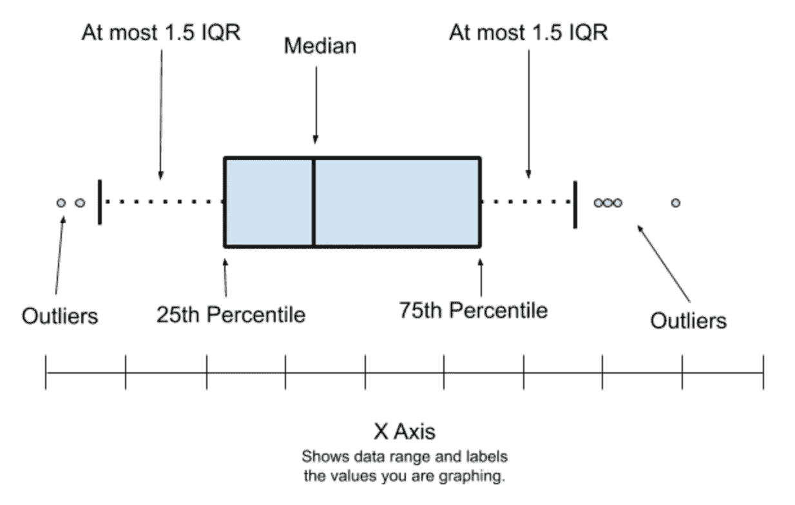
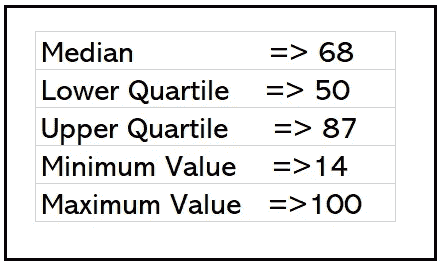
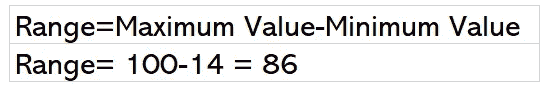
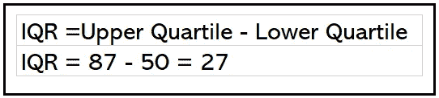
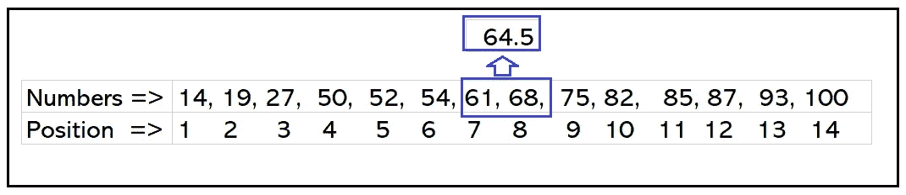
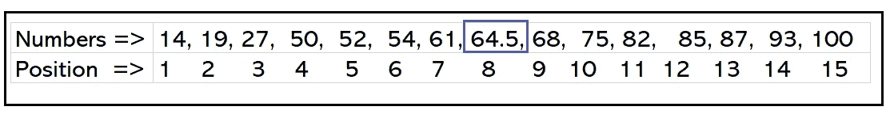
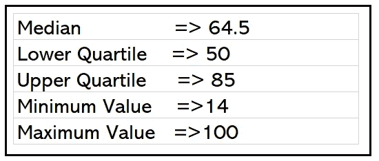
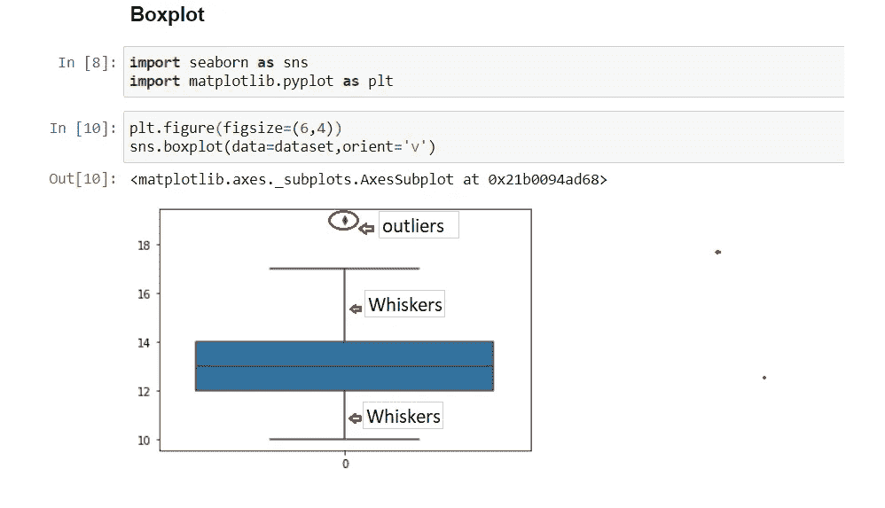
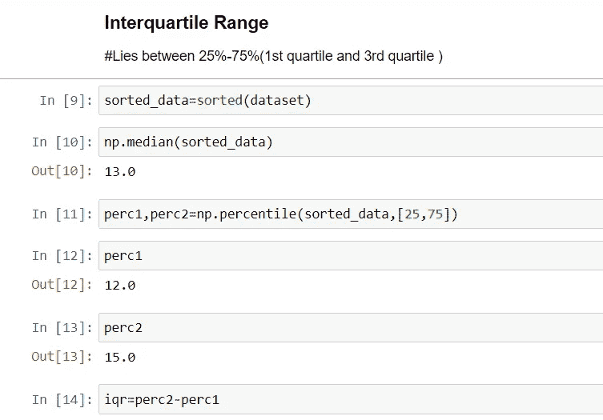
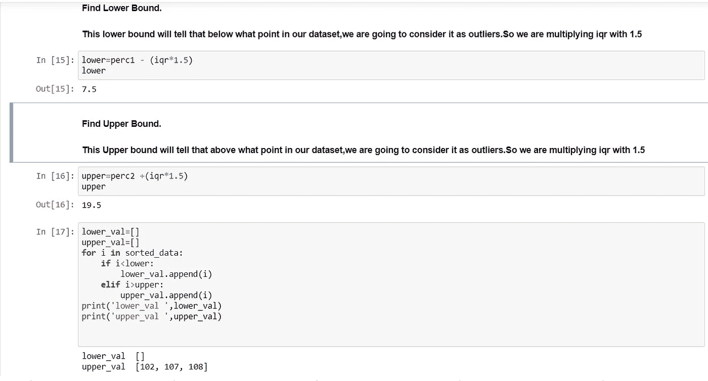

# 数据科学统计学:盒须图

> 原文：<https://medium.datadriveninvestor.com/statistics-for-data-science-box-whisker-plots-e5ce7e9ff92a?source=collection_archive---------3----------------------->

Image:DBA Services

# **简介**

统计是分析行业的基础。所有的机器学习、深度学习、NLP 算法都以这样或那样的形式使用统计数据。

我们将在这里看到统计中关于盒须图的细节。

# **涵盖话题:**

1.  盒须图
2.  五个数摘要
3.  盒须图的工作示例
4.  范围
5.  四分位数间距(IQR)
6.  盒须图在机器学习中的应用。

**框&须状图:**

箱线图也称为五位数汇总，使用中值、上四分位数、下四分位数以及最小值和最大值汇总数据。它允许您一目了然地(直观地)看到数据的重要特征。这也有助于我们可视化数据集中的异常值。

**方框图或五个数字汇总有以下五条信息。**

1.中位数

2.下四分位数(第 25 个百分位数)

3.上四分位数(第 75 个百分点)

4.最小值

5.最大值

Image : Public Lab

**盒子&须状图的工作示例:**

让我们用这个例子来理解盒图。

**步骤 1** —取给定的一组数字

14, 19, 100, 27, 54, 52, 93, 50, 61, 87,68, 85, 75, 82, 95

按升序排列数据

14, 19, 27, 50, 52, 54, 61, 68, 75, 82, 85, 87, 93, 95, 100

**第二步** —求该数据集的中值。中位数是有序数据集中的中间值。

14，19，27，50，52，54，61， **68** ，75，82，85，87，93，95，100

这是 68。

**第三步** —让我们找到下四分位数。

下四分位数是在步骤 2 中找到的中值左侧的中值(即 68)

(14，19，27， **50** ，52，54，61)，68，75，82，85，87，93，95，100

下四分位数是 50

第四步——让我们找到上四分位数。

上四分位数是从步骤 2 中找到的中间值右侧开始的中位数(即 68)

14，19，27，50，52，54，61，68，(75，82，85， **87** ，93，95，100)

上四分位数是 87

第五步 —让我们找出最小值

它的值位于该数据集的最左端或排序后数据集中的第一个值。

14、19、27、50、52、54、61、68、75、82、85、87、93、95、100

最小值是 14

第六步 —让我们找出最大值

它的值位于该数据集的最右端或排序后的数据集中的最后一个值。

14，19，27，50，52，54，61，68，75，82，85，87，93，95， **100**

最大值为 100

**范围:**

范围基本上是我们数据集的分布。范围可以通过最大值和最小值之间的差值来确定。

**四分位距(IQR):**

四分位数间距(IQR)是上四分位数和下四分位数之间的差值。

如上图，我们的下四分位数是 50，上四分位数是 87

**偶数数据集盒图:**

**第一步**:

**我们下面有 14 条记录。**

14, 19, 100, 27, 54, 52, 93, 50, 61, 87,68, 85, 75, 82

按升序排列数据

14, 19, 27, 50, 52, 54, 61, 68, 75, 82, 85, 87, 93, 100

**步骤 2** :因为我们偶数取中间的两个值，将它们相加，然后除以 2。

这里位置 7 和 8 的值是中间值。

所以我们新的中间值是 64.5

继续第 3 步至第 6 步，以获得第**部分&须状图**的**工作示例中提到的值。**最终结果如下

# **在机器学习中使用盒状&须状图:**

盒须图用于显示数据集中的异常值。离群值是那些远离其他数据集的值

**使用 Python 代码检测异常值:**

这里 **102、107 和 108 是异常值**

**结论:**这里总结了盒须图和五数汇总。这对于机器学习中的离群点可视化&检测&去除是有用的。

 [## 将定义 2020 年就业前景的五大数据科学和机器学习趋势|数据驱动…

### 数据科学和 ML 是 2019 年最受关注的趋势之一，毫无疑问，它们将继续发展…

www.datadriveninvestor.com](https://www.datadriveninvestor.com/2020/02/19/five-data-science-and-machine-learning-trends-that-will-define-job-prospects-in-2020/) 

希望你喜欢我关于数据科学统计学的文章。请鼓掌👏(50 次)激励我继续写下去。

想要连接:

联系方式:[https://www.linkedin.com/in/anjani-kumar-9b969a39/](https://www.linkedin.com/in/anjani-kumar-9b969a39/)

如果你喜欢我在 Medium 上的帖子，并希望我继续做这项工作，请考虑在 [**patreon**](https://www.patreon.com/anjanikumar) 上支持我