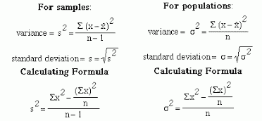
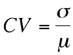
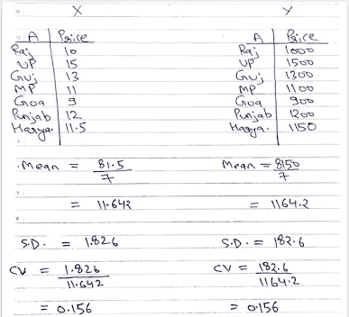
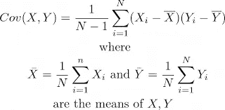
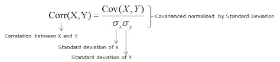

# 统计—我

> 原文：<https://medium.datadriveninvestor.com/statistics-i-302d540ee4b1?source=collection_archive---------19----------------------->

# ***中枢倾向***

**Mean** :数据集中特征的平均值(实数)。平均值受异常值的影响很大。当我们面对缺失值时，它的值用于数据预处理步骤。我们用平均值代替缺失值。当我们有正态分布，意味着数据是连续的和对称的时，它应该被用作一个统计参数。

**Median** :数据集中一组有序特征值的中间值。它不受异常值的影响。如果有 2 个中值，则取这 2 个值的平均值作为中值。

**模式**:数据集中出现频率最高的值，用于分类值。

# 变化性

**方差**:数据点围绕其均值的离差。它衡量相对于平均值分布了多少数据。方差越大，数据集中的变化就越大。

[**Standard Deviation and Variance**](https://i2.wp.com/makemeanalyst.com/wp-content/uploads/2017/05/variation06.gif?resize=418%2C193)

**标准偏差**:引入该术语是为了考虑方差的较高值。这是数据点和平均值之间的标准差值。它是方差的平方根。

**变异系数(CV)** :表示标准差与均值的比值，用于衡量两个数据集的可变性，即使均值不同。这是一个无单位的量。

[**Coefficient**](https://i1.wp.com/www.resourcesystemsconsulting.com/wp-content/uploads/Cv.png?w=328&ssl=1)

示例:-

有两个数据集 X 和 Y 显示了印度不同邦的商品 A 的价格。x 表示以卢比为单位的价格，Y 表示以比索为单位的价格。尽管这两种方法之间有巨大的差异( ***11.642*** 和 ***1164.2*** )我们可以从 ***CV*** 中得出结论，这两个数据集是相同的，只是以两种不同的单位显示价格。

**协方差**:简单来说就是告诉变量一起变化多少。它讲述了两个变量之间的无标度关系。

两个变量之间的**正**协方差表明它们的值在同一个方向变化，无论它们是增加还是减少。

两个变量之间的负协方差表明它们的值在相反的方向变化。如果一个变量增加，那么第二个变量减少，反之亦然。

**Covariance**

因为协方差幅度既没有缩放也没有限制在某个范围内。它的值可以从负无穷大到正无穷大。现在问题出现了，如何判断两个变量之间的关系。

所以引入了一个新的术语**相关系数**来解决这个问题。

**相关系数**:它告诉我们两个变量之间的关系，它们一起变化了多少。可以有把握地说，协方差的**标度**版本。它的值介于-1 到+1 之间，包括-1 和+1。

现在我们知道了它的最小值和最大值，所以我们可以知道变量的相关性有多强。

如果值是-1，那么变量有一个**完美负相关。**

如果值为+1，则变量具有**完美的正相关性。**

如果值为 0，则变量**不相关**。

相关系数也称为 **r 值**。

在数据科学中，可以使用熊猫库中的 corr()函数直接计算。

> 进口熊猫作为 pd
> 
> df = pd.read_csv('../data . CSV’)
> 
> df.corr()

上面的函数给出了数值数据类型特征之间的相关矩阵。默认情况下，该函数使用 **Pearson** 函数来计算相关性。

有 3 种流行相关性度量:

1.  皮尔逊相关测度
2.  斯皮尔曼等级相关
3.  肯德尔相关测度

**Pearson Correlation**

如果你喜欢并欣赏这本书，👏👏拍手分享。

你可以在 这里找到 [**的代码。
你可以在**](https://github.com/pranavkriya/statistics/blob/main/Statistics_%E2%80%94_I.ipynb) **[**Linkedin**](https://www.linkedin.com/in/pranavgarg1506/) 上和我联系**