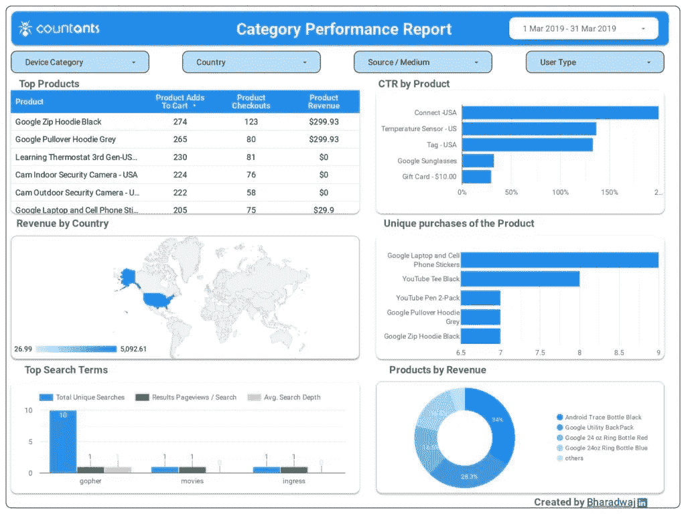
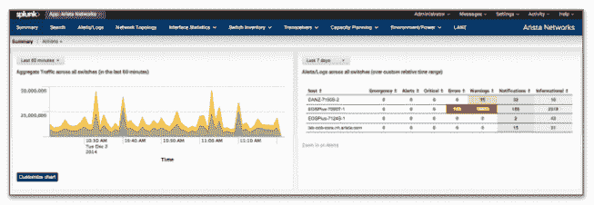
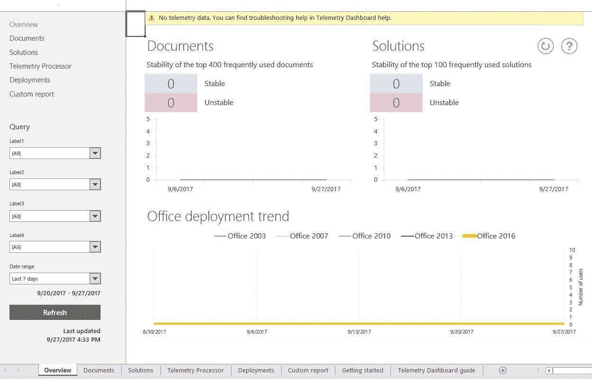
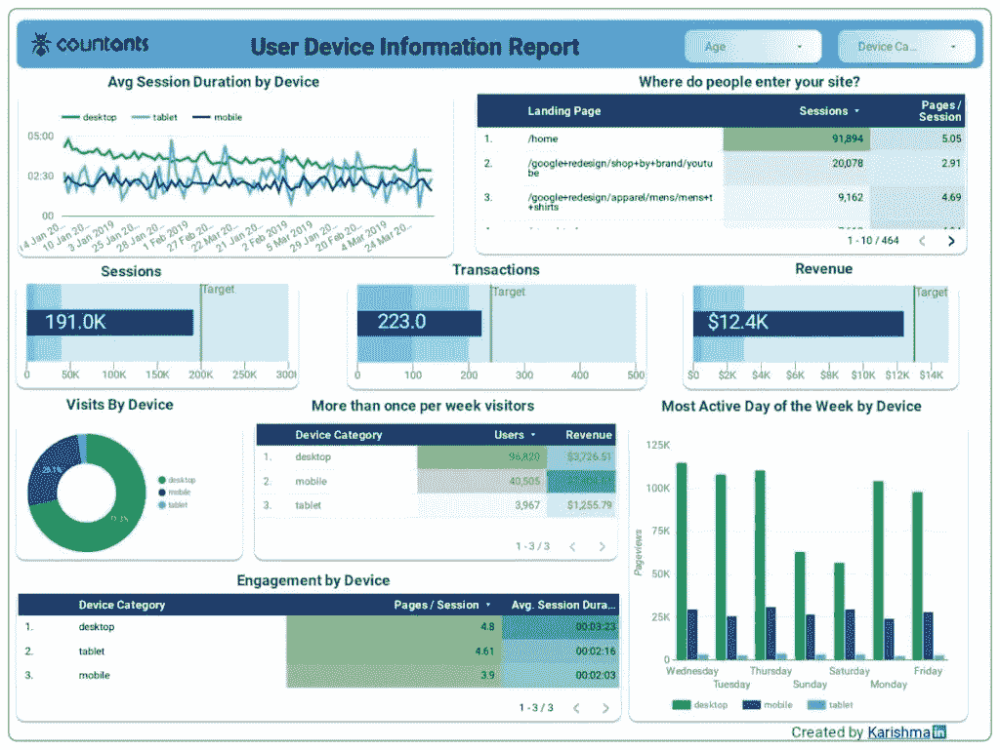
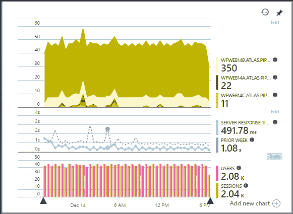
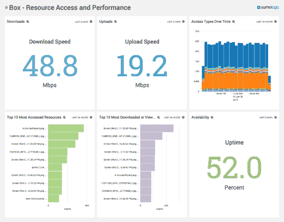
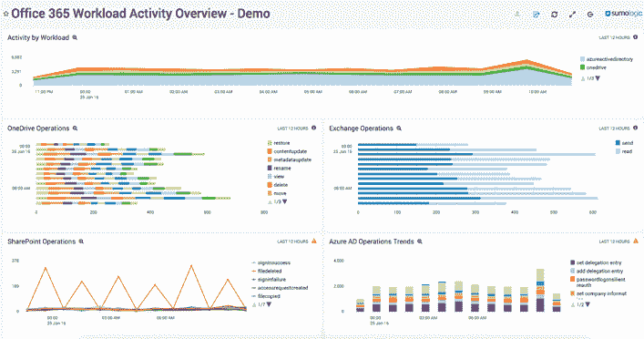
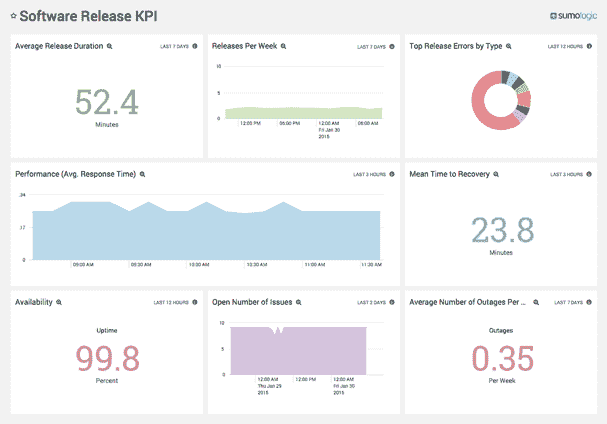

# 用于用户管理的统计和遥测仪表板

> 原文：<https://medium.datadriveninvestor.com/statistics-telemetry-dashboard-for-user-management-9b1e7ade5170?source=collection_archive---------2----------------------->

在监控任何软件应用时，遥测都是这一过程不可或缺的组成部分。顾名思义，遥测是通过使用技术记录和监控来自任何远程源或系统的数据的过程。

在 IT 和软件领域，部署遥测和监控是为了观察各种应用指标，如服务器负载和性能、内存使用情况，甚至对用户体验的影响。

尽管有最新的创新，遥测系统并不是一个新的发展，而是从 19 世纪就已经存在了。例如，已经设计了自动通信系统来远程收集实时数据并传输数据以进行更好的监控。此外，遥测系统已被用于运输和气象行业的应急管理、任何问题的远程故障排除，甚至用于增强网络安全。

 [## 2019 年最值得学习的编码语言|数据驱动的投资者

### 在我读大学的那几年，我跳过了很多次夜游去学习 Java，希望有一天它能帮助我在…

www.datadriveninvestor.com](https://www.datadriveninvestor.com/2019/02/21/best-coding-languages-to-learn-in-2019/) 

在本文中，我们将重点关注数据分析领域中的遥测范围，以及统计和遥测仪表板如何促进更好的用户管理。

# 什么是统计和遥测仪表板？

在用于实时遥测和监控的常用工具中，统计和遥测仪表板是一种有效的[数据可视化](https://www.countants.com/blogs/5-data-visualization-techniques-that-you-should-start-using-now/?utm_medium=social&utm_source=Medium&utm_campaign=traffic)工具，用于实施明智的响应。

以下是应用程序监控中的典型四点响应策略(通过该控制面板实现):

*   任何应用程序问题的早期检测以及问题的根本原因分析。
*   更容易与任何业务主管或利益相关者沟通，他们可以对任何报告的问题做出明智而准确的决策。
*   立即修复任何报告的问题，从而使应用程序得以恢复。
*   未来或长期的响应，以防止类似的应用程序问题。

以 Microsoft Office 遥测仪表板为例。该仪表板工具与 Office 2016、Office 2019 和 Office 365 兼容，可以收集和呈现有关 Office 文档和已安装解决方案的库存和健康相关数据。

接下来，让我们看看统计和遥测仪表板在用户管理流程中的作用，以及该流程中使用的优势和关键指标。

# 使用统计和遥测仪表板进行用户管理

在软件领域，遥测可用于从远程位置收集关于软件应用程序的使用和性能的有价值的数据和见解。例如，遥测可用于测量:

*   产品功能的使用
*   应用程序的加载时间
*   应用程序崩溃或失败的次数
*   与一般应用程序使用相关的统计数据

借助遥测工具，软件公司或开发人员可以收集关于应用程序使用情况的远程数据，这是通过内部手段无法获得的。

在监控最终用户活动时，遥测扮演着非常重要的角色。一旦软件公司将软件工具交付给远程客户，他们就不可能监控最终用户如何使用他们的产品。然而，由于遥测技术，以下见解可以在任何仪表板上提供:

*   用户如何使用你的产品，或者他们是否在使用新产品功能？
*   智能手机用户使用你的软件应用的频率有多高，持续时间有多长？(这已由**网页遥测**启用。)
*   最终用户最常用的软件配置设置是什么？他们是否更喜欢某种显示设置或方向？
*   用户如何应对应用程序或移动应用程序崩溃？崩溃最常见的原因是特定的功能或任务吗？

无论是软件应用程序还是移动应用程序，这些见解都允许软件公司了解用户情绪，并相应地增强产品功能，更重要的是，增强用户体验。

为了使用统计数据和遥测技术改善用户管理，必须监控哪些关键指标？接下来我们来评估一下。

# 统计和遥测—关键指标

如简介中所述，服务器性能和内存消耗等应用程序监控指标是确保最佳用户体验的关键。然而，通过统计和遥测仪表板可以包含和监控其他一些指标和 KPI。

这些指标可以分为以下几类:

*   特定于服务器的指标
*   应用基础设施指标
*   与云相关的指标
*   特定于应用的高级指标

让我们详细讨论这些类别中的每一个:

## 特定于服务器的指标

应用遥测中特定于服务器的指标不仅仅是监视您的服务器是正常运行还是停机。这些指标旨在测量服务器 CPU 利用率(包括峰值和平均利用率)以及服务器中基于时间的内存使用情况。

此外，特定于服务器的指标可以包括与用户相关的活动，如选定时间段内的用户请求数或服务器上的并发用户请求数。

## 应用基础设施指标

除了应用程序监控之外，网络监控对于评估您的网络和存储基础架构也至关重要。这些应用基础设施指标最终都会影响用户管理和体验。

网络监控对于特定应用的带宽使用和正常运行时间等指标至关重要。此外，它还可以深入了解网络性能和应用程序利用率，并指出任何安全或性能问题。

## 与云相关的指标

随着面向业务应用的公共云平台的增加，与云相关的遥测指标也变得越来越重要。云相关指标适用于应用托管在任何云平台之前(或之后)的任何时间点。

云上的应用程序监控通常包括测量云平台可用性(或中断)和互联网延迟。它还可以扩展到测量互联网路由路径、内部和外部请求的延迟以及混合云的使用。

# 特定于应用的高级指标

最后，特定于应用程序的指标可以扩展到测量每秒的事务数量，或者观察它们是否满足公司的服务级别协议(或 SLA)中的目标。

此外，您可以包含特定于特定行业领域的指标。例如，电子商务应用程序指标可能包括在线销售数字、信用卡交易或数据库数据的增长。

例如，这里有一个遥测仪表板，带有特定于软件版本的指标。

# 统计和遥测仪表板—业务优势

首先，应用遥测和监控使产品开发人员能够评估最终用户对其产品的接受程度。这些数据洞察是通过可视化仪表板提供的，这使得高管更容易做出正确的决策。

开发统计和遥测仪表板有什么商业好处？以下是其中的几个例子:

## 它提供对客户使用情况的实时洞察。

产品开发期间的日志工具可以帮助诊断错误或任何代码缺陷。另一方面，遥测工具更有益，因为它们使企业能够在应用程序在公开市场上发布后收集客户使用数据。

## 它可用于各种行业

应用遥测和监控可用于各种行业的远程数据收集和分析。这包括跟踪和监控航天器，医疗条件，执法，等等。

## 提供大量有价值的分析

遥测技术提供了有价值的数据分析，可用于改善客户体验。遥测仪表板回答了许多与产品相关的问题，涉及客户对产品的参与、受欢迎的产品或应用程序功能、购买免费试用产品还是付费版本，等等。

这些与产品相关的分析对任何产品开发团队来说都是宝贵的资产，因为他们计划在未来的版本中添加功能和其他改进。

## 它可以与您的业务目标保持一致

最后，应用遥测可用于衡量您的业务目标。通常，这包括衡量业务目标，例如:

*   获得客户:产品是否能让你获得更多的客户？什么样的产品特性或营销策略在推动客户购买？
*   商业收入:是什么特点或功能使你的产品在竞争中脱颖而出？客户对你目前的定价策略满意吗？
*   客户参与和成功:你的产品在市场上推动客户成功了吗？哪些功能使它成为可能？如何衡量客户对你的产品的参与度？
*   商业愿景:你的客户与你的商业愿景和理念一致吗？

即使面临用户隐私问题等挑战，使用遥测技术的应用监控仍将继续用于确定客户未来的需求和期望。与遥测相关的过程在后台进行，即使是喜欢隐私的用户也很难注意到或干脆忽略这个过程。简而言之，遥测技术将通过有效的数据分析继续推动产品开发。

# 结论

除了应用程序监控之外，[遥测工具](https://github.com/mozilla/telemetry-tools)如统计和遥测仪表板能够对产品或客户相关数据做出精心策划的响应。

作为全球数据分析和商业智能解决方案提供商，Countants 已帮助其客户利用他们从丰富的交互式[数据可视化](https://www.countants.com/blogs/effective-data-visualization-7-key-principles-to-keep-in-mind/?utm_medium=social&utm_source=Medium&utm_campaign=traffic)解决方案中获得的洞察力。通过简单且可扩展的用户仪表盘，我们让数据驱动的洞察力更贴近业务决策者。如果您想使用遥测技术实现应用监控，[请致电](https://www.countants.com/contact-us/?utm_medium=social&utm_source=Medium&utm_campaign=traffic)寻求我们的服务，我们将竭诚为您服务。