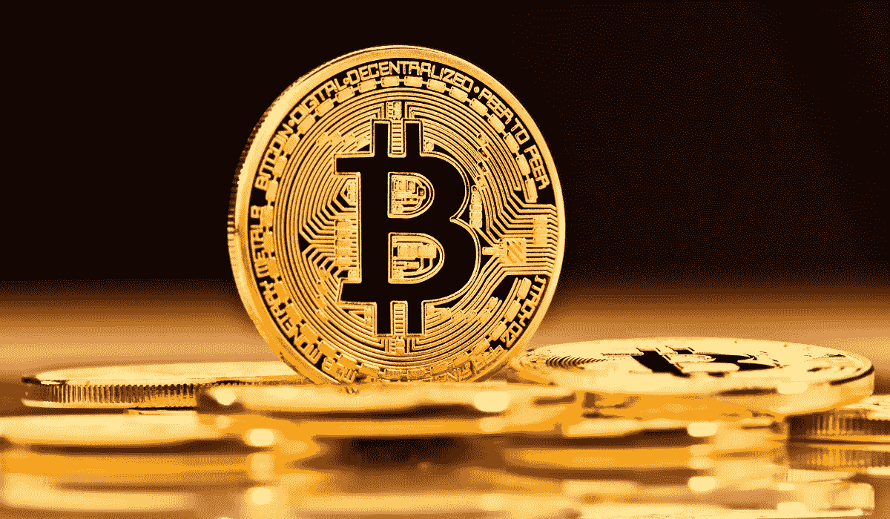

# 远离比特币？为什么我不买

> 原文：<https://medium.datadriveninvestor.com/stay-away-from-bitcoin-why-im-not-buying-42771387b19b?source=collection_archive---------1----------------------->

## 货币不应该这样波动…

比特币被吹捧为一种分散的货币，赋予人们更多的权力。如果你观察比特币的价格走势，你不会认为它是一种货币。

最初的加密货币有一个传奇的旅程，其特点是 2017 年令人瞠目结舌的上升，2018 年的暴跌，以及 2021 年的完全狂热模式。有些早期投几百块钱比特币的人，现在都是百万富翁了。

与 2017 年相比，现在乘坐比特币列车的人似乎更多。埃隆·马斯克(Elon Musk)最近买进了比特币，他也是 Dogecoin 的倡导者，今年迄今为止，doge coin 已经上涨了 953%。越来越多的传统投资者和机构开始买入比特币，或上调其目标价。JP 摩根认为比特币可以达到 14.6 万美元，但这并没有阻止他们的首席执行官在几年前称比特币为欺诈。

# 大多数人不在乎它应该是一种货币

大多数人不买比特币，因为他们认为它是一种革命性的货币。当你读到关于比特币的新闻时，你不会想到这种货币有多么具有革命性。围绕比特币的所有新闻都围绕着其当前价格、接近里程碑以及分析师提供的价格目标。

当大多数人购买比特币时，他们只希望一件事…比特币继续上涨。当比特币在 2017 年飙升超过 2000%时，它成为了热潮。每个人都在谈论它，许多投资者变得贪婪。然后大规模抛售发生了。

比特币现在比 2017 年的峰值高得多，但狂热仍与 2017 年一样，但程度更深。

这种目前的热潮与 GameStop 股票 2021 年的抛物线增长非常相似。人们不是在为公司购买股票。他们买它是因为空头挤压数字，但也觉得他们是一个运动的一部分，搞垮华尔街。

如果你看看人们的推文和整体叙述，这种类型的运动不是比特币买家的主要动机。动机是尽可能多赚钱。这是一个可以理解的动机，但对于一种应该是货币的东西来说，这是一个奇怪的动机，这种投资应该具有稳定的价格，相对于其他类型的投资几乎不会波动。

# 它可以被调节

虽然比特币被认为是去中心化的，但它对监管并不陌生。一些国家实施了限制，而另一些国家则完全禁止人民币。这些先例已经存在的事实意味着更多的国家可以效仿。

如果一些国家认为比特币对他们的货币产生了负面影响，网络罪犯过度滥用比特币，或出于其他原因，他们可能会制定法规。每一项投资都有它的一套风险，这些对比特币来说是很大的风险。许多券商停止了 GameStop 和其他 Reddit 股票的交易，对比特币也可以采取类似的行动。加密货币有机会被广泛采用，但目前它更像是一种投机投资，而不是一种货币。

# Dogecoin 实际上是基于讽刺的

今年上涨了 953%的同样的加密货币是基于一个笑话。狗的脸是基于一个迷因，并不打算成为一个严重的货币。现在，起初只是个笑话的加密货币已经变成了一种令人难以置信的投机工具。

虽然 Dogecoin 和比特币是两种不同的加密货币，但它抓住了当今加密货币的奇异本质。Dogecoin 提供了什么内在价值？除了今年上涨了 953%，人们告诉你要买之外，为什么还有人买呢？

它可能是一种未来的货币…但是如果你持有它，你就不会把它作为一种货币。你不会想成为[那样的人，在成为主流](https://www.investopedia.com/news/bitcoin-pizza-day-celebrating-20-million-pizza-order/)之前花 10，000 比特币买了两个棒约翰披萨。

如果你认为 Dogecoin 要去月球，你肯定不会进入你的电子钱包，把你的 Dogecoin 花在披萨上。一种货币的全部意义在于它可以被用来交换商品和服务。这种交换不会发生。唯一发生的大部分交易是加密货币交易。买入它们，希望它们升值，然后最终卖出获利。

# 储存货币的困难

别告诉我你是在罗宾汉上买的加密货币。如果是，那么你实际上并不拥有它们。罗宾汉有他们自己的数字钱包，你必须相信他们会保证数字钱包的安全([尽管他们在](https://www.coindesk.com/robinhood-users-lost-cash-crypto)之前已经被黑了)。

获得比特币并不像在富达上创建一个经纪账户并购买自己喜欢的股票那么简单。你需要一个数字钱包，它是由像比特币基地这样可能被黑客攻击的平台提供的。你也可以从你的数字钱包中取出所有的比特币，放入硬盘以保证加密货币的安全，但即使这样也有风险。

如果你把硬盘放错了地方，那就太遗憾了。[一个人不小心扔掉了他的硬盘，里面有 7500 个比特币。](https://news.bitcoin.com/man-accidentally-threw-away-hard-drive-with-7500-bitcoins-million-landfill/)你也有一些比特币投资者因为记不住密码而被锁在财富门外。[一名投资者在被永远锁定价值超过 2.2 亿美元的比特币之前，还有两次登录尝试。](https://www.newsweek.com/man-has-two-login-attempts-left-access-220-million-bitcoin-before-its-all-lost-1560984)

如果您忘记了经纪账户的密码，您可以申请一个新的。像前面提到的那种投资者没有这种奢侈。

# 还有其他投资选择

股票和房地产是众多投资中的两种。你可以选择更安全、注重现金流的投资，或者选择市值较低的高成长型股票来获得高回报。

比特币被定位为一种货币，但它并没有被当作一种货币对待。人们投资的唯一目标是赚钱，听说过用 10，000 比特币换披萨的人永远不会使用加密货币来实现货币的主要功能:商品和服务的交换。

以上是我不碰比特币的原因。现在比特币飞得很高，但它的翅膀可能离太阳太近了。没有人知道未来比特币的价格会怎样。许多人谈论比特币，好像它在未来的一年里可以轻松地翻一番、翻三番，甚至翻 10 倍，但这是一次我正在避免的冒险之旅。

[***想学习如何投资股市赚钱？今天就加入《成为更好的投资者》简讯***](https://solitary-haze-4234.ck.page/6025081be9)