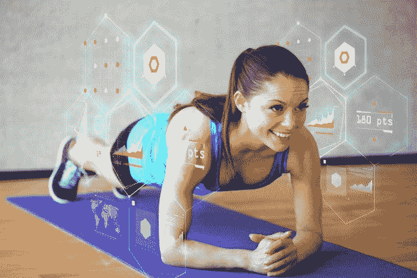
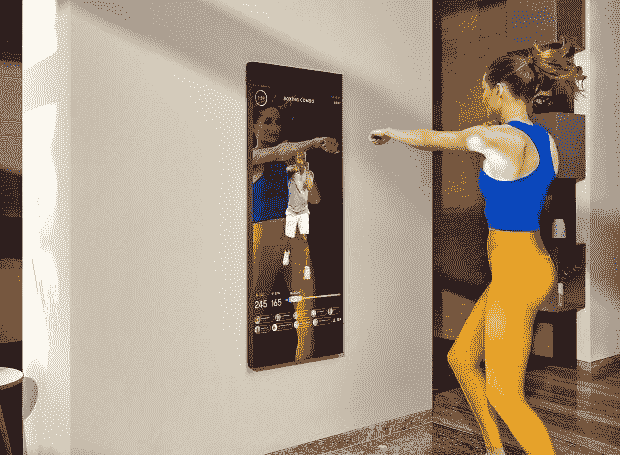
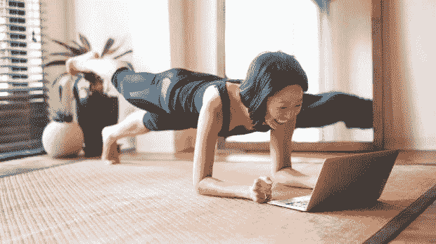

# 在非常时期保持健康|数据驱动型投资者

> 原文：<https://medium.datadriveninvestor.com/staying-fit-in-exceptional-times-4e91236592a4?source=collection_archive---------19----------------------->

我们生活在一个前所未有的时代。由于冠状病毒疫情，世界人口的三分之一被封锁。在许多国家，人们只有在有充分理由的情况下才被允许外出。我们在家工作。四面墙和互联网已经成为我们未来几周的新现实。

但情况并没有那么糟糕。人们正在重新创造他们的日常生活，企业试图赶上“一切在线”的新需求。人们比以往任何时候都更想保持健康，即使他们不能去健身房。这是一个特殊的机会之窗。

像许多其他人一样，隔离给了我一个重新参与日常锻炼的机会。没有冲进办公室的压力，我每天早上 7:30 开始瑜伽练习。阳光射进我的房间，清新的晨风吹动窗帘，小鸟在外面啁啾。让瑜伽成为我日常生活的一部分有助于我一整天都保持积极的心态，即使当我感觉被“囚禁”在自己的房子里。

如果没有小的技术技巧和智能设备，这将更加困难。幸运的是，最新的技术能够提供高质量、个性化的健身体验，而无需离开家。这些是最新的健身趋势，我发现最有希望在家里锻炼。

# 趋势 1:智能教练

没有什么比私人教练更能帮助你设定健身目标并让你保持动力。但是指导并不总是需要面对面。智能应用程序可以完成这项工作。

应用程序(例如 FitMo)让你可以访问虚拟教练的综合数据库，帮助你开始你的个人幸福之旅。FitMo 作为一个匹配平台，将你与健身、健康饮食和减压方面的专家联系起来。生活中的变化，就像当前的危机，是一个很好的机会来开始这些转型项目之一。

**提供商:** FitMo，iFit， [Aaptiv](https://aaptiv.com/how-it-works) ，Freeletics。

**商业机会:**支持员工向远程工作过渡的雇主需要促进员工福利、心理健康和减轻压力的计划。提供全公司计划以保持员工参与、健康和最佳表现的技术提供商将获得最佳位置。

# 趋势 2:智能规划和跟踪

在大城市的喧嚣中，很容易变得非常忙碌而忽略了自己的幸福。但是呆在家里更容易失去动力。套路把你吸进去了。网飞和一大盒饼干也无济于事。如果你觉得无法掌控自己的生活，智能规划和跟踪技术是关键。好习惯是在一小步一小步中养成的。技术可以帮助你采取这些小步骤，并保持在正轨上。它提醒你定期锻炼，补充水分，练习正念呼吸，按时上床睡觉。

我个人喜欢 Lifesum 应用。它可以让你跟踪你吃了什么，平衡你的饮食，而不会被卡路里困扰。然而，很容易将这些应用视为暴君，而不是朋友。他们还要求对你所做或所吃的一切进行细致的记录。这可能会变得过于繁琐和耗时。

**提供者:** Lifesum，8fit 健身程序&膳食计划器，循环习惯跟踪器，Zero，睡眠周期。

**商机:**[物联网](https://www.datadriveninvestor.com/glossary/internet-of-things/)中嵌入的健康跟踪器。想象你的冰箱提醒你吃你的[“一天 5 个”](https://www.nhs.uk/live-well/eat-well/why-5-a-day/)。或者语音助手温柔地说你已经两个小时没从椅子上起来了。这可能看起来很怪异，但对大多数人来说，尤其是在“在家工作”的时代，这将成为一个必备的东西。此外，你不需要手动输入所有信息——这是人们放弃使用计划器和追踪器的主要原因之一。

# 趋势三:智能设备

如果你是一个健身房迷，没有良好的锻炼就无法生活，你必须拥有达到专业健身房标准的设备。它应该紧凑、易于使用、安全且相对便宜。它还应该是交互式的。

幸运的是，许多健身服务提供商提供他们版本的“家庭健身房”。智能设备通常与实时流媒体锻炼和个人教练相结合。有点“三合一”的感觉。

Source: [The Mirror](https://www.mirror.co/)

[镜子](https://www.mirror.co/)在这个领域大概是领先的。当关闭时，它看起来就像一面普通的全身镜，但一旦打开，魔法就开始了。镜子变成了一个互动屏幕，用户可以在那里观看直播或点播课程。他可以按照教练的指示，调整自己的动作。镜子有一个内置的摄像头，可以跟踪用户的生物动态数据，并提供有价值的反馈。镜子是你在家里最接近健身房的体验。

另一项技术，Tonal，用一个光滑的壁挂式屏幕取代了整个房间的重量。音调 [AI](https://www.datadriveninvestor.com/glossary/artificial-intelligence/) 计算你建议的体重，进行个性化的体重调整，并跟踪你的进度。不再有改变重量的痛苦——当你变得更强壮时，Tonal 会自动增加重量；如果你开始挣扎，Tonal 会自动减少重量。该系统提供个性化的教练，以及演示和定制的锻炼。如果你在封锁期间错过了举重，这是一个绝妙的选择。

**提供者:**镜像，飞轮，Peloton，Tonal，FightCamp，Ergatta，Tempo Studio。

商机:所有智能设备都瞄准高端客户，并在一个包中提供大量功能。在家里进行广泛的训练需要一种更轻薄、更实惠的镜子。它可能不那么光滑，附加的东西也少，但应该满足基本需求——在家里有一个类似健身房的体验。变革性的健身设备应该从低端客户(市场的大多数)开始，并最终向上移动，以完全取代传统设备。一个例子是数字重量(如可调哑铃)，你可以通过点击改变重量。或者一个简单的磁阻设备，你可以把它放在床下。它的费用应该和健身房订阅几个月的价格相当。它应该收集训练数据并将其发送到智能手机，并附带一些流式锻炼。一旦我发现这样的东西，我就完全被收买了！

# 趋势 4:实时流媒体健身课程

由于在线流媒体市场的准入门槛如此之低，我们见证了从专业运动员到精品工作室再到瑜伽爱好者的大量报价。建立自己的直播课程或加入课程非常容易。在疫情，许多健身房和健身俱乐部为他们的锻炼提供网上替代方案，推动了市场的发展。

虽然我喜欢直播课程，但我经常发现它们不如面对面的训练有吸引力。这是一个很好的替代方案，但与真实体验相比可能不太好。试图带来人类存在火花的在线课程肯定会赢得健身爱好者的心。

许多智能设备提供商，如 Peloton 或 the Mirror，嗅到了机会。他们提供在线锻炼来模拟举重或在跑步机上跑步的乏味体验。在流媒体播放期间提供个人互动的提供商将在竞争中领先。例如，在 Tempo studio 中，教练会看到从你的三维运动传感器收集的数据，并给你直接的反馈，就像你在真实的课堂上一样。

**提供者:** Peloton app，Fit Body app，Tone It Up，Alo Moves，Orangetheory 等。

**商机**:任何提供接近实时反馈的直播课程。这可以通过安装在可穿戴设备上的追踪器来完成，或者通过摄像头将用户的运动传输回教练。这不仅能让你边走边调整，还能给课程带来有价值的人情味。尽管有点贵，但这种课程在未来肯定会有回报(以防疫情再次封锁或漫长的冬天)。

更激进的幻想家梦想将健身和虚拟现实结合起来。想象教练就在你面前给你示范动作。或者想象你和真正的迈克·泰森在拳击场上比赛！一些先驱公司(如黑盒 VR)推出的整个 VR 健身房会让电子游戏的粉丝喜极而泣。这看起来像“准备好的玩家一号”成真了——但是，与传统的视频游戏不同，你玩得越多，你就越健康。VR 健身房仍然需要昂贵的设备，并且不适合家庭锻炼。还没有。但在未来十年，随着 VR 和 AR 设备越来越便宜，越来越容易使用，VR 健身房设备，如以免提 VR 控制器和 VR 眼镜为动力的阻力机或跑步机，将进入我们的家庭和我们的心中。

随着当前的危机，越来越多的人意识到你不需要额外的努力来保持健康。多亏了这项创新技术，你可以在家里以更高的频率和强度进行锻炼。对于 Fittech 的投资者来说，这是一个黄金机会，可以支持那些将在未来十年重新设计健身未来的公司。

【https://www.datadriveninvestor.com】原载于 2020 年 4 月 22 日**。**

*如果你想了解更多最新的健身趋势，可以看看我写的关于体育运动未来的故事。*