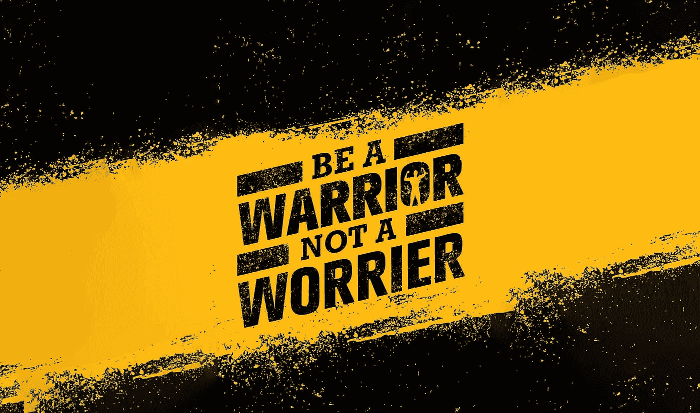

# 在求职中保持动力！！

> 原文：<https://medium.datadriveninvestor.com/staying-motivated-in-job-search-9677d0ca49d8?source=collection_archive---------23----------------------->

尽管我们正处于一个造成大量健康、经济和就业损失的疫情，求职者很容易变得自我批评并失去动力。

你可能在大萧条以来最糟糕的就业市场期间处于失业状态，但错误地认为你应该以市场强劲时的速度获得面试和工作机会。当这种情况没有发生时，沮丧和失望就会出现。当你在六个月或更长时间后还没有找到新工作时，很难保持健康的心态。

请不要觉得这仅仅是你。放松呼吸，因为意识到每个人都在经历类似的恐惧、压力和沮丧。每个人都曾因工作被解雇，错过了一个有价值的晋升机会，或者在一次明显不同寻常的会议后被干掉。努力变得理智。在那一点上，困难、事故和障碍将会被逐步处理，而不是被实际处理。

由于基于网络的媒体统治着我们的生活方式，我们错误地认为每个人都从体面的生活中获得了乐趣，而只有你一个人在战斗。无视别人的 Instagram 贴面；否则，你就是在拿自己和生产出来的、不真实的东西做对比。

坚持一天一天的时间表，以保持集中，并有一种例行公事的相似性。尽管你在努力寻找工作，但一定要练习自我照顾。发现可以让你减压的娱乐和锻炼，让你摆脱对工作的追求。你可以仔细阅读，做一点瑜伽，一些俯卧撑，仰卧起坐，跑步锻炼，在广场上漫步或者任何你喜欢的运动。

尝试排练一些反思和深呼吸活动来减压和放松。获得足够的休息，远离过量的酒、药物和低质量的营养品，它们会降低你的性情，使你感觉迟钝。

这里有一些你可以做的事情来保持乐观、积极和避免陷入消极。

接受这些时间不是典型的。这个时期与以往不同。你不能——也不应该——拿你在新冠肺炎之前的表现来衡量自己。这是一个新的不同的世界。为了保持理智，你应该重新调整你的期望，并采取措施保存你的能量，保持在正轨上。

丹妮尔·海尔斯顿博士说,“认为我们做得不够的感觉会损害我们的心理，而且这种感觉本身会让人失去动力。度过这一天的一个重要步骤是承认没有效率或动力是正常的，也是完全正常的。

庆祝小胜利。即使在最好的情况下，求职也是一个有规律起伏的过程。有时我们会收到网络联系人或招聘人员的回复，有时则不会。加上科维德的压力，这是一个苦差事。这就是为什么承认和欣赏一路上的小胜利是至关重要的。从在你的简历上得到一位受人尊敬的同事的积极反馈，到在你的 LinkedIn 个人资料上收到一封推荐信，每一个都是建立你的可信度和信心的重要一步。最近，我的一个学生在一场竞争激烈的招聘中进入了第三轮面试。我祝贺她的成就。的确，她还没有赢得这份工作，也可能不会。尽管如此，她能走这么远已经是一项成就了。停下来认识到这一点可以给她继续前进所需的能量。

投资你的人际网络。求职可能会让人感到孤立。只有你，你的办公桌，还有网上的招聘启事。这种孤独感会耗尽你的自信，因为它会让你远离那些我们可以倾诉的人，那些愿意倾听的人，以及那些我们喜欢与之相处的人。

所以，走出去，和人们在一起！这可能意味着安全的社交，花时间和家人在一起，做兼职，或者志愿贡献你的时间。与他人在一起会激发我们的联系感和团体感，促进大脑中那些感觉良好的荷尔蒙。依靠这些网络可以帮助我们处理我们周围的世界，并给我们提供应对机制来处理我们感受到的持续的环境压力。

在保持工作人体工程学的同时，学习和练习放松技巧。每天花时间放松有助于管理压力，保护身体免受压力的影响。你可以从各种技巧中选择，比如深呼吸、想象、渐进式肌肉放松和正念冥想。许多在线和智能手机应用程序指导这些技术；虽然有些需要购买费用，但许多是免费的。

如果你停止采取积极主动的行动，你真的会走回头路。在科学中，一篇文章移动仍然是移动的。当某样东西停下来的时候，很难再重新点燃。你必须继续向前推，不管你是否只需要把被子拉过你的头，然后一整天都躺在床上。然而，请记住，这可能看起来很慢；向前就是向前…
狩猎愉快！！