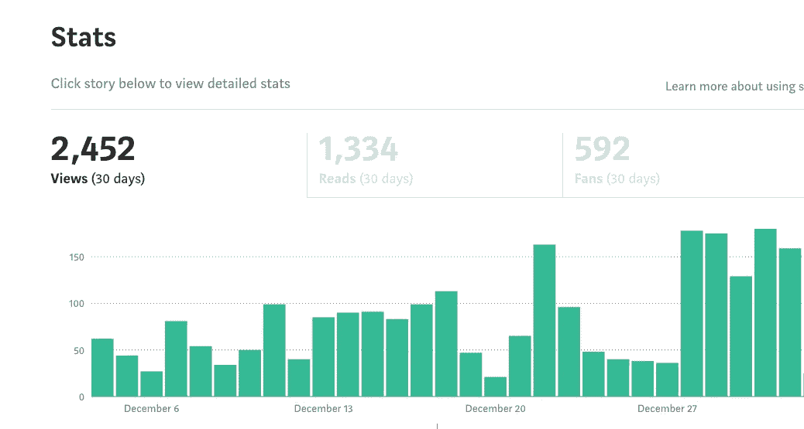
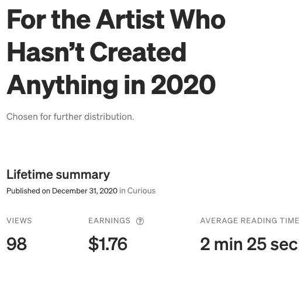
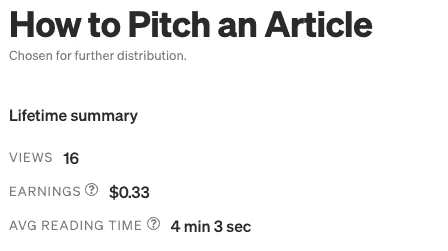

# 稳定的增长和收益

> 原文：<https://medium.datadriveninvestor.com/steady-increases-and-gains-a3aced2e13ee?source=collection_archive---------19----------------------->

## 在我达到 100 美元/天的旅程中，最大的收获是忠诚的读者，良好的阅读和每日增长。

Photo by [Greg Rosenke](https://unsplash.com/@greg_rosenke?utm_source=medium&utm_medium=referral) on [Unsplash](https://unsplash.com?utm_source=medium&utm_medium=referral)

新年快乐！感谢您选择在这个网站上阅读我和我的被动收入之旅。

如果你是这个旅程的新手，下面是第一周 [1](https://aignerloren.medium.com/road-to-100-a-day-a6639624eab2) 、 [2](https://aignerloren.medium.com/engagement-spread-and-tweaking-650ef9be1fc3) 和 [3](https://aignerloren.medium.com/pull-back-and-reflect-3be407367ce) 来看看我的进步。

## 快速介绍

我是这个平台上的专业作家和编辑，我希望增加媒体作为另一个收入来源和获得一些故事，诗歌等的方式。让人们去阅读。我写了很多。我出版了很多。

上个月是我在 Medium 上的第一个完整月。我开始的时候有一个简单的目标，那就是在那个月赚 1 美元/天，到月底，我的目标是出版 60 篇文章，赚超过 30 美元。我学到了很多关于如何看到回报和获得忠诚的追随者。

在这个月里，我尝试了一系列不同的事情，看看在浏览量和收入方面，什么能带来最好的结果，什么更重要，什么更重要。带着我上个月学到的东西，我正以一个新的角度接近一月。

我会集中精力写很多东西，发表一些文章，并尽可能多地参与/阅读。我的目标是每周发表和分享 2-3 篇文章，向更多的出版物投稿，每周写 6 篇文章，每天阅读——除了周末，我通常会抽出时间来写作、恋爱和生活。

我的目标是在一月份用这个策略每天赚 3 美元，让我的收入翻倍。

## 第 4 周的统计数据

Those 5 days of over 100 views were from my new efforts. My old highs are my new lows and I am loving it.

上周的报道获得了 163 次浏览，让我兴奋不已。我现在正逐步达到这些高度。最重要的是，这种上升是因为我的新阅读策略，关注那些在这个网站上积极参与和阅读的人。

为了达到我的 60 篇故事的目标，我上周贴了 9 篇新文章。其中大部分是诗歌。他们为我赢得了很多参与机会，并且有着几乎一出版就被策划的记录。

我上周的亮点是赢得了一些铁杆读者，他们浏览了我的全部故事集。根据我的理解，[Medium 支付和计算收入的方式](https://help.medium.com/hc/en-us/articles/360036691193-Calculating-earnings-in-the-Partner-Program)都是关于会员阅读时间的。

不仅仅是成员花多长时间在一件作品上，而是每个人花多长时间在你的作品上。如果一个会员每月花 5 美元阅读你的故事的时间比其他任何作家都多，你会得到更多的收入。

比一个随机的读者读了你的故事，拍手叫好，但再也不会读你的另一个故事要多得多。

到了月底，我所有的故事都赚钱了，大多数赚了 1 美元以上。然而，没有一个人靠自己挣了超过 10 美元。所以，这将是我这个月的一个延伸目标。

我在一周内获得了 150 多名新的追随者，其中超过 10%是死忠读者，他们阅读了我 5 篇以上的背景故事。我现在是主题写作、创造力和诗歌的特色作家轮值成员。我的目标是在接下来的几个月里用我的作品统治这些类别。

另一个大胜利是有一个高策展周。我仍然认为参与是成功的最高因素，但在我不阅读或分享我的作品的日子里，我的策划作品仍然会赚到钱。

**本周最佳故事**

 [## 对于 2020 年还没有创作出任何东西的艺术家来说

### 你不是莎士比亚或巴赫，这没关系。

medium.com](https://medium.com/curious/for-the-artist-who-hasnt-created-anything-in-2020-187db7c88f5a) 

**本周最糟糕的故事**

 [## 如何推销一篇文章

### 好奇如何让你的文章想法进入出版物，甚至如何想出文章的想法？本指南是…

medium.com](https://medium.com/starburst-school-of-writers/how-to-pitch-an-article-53d05fc4892e) 

如你所见，两个都是策划的，但只有一个真的得到了阅读和起飞。每一个都有价值，但它们属于不同的类型。

如何推销一篇有职业发展价值的文章？它涉及到人们如何向杂志推销他们的文章想法。没有创造的艺术家都是内在的自我感觉良好的价值。

那篇文章没有任何知识或信息，但它是迄今为止表现最好的文章。时间、位置和内容都在那之后。我只需要进一步推动它，让它发挥出最大潜力。

对于 2020 年还没有创造任何东西的艺术家来说，这将是我试图突破 10 美元大关的文章。我认为它本身就是一个高收入者。但它不是常青树，所以我有一个小窗口，让它在枯萎和落入我的后备目录之前赚回来。

## 上周外卖

上周之前，我花了 12 月份的大部分时间浏览了下面的清单。我看到人们发布了什么或没有发布什么，然后决定是否继续关注他们。

上周，我改变了这种状况，花了更多的时间阅读和接触那些在中型脸书群体中分享的人，关注我的人，以及出现在我每日关注阅读列表中的人。

实际上，我阅读了我认识的活跃在这个网站上的人，并关注我，希望建立联系。

我有时候觉得自己就像一张刮花了的 CD。总是重复同样的事情。

> 连接和接合。连接和接合。连接和接合。连接和接合。连接和接合。

但是真的，过度策展和突出的地位，这是我发现的能真正带来成功的两件事。这就是那些没有被策划的作家如何从他们的故事中赚钱的。

通过你的文字和文章与你的听众联系起来。如果你不确定谁是你的观众，通读你的关注者列表，看看他们有什么反应并为之鼓掌。他们的兴趣是什么？它们与你的一致吗？那么那个人就是你的观众。

自从 Medium 的最新变化以来，他们分享作品的方式以及希望作者使用这种方式，不再那么关注大众传播和大量输出内容。这都是关于在你的领域内联系和写有价值的文章。

在这个网站上工作时有一个合适的位置和一个相关的策略是你接触到更多观众的方法。反过来，这也是你在这个网站上持续赚钱的方式。

订婚归根结底是真诚的。不要把目标定在为鼓掌而鼓掌的关系或为阅读而阅读的关系上。通过评论和定期阅读那些作品触动你的作家来获得友谊。

继续写下对你来说意义重大的单词。我也会这样做。

下次见！

艾格纳

[*艾格纳·洛伦·威尔逊*](https://mailchi.mp/96c4fc187b6d/y3g98x12da) *是一位酷儿黑人 SFWA、HWA 和抄本作家。她被列入 2019 年其他奖学金的荣誉名单。她提供了一个* [*写作工艺简讯*](https://mailchi.mp/daa8adde6fec/d07l8sg9s6) *给那些想成为更好的作家和出版高质量作品的人。*

**访问专家视图—** [**订阅 DDI 英特尔**](https://datadriveninvestor.com/ddi-intel)