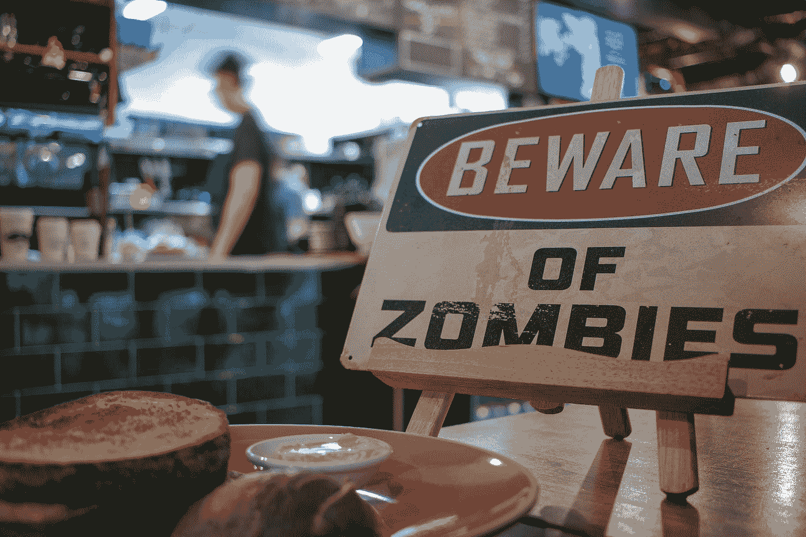

# 日交易者押注僵尸公司的复活

> 原文：<https://medium.datadriveninvestor.com/steer-clear-of-the-zombie-resurrection-7df71c27f5f1?source=collection_archive---------11----------------------->

罗宾汉散户投资者将破产公司的股价从低点推高了 200%至 450%……但他们可能会彻底出局。

Photo by [Chris Hall](https://unsplash.com/@unibridge_project?utm_source=medium&utm_medium=referral) on [Unsplash](https://unsplash.com?utm_source=medium&utm_medium=referral)

# 政府赞助的赌场

标准普尔 500 和纳斯达克指数今年分别持平和略有上升。鉴于世界正在经历有史以来最严重的衰退之一，前所未有的失业水平，负油价和美国深刻的内乱，这是非常有趣的。由美联储史无前例的刺激政策推动的资产价格已经完全脱离了现实。结果，股票市场变成了政府赞助的赌场。后者的一个很好的例子是过去几天一些破产公司经历的价格飙升，如赫兹、JC Penny 和切萨皮克。

 [## 使用谷歌搜索趋势预测首次申请失业救济人数|数据驱动的投资者

### 几年来，我的重点一直是使用多种替代数据来预测宏观经济统计数据…

www.datadriveninvestor.com](https://www.datadriveninvestor.com/2020/03/25/using-google-search-trends-to-predict-initial-jobless-claims/) 

# 尽管面临巨额债务，赫兹的股票还是上涨了 4 倍

租车公司赫兹(Hertz)已于 2020 年 5 月申请破产保护。它的股价下跌了 80%,然后从最低点上涨了 400%。该公司不得不经历价值 190 亿美元债务的痛苦重组。其已经违约的债券现在的交易利率为 39%。这意味着债券市场预计其信用持有者将收回 30%的资金。因此，从理论上讲，该公司的股权应该为零，因为一旦其资产被清算，股权持有人是最后一个获得报酬的。该公司的市值高达 3 亿美元。

# 面值为 5%的切萨皮克债券

尽管公司申请破产，切萨皮克能源公司的股票已经反弹了 200%。没错，油价已经反弹，但该公司仍有 3 亿美元的未偿债务。其债券的交易利率为 5-10%，这意味着债券持有人预计他们投资该公司的每一美元只能收回 5-10 美分。再说一遍，如果债券持有人预计拿不回他们的钱，那么股票持有人应该什么也拿不到。然而，该公司的市值达到了令人疯狂的 1.71 亿美元。

# 这些极端举动背后的散户投资者

美国股票和期权交易应用 Robinhood 的用户似乎是这些疯狂举动的源头。根据该平台上的数据跟踪持有量，自 6 月初以来，该应用程序的用户购买的赫兹、切萨皮克和 JC Penny 的股票比任何其他上市公司都多。Robinhood app 似乎特别被年轻散户使用。在许多这些投资者聚集的 Reddit 群(称为 WallStreetBets)中，我们可以看到以下评论:“ ***赫兹破产被罗宾汉投资者*** 取消”；” ***好样的伙计们，赫兹现在又是一家有生命力的公司了***；如果我们能打败雷伊·达里奥、史蒂夫·科恩或乔治·索罗斯，那么这个潜艇就能接管世界。

# 增加复苏的风险

美联储无限制的量化宽松正在破坏金融市场的完整性。我们目前在市场上看到的投机水平最终将导致一场重大的金融危机。这只会给我们的经济带来更多的麻烦。