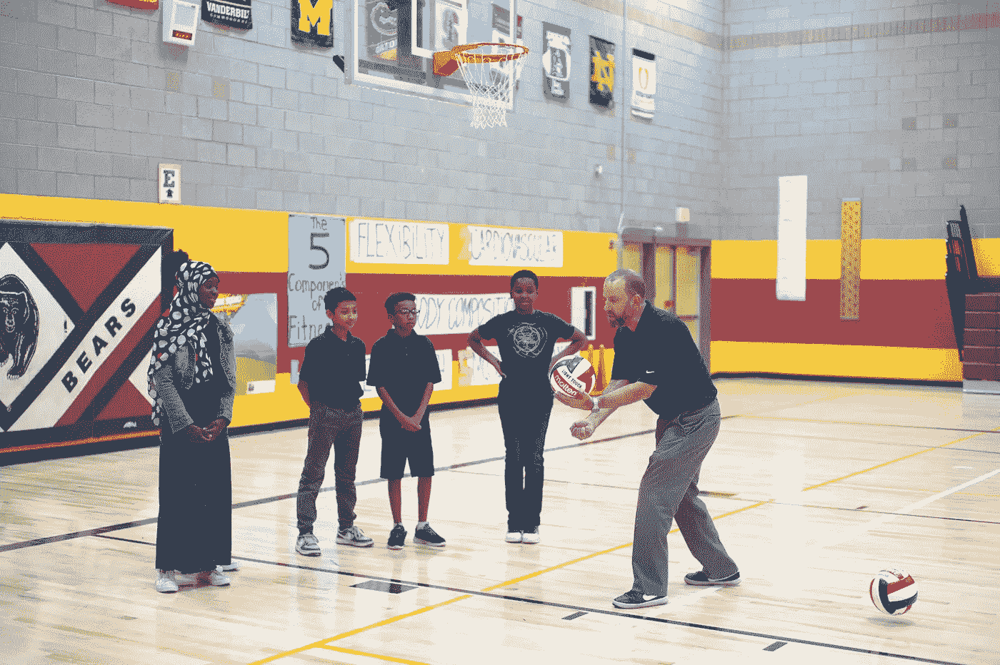

# STEM 与体育:合作提高学生参与度

> 原文：<https://medium.datadriveninvestor.com/stem-and-sports-teaming-up-to-enhance-student-engagement-1fdcb8591210?source=collection_archive---------13----------------------->

## 体育运动可能是让孩子们对 STEM 概念和职业感兴趣的关键。

Image: Getty ID# 1063388278 / Boy Playing With Basketball

*作者:* [*安德鲁·b·劳普*](https://medium.com/u/d8c8d333927a?source=post_page-----bc7b73a1ac7b----------------------)*/*[*@ stem CEO*](https://twitter.com/stemceo)

在流行文化中，智力和体育运动之间的脱节由来已久。任何数量的电影和电视节目都把科学呆子和运动员设定为学校社会结构中的对立力量，他们很少交叉，也没有什么共同点。事实上，在这些陈词滥调的寓言中，脑力和马力经常被对立地描绘出来。

但是伴随着我们成长的刻板印象已经离真相越来越远了，故事也在改变。事实上，STEM——研究科学、技术、工程和数学——和体育是紧密相连的。今天的年轻人兴趣广泛，将他们喜欢的科目与体育和身体健康联系起来是促进跨学科研究和培养自我激励学习的好方法。

**为什么 STEM 和运动是完美的组合**

当今有效的 STEM 教学法专注于创造引人入胜的、动觉的和专注的体验。为了培养创造性思维，艺术通常与 STEM 联系在一起——通常被称为 STEAM。将运动加入 STEM 将进一步增加对这些科目的兴趣，并帮助那些学习风格和个人偏好喜欢积极和人际团队游戏的人参与进来。

 [## 理解 STEM 教育的接穗、分支和节点

### 一场更广泛的民众运动的偏离和演变视角

medium.com](https://medium.com/age-of-awareness/understanding-stem-educations-scions-offshoots-and-nodes-73b87d819198) 

目前的研究证明了这一假设。2017 年，加拿大 [Sport + STEM 项目](https://www.sportanddev.org/en/article/news/sport-and-stem-subjects)利用棒球、曲棍球、足球和橄榄球向不相关的学生教授关于生态系统、区块链编程、设计思维和几何的概念。由于教练在球场上教授的课程，89%的学生同意通过体育运动更容易学习这些概念。

宾夕法尼亚大学博士后研究员、前大学篮球运动员约翰·德拉詹正在研究体育和 STEM 拓展项目的影响，尤其是对市中心年轻人的影响。同样，[弗吉尼亚联邦大学的 Kristi Mueller](https://soe.vcu.edu/news/recent-articles/dr-mueller-looks-at-connecting-pe-courses-to-stem-efforts.html) 博士探索了体育教师利用 STEM 活动拓展课程的方法，包括里士满的 [STEM in Sports Day](https://soe.vcu.edu/news/archived-articles/stem-in-sports-making-learning-fun.html) 。

Image: Getty ID# 904171632 / Soccer Club Playing A Night Game

正如这项关于教育推广的研究表明的那样，STEM 和体育的结合具有为服务不足的社区带来更深入学习的巨大潜力。弱势青年常常得到这样的信息，即体育是他们进入大学的唯一途径，因此将 STEM 与这一兴趣领域联系起来可以扩大许多学科的实际吸引力，并激励孩子们对未来成功的更多愿景——这是教育公平的一个重要目标，因为我们寻求为所有学生提供学习机会。

当然，从这种合作中获益的不仅仅是 STEM。将体育运动与跨学科相结合可以鼓励孩子们走出户外并运动，作为身体活动的重要组成部分，以实现身心平衡。在这个儿童肥胖率上升和“生活方式疾病”流行的时代，这些策略极大地提醒了我们，STEM 教育不仅仅是屏幕时间和编码——它也是可以带来幸福健康生活的综合心态的一部分。

**早期 STEM 和运动项目创新者**

许多教育工作者没有足够的规划时间来建立有效的课程。幸运的是，一些企业家已经介入来填补这个空白，把他们对运动和学习的热爱带到一起，为他们所服务的社区提供独特的机会。

Image: STEM Sports® / Jeff Golner Serving Volleyball

作为前亚利桑那州响尾蛇队高管和现任体育营销机构老板，[杰夫·高尔纳](https://www.verdenews.com/news/2020/apr/06/schools-shut-down-remaining-physically-active-crit/)对体育的力量如何吸引观众略知一二。今天，他担任 STEM Sports 的首席执行官，该组织设计了将批判性思维和解决问题的技能与体育活动相结合的完整课程。从幼儿园到八年级的学生都有不同的课程，并且符合标准。

正如 Golner 指出的，93%的 STEM 工作的薪酬高于全国平均收入，这就是为什么每个 STEM 运动学习模块都附有一份与所教授的概念相关的工作清单。这些职业将 STEM 和体育结合在一起，旨在激发孩子们对未来的想象——甚至连一件实验室外套都没有。

Image: STEMLETICS / Jonathan Blanchard

STEMLETICS 是 [Jonathan Blanchard](https://www.flintside.com/inthenews/STEMletics-using-sports-to-teach-flintsones-science.aspx) 的创意，提供完整的在线途径，旨在将企业家精神、工程和体育结合到一个现实世界的项目中。在工程创新项目中，学生设计一项新发明来帮助提高运动成绩。在课程结束时，他们可以提交他们的设计，有机会获得资金来建立一个原型——谈谈现实世界的激励措施。

布兰查德是在凯特林大学的宿舍里玩电子游戏时想出这个主意的。他在密歇根州的弗林特出生和长大，对体育产生了深深的热爱，并且知道他想回馈他的社区，激励孩子们在数学和科学上取得成功。当他意识到他在倾倒他的篮球视频游戏统计数据时使用了多少算术时，他意识到他可以利用这种参与方式来吸引孩子们学习更高层次的数学和工程概念。当他还是一名大学生时，他就开始了 STEMLETICS，并一直致力于扩展他的组织的产品。

**STEM 对现有体育项目的影响**

除了 STEM Sports 和 STEMLETICS 等完全专业化的学术项目，还可以将 STEM 学习的元素添加到更传统的体育项目中。美国体育夏令营现在提供电子竞技机会，并提供游戏和领导技能的强大课程。

 [## 电子竞技和 STEM 教育:2020 年展望

### 结构化视频游戏在学校有一席之地吗？

medium.com](https://medium.com/datadriveninvestor/esports-and-stem-education-a-2020-perspective-a3f2cc934e33) 

Defenders Sports Network 通过一系列代表青年体育和技术未来的虚拟技能锦标赛、互动技术和电子竞技，将篮球带到了一个新的水平。[高中教练](https://www.forbes.com/sites/jefffedotin/2020/03/16/in-game-data-analytics-via-tablets-is-beginning-to-permeate-high-school-football/?sh=728ecb603012)也开始接受数据分析，疫情正在迫使[体育教师](https://www.cnn.com/2020/08/31/health/gym-class-online-learning-wellness/index.html)授课方式发生重大转变。

当尘埃落定时，STEM 可能会有助于改善青少年体育运动，而体育运动将使 STEM 与更广泛的学生更相关，更容易接近。这最终是天作之合——一种持久的伙伴关系，将抓住孩子们的想象力，促进整体健康，并为明天的[工作做好一代人的准备。](https://www.forbes.com/sites/forbestechcouncil/2018/11/08/moving-target-preparing-todays-minds-for-the-stem-jobs-of-tomorrow/?sh=35e38b2ce147)

Image: Getty ID# 108310406 / Boy Holding A Football At Sunset

这篇文章最初于 2021 年 2 月 1 日刊登在*新闻周刊*上，并于 2021 年 2 月 13 日更新为[*媒体*](https://medium.com/u/504c7870fdb6?source=post_page-----1fdcb8591210--------------------------------)**。**

*[安德鲁·b·劳普](https://medium.com/u/d8c8d333927a?source=post_page-----bc7b73a1ac7b----------------------)是创始人/执行董事 [@stemdotorg](https://twitter.com/stemdotorg) 。*“通过健全的政策实践使科学、技术、工程和数学(STEM)教育民主化……应用 STEM 来更好地理解它。”**