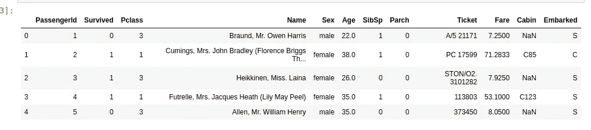
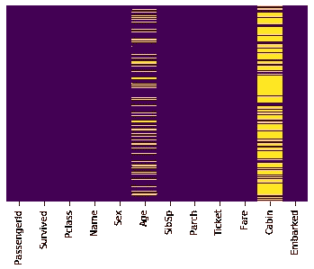
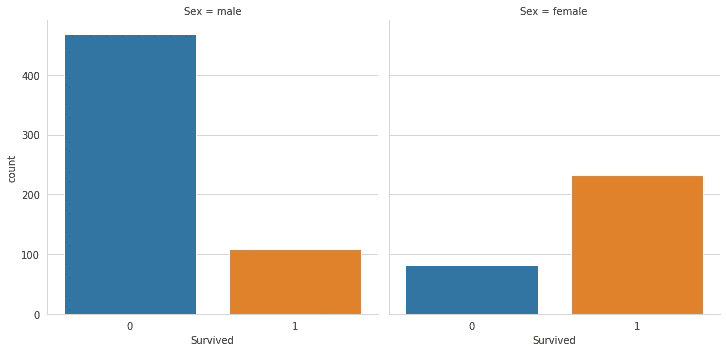
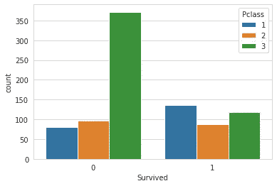
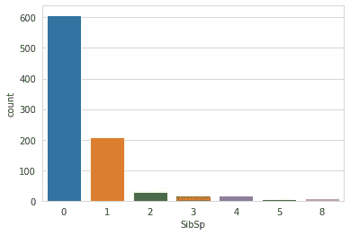
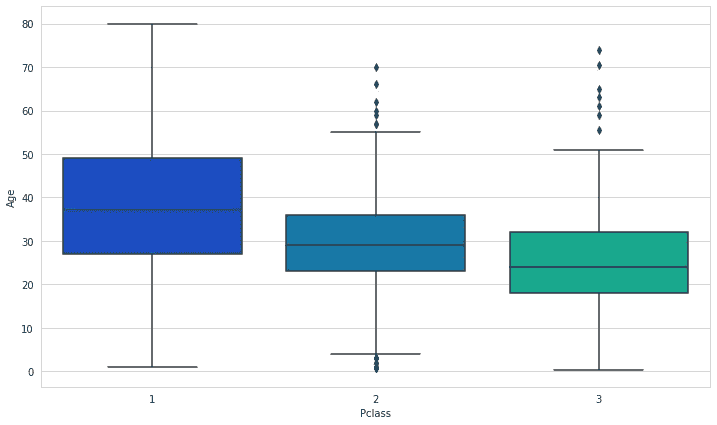

# 海量数据的逐步探索性数据分析

> 原文：<https://medium.datadriveninvestor.com/step-by-step-exploratory-data-analysis-of-titanic-dataset-2d0fb09b0e86?source=collection_archive---------0----------------------->


(Picture By Annie Sprat On Unsplash)

探索性数据分析是任何数据科学项目最重要的步骤之一。这里我们将对泰坦尼克号数据集进行数据分析。为此，我们将使用 Pandas、Seaborn 和 Matplotlib 库。我们可以从 https://www.kaggle.com/c/titanic/data 下载数据集。

# 讲故事:

让我们先试着理解数据集。它有 12 列。

这里我们有 11 个特征，利用它们我们可以预测“幸存”的目标变量。

目标变量是我们试图预测的变量。其他都是特色。我们的第一步将是完善这些功能，以便它可以用于输入到机器学习模型中，我们可以用它来完成我们所需的任务。

要将数据加载到数据帧中，我们可以使用

```
train=pd.read_csv(‘/home/aditya123/Downloads/titanic.csv’)
```

为了了解数据集，我们可以使用 dataframe 的 head 函数。它将返回前 5 行。因此，执行 *train.head()* 将得到前 5 行。给出的图片显示了它的输出。



同样我们可以使用 ***info*** 和 ***describe*** 方法来获得关于数据的详细统计。

数据预处理和 eda 的一个重要目标是去除空数据。要做到这一点，我们需要知道我们在哪里得到了空值。为了对此有个概念，我们将使用热图。为了实现它，将使用 seaborn 库。下面的代码片段将为它创建一个热图。

```
sns.heatmap(train.isnull(),yticklabels=False,cbar=False,cmap=’viridis’)
```

上面代码的输出应该是这样的



(Heatmap to know about missing values)

正如我们从图表中看到的,“年龄”和“客舱”列的值为空。“Cabin”有大量的空值，“Age”有适量的空值。

这里，我们将删除“Cabin”列，因为它的值大部分为空。

为此，我们将使用下面的代码片段。

```
train.drop(‘Cabin’,axis=1,inplace=True)
```

现在有趣的部分来了。我们需要形成一个逻辑来估算“年龄”列中缺失的值。在理解了“年龄”和各种其他变量之间的关系之后，我们将回头再来讨论它。

让我们试着了解因变量“幸存”与变量“性别”是否有任何关系。

为此，我们将使用 factorplot。下面的代码片段将为我们返回所需的数字。

```
sns.factorplot(x=’Survived’,col=’Sex’,kind=’count’,data=train)
```

上述代码的输出如下图所示



**推论**:从电影和泰坦尼克号的故事中我们都知道，女性在拯救乘客时被优先考虑。上图也告诉了我们同样的故事。男性乘客的死亡人数多于女性乘客。

同样，让我们试着看看变量' ***Pclass*** '与变量' ***幸存*** 是如何关联的

为此，我们将使用下面的代码片段绘制一个计数图。

```
sns.countplot(x=’Survived’,hue=’Pclass’,data=train)
```

上述代码的输出如下图所示



推论:图表告诉我们，第三类人更有可能幸存。它是为富人设计的，而 Pclass 1 是最有可能的受害者，相对比 class 3 便宜。

让我们试着详细理解‘Sibsip’一栏。为此，我们将再次使用 seaborn 的 countplot。下面的代码片段将达到同样的效果。

```
sns.countplot(x=’SibSp’,data=train)
```

上述代码的输出是



**推论**:这里的‘SibSp’变量指的是这个人所伴随的兄弟姐妹或配偶的数量。我们可以看到大多数人都是单独来的。

最后，我们必须找出一种方法来填充变量“年龄”的缺失值。这里，我们根据 Pclass 变量分离了“年龄”变量，因为我们发现“年龄”和“Pclass”列是相关的。我们会画一个箱线图，告诉我们每一类的平均值。为此，我们可以编写以下代码片段。

```
sns.boxplot(x='Pclass',y='Age',data=train,palette='winter')
```

它会产生这个图表



从这张图表中，我们可以找出每个阶层的平均年龄。我们将同样估算缺失的“年龄”值。我们可以编写一个简单的 python 函数来获得相同的结果。

## 处理分类值:

我们必须将分类值转换成数字，以便它可以用作模型的输入。为此，我们将使用下面的代码片段。

*embark = PD . get _ dummies(train[' Embarked ']，drop _ first =****True****)Sex = PD . get _ dummies(train[' Sex ']，drop _ first =****True****)*

同样，我们必须删除所有不提供任何有意义信息的列，如“姓名”和“机票”以及之前的“上船”和“性别”，因为它们已被替换。我们还需要添加新创建的*着手*和*性别*列。

```
train.drop(['Sex','Embarked','Name','Ticket'],axis=1,inplace=**True**)
train=pd.concat([train,sex,embark],axis=1)
```

现在，我们的数据集已准备好用作机器学习模型的输入。这是对泰坦尼克号数据集的详细分析。

完整的代码可以在这里找到[https://github . com/mohantyaditya/explorative-Data-Analysis-Titanic/blob/master/titaniceda . ipynb](https://github.com/mohantyaditya/Exploratory-Data-Analysis-Titanic/blob/master/TitanicEda.ipynb)

要在 linkedin 上与我联系，请点击此链接[https://www.linkedin.com/in/aditya-mohanty-7982451a9/](https://www.linkedin.com/in/aditya-mohanty-7982451a9/)。