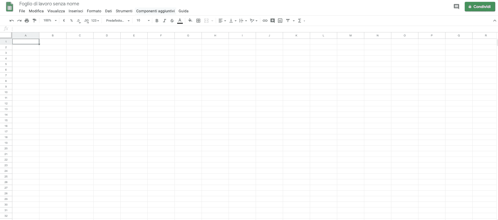
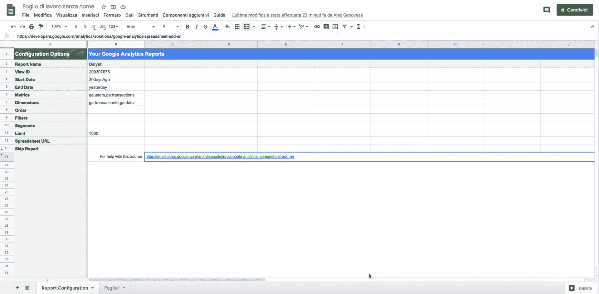
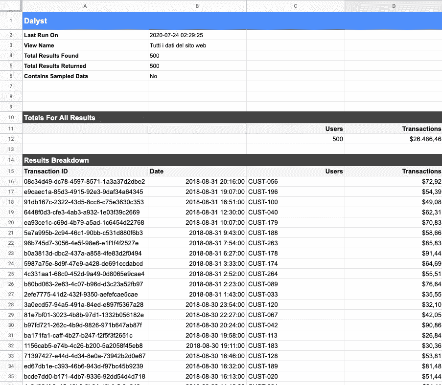
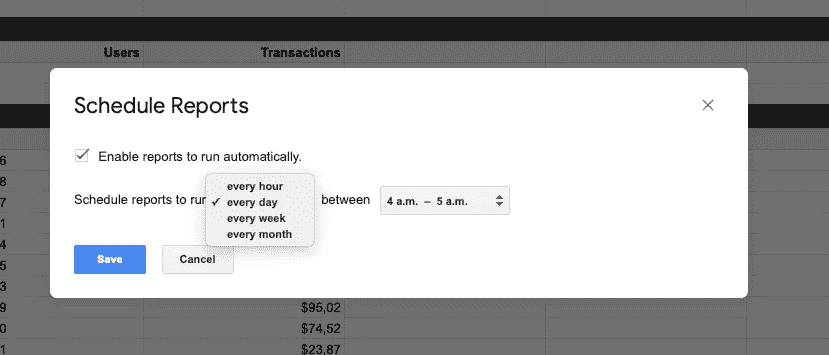
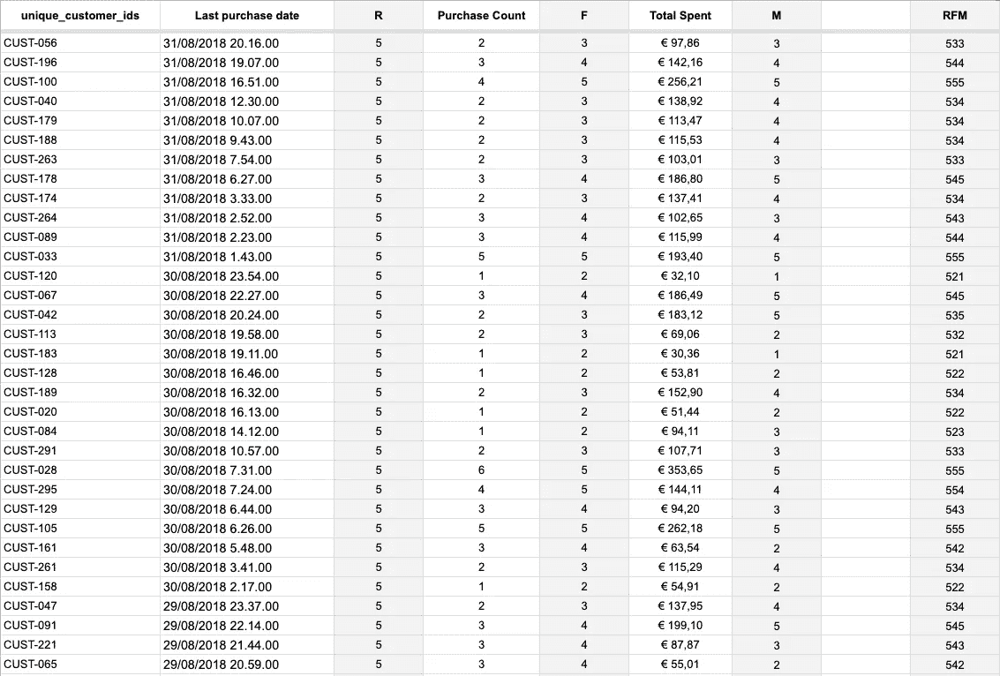

# [分步指南]使用 Google Analytics 和 Sheets 创建客户细分，无需编写任何代码

> 原文：<https://medium.datadriveninvestor.com/step-by-step-guide-create-customer-segmentation-using-google-analytics-and-sheets-without-c991053f6f2d?source=collection_archive---------4----------------------->

使用 Google Analytics，我们可以根据客户的兴趣、点击量、页面停留时间、跳出率、自定义事件等常见特征来分析客户行为。以及他们作为购物者的行为，如添加到购物篮、平均产品数量购物篮、LTV、AOV 等。

如果你的 Google Analytics 配置良好，所有这些信息都是一个可以探索和分析的金矿，可以提取更多关于你的客户细分的信息。

# 我们为什么要分析客户的数据？它不仅仅是一个产品卖给某人吗？

是的，它是……但是它和“只是卖”有一点不同。向某人销售是一个过程，它被很好地定义为一个漏斗，每个客户从上到下移动。

营销的主要目标是吸引(漏斗的第一部分)并向下推动，直到购买(漏斗的底部)产品或服务。卖什么，你如何与你的客户或潜在客户沟通，使整个世界的差异，为此，你需要了解你的客户想要什么，他们是什么，什么时候是向他们推销你的产品(或他们的一部分)的最佳时机。

# RFM 的意义是什么？

**RFM** (最近、频率、货币)分析是一种营销技术，通过检查客户购买的时间(最近)、购买频率(频率)和消费金额(货币)来定量确定哪些客户是最佳客户。

> “客户细分是指将客户群划分为在与营销相关的特定方面(如年龄、性别、兴趣和消费习惯)相似的群体。”来自[销售团队](http://searchsalesforce.techtarget.com/definition/customer-segmentation)

正如您在下面看到的，细分将您的客户聚集在不同的买家类别中，使用他们的新近度、货币和频率对他们进行评分。

Source: Clevertap

这是一个简单的分数计算，从 1 到 5 分的 3 个不同领域(RFM)决定了客户群。如果你想知道更多，你可以点击这里阅读我写的这篇文章。

RFM 分析的目标是根据最近的购买次数、频率和货币价值，了解有多少人和什么样的人在你的商店购买。

数据分析师的正确工作是了解**如何从一个细分市场转移到另一个相邻的细分市场，以便为每个细分市场提出个性化的内容和产品。**

如果你想更多地了解 RFM，你可以阅读这本分步指南，它以简单的方式向你解释了 RFM 的单一计算。

# 让我们从指南开始

> GA 和 GA360 的区别仅仅在于你如何查询数据和 json 响应结构。反正对于本文来说，都是一样的。

Photo by [Markus Winkler](https://unsplash.com/@markuswinkler?utm_source=medium&utm_medium=referral) on [Unsplash](https://unsplash.com?utm_source=medium&utm_medium=referral)

1.  **创建一个新的谷歌电子表格**，这将是我们从谷歌分析数据采集的开始“数据库”。
2.  现在**通过点击附加组件安装谷歌分析插件**，将会打开一个模式，你会在其中找到谷歌分析。单击并安装组件。

3.现在我们**通过点击“**附加组件>谷歌分析>创建新报告**来创建新报告**。这将在右侧打开一个侧边栏，您可以在其中选择想要链接的帐户、属性和视图。让我们选择以下*指标*:

*   用户:它将获得 GA 用户 ID
*   交易:它会显示所有金额

在*尺寸*上，我们选择:

*   日期
*   交易 ID

现在，点击“创建报告”。

谷歌分析将创建行和列显示所有数据信息选择启动报告。

4.此时，我们**启动报告**以获取所有原始信息。

信息加载完成后，它将在新的选项卡中显示数据，如下例所示:

注意:这些数据代表了 Google Analytics 在浏览用户时能够跟踪的值。

在这个数据集中，我们有引用相同客户的行，但是有不同的交易。好了，现在我们要对这些行进行规范化。

4.1 可以创建一个时间表，允许您每周或每月刷新数据集。根据营销活动，您可以随时跟踪客户的发展变化。

5.现在我们有了初始数据，我们可以继续进行归一化和计算 RFM 矩阵得分，首先创建一个新选项卡，我们将在其中创建以下字段:

*   唯一客户标识
*   上次购买日期
*   稀有
*   购买数量
*   F
*   总计 _ 花费
*   M
*   RFM

带“_”的列表示将使用 Google 电子表格提供的函数计算的值。

**unique_customer_id** :使用 unique，我们从列“Dalyst！C16:C515 "只购买过一次的顾客的 id。

**last_purchase_date** :我们采用最后一个有用的日期，与 unique_customer_id 进行比较。我们需要客户的最后购买日期来计算最近的购买时间。

**purchase_count** :表示与 unique_customer_id 列中的客户 ID 相比，购买次数的总和。

**total_spent** :是购买总额与顾客 id 之比。

因此，R、F 和 M 值代表了我们计算客户细分的目标。在这个例子中，给定计算模型和使用的工具，我们使用具有“固定值”的分段。

**这里是你将得到的结果:**

现在，我们可以使用 Google Sheets 上的图表或通过将该电子表格与 Google Data Studio 链接起来，按照我们认为合适的方式来排序和表示 RFM 矩阵值。

## [点击这里下载工作资料，自己尝试。](https://alexgenovese.it/blog/customer-journey-segmentation-using-google-analytics-and-gsheets/)

# 文章系列

我正在写一个基于 RFM 矩阵的系列文章来解释不同的可行策略来发展你的业务。

如果您错过了什么，该系列包括以下文章:

*   [立即将 RFM 客户细分应用到您的业务中](https://alexgenovese.it/how-to-apply-rfm-customer-segments-your-business/)
*   [**【逐步指南】使用 Google Analytics 和 Google Sheets 绘制客户细分图**](https://alexgenovese.it/customer-journey-segmentation-using-google-analytics-and-gsheets/)
*   [使用 Google Sheets e Google Data Studio 对 Shopify 客户群进行细分](https://alexgenovese.it/segment-shopify-customer-base-using-google-sheets-e-google-data-studio/)