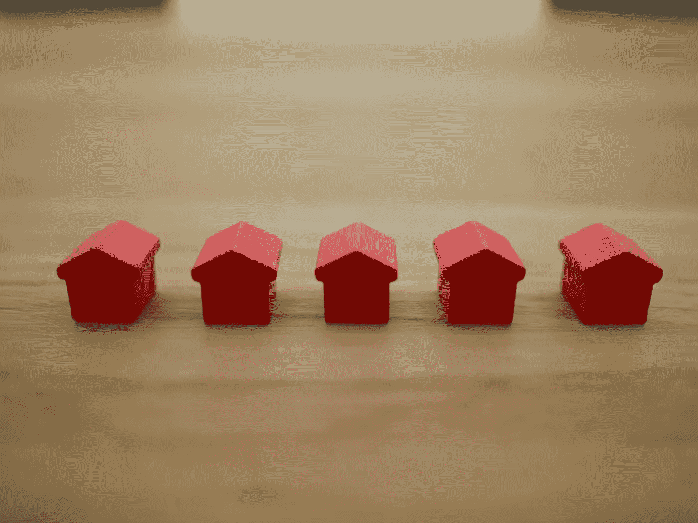

# 瑞士买房或租房的逐步指南

> 原文：<https://medium.datadriveninvestor.com/step-by-step-guide-to-decide-buy-or-rent-in-switzerland-bd5ae6e24c0d?source=collection_archive---------12----------------------->

## 在瑞士，70%的人租房，30%的人拥有房产。当谈到购买或租赁时，它不像在其他国家那样简单，在这些国家，购买房产是投资的首要任务。这里有一个循序渐进的指导来帮助你做出明智的决定，至少从数字的角度来看是这样的。

Photo by [Tierra Mallorca](https://unsplash.com/@tierramallorca?utm_source=unsplash&utm_medium=referral&utm_content=creditCopyText) on [Unsplash](https://unsplash.com/s/photos/rents?utm_source=unsplash&utm_medium=referral&utm_content=creditCopyText)

如果你手头有额外的现金，并且正在考虑是否应该购买房产，你有三个选择。

1.  租房，把钱投进去。
2.  买一处房产，然后住在那里
3.  购买房产并出租。你一直住在出租房里。

让我们来看看每种方案的利弊，从金钱的角度来看，哪种方案是最好的，这一点就很清楚了。

# **1。租房和投资**

在这种情况下，你的现金流会是这样的

1.  支付租金

2.你本可以用来支付首付的钱的投资回报。

净现金流是这两者的总和。为什么不把钱存入银行？我假设，由于瑞士银行的利率接近 0%，把你的钱放在周围是没有意义的，相反，你应该把它投入市场，让它为你赚钱，要么作为资本收益，要么作为股息收入。在我的另一篇文章 [<为什么穷人越来越穷，富人越来越富>](https://medium.com/datadriveninvestor/why-the-poor-are-poorer-the-rich-are-richer-802a5437f431) 中，我已经解释过长期投资指数基金已经被证明会产生良好的回报，因此我为什么要把钱存在瑞士银行，让通货膨胀吞噬掉呢？你可以对你的投资回报做一个假设，比如 6% — 8%取决于你的投资类型。

**将这两者相加，a1 支付为负，投资回报为正。然后你得到你的净现金流。**

# **2。购买房产然后住在那里**

1.  **支付利息，现金流出**

由于目前 10 年期抵押贷款利率低至 0.8%，我假设你会尽可能多地从银行贷款，最高可达购买价格的 80%。为什么？因为这就像银行免费借给你钱一样，为什么不用光你所有的资本呢？！

所以第一个成本是利息成本。这是现金外流。

**2。支付水电费或维修费(Nebenkosten)**

这可能不到每年购买价格的 1%。如果你要求具体的建筑项目，费用可能会有所不同。

**3。支付投资回报的机会成本**

这个数字与情景 1 中的现金流入相同。原因是，如果你不使用这笔钱的首期付款，这笔钱可以产生现金给你。所以我把这个机会成本加到计算中。

**4。支付附加所得税**

现在事情变得有点有趣了。在瑞士，房产所有者必须在应税收入中增加“租金收入”。你的房产会被一个政府工作人员评估，哪个政府部门？我忘了。根据市场价格，如果你把你的公寓租给别人，你将获得租金收入。然后他们用一个比率，同样取决于你住在哪个州，典型的瑞士，你会用一个比率乘以这个租金收入。那部分将是应税收入。假设你的公寓可以以每月 2000 瑞士法郎出租，那么在瑞士州，你使用 65% x 2000 瑞士法郎 x12 个月= 15600 瑞士法郎，这是额外的应税收入。

但是

它还没有完成。

还有一个免赔额比例，同样取决于州。如果你的公寓不足 10 年，你可以从应税收入中扣除 10%(15，600 瑞士法郎 x 90% = 14，040 瑞士法郎为应税收入)。如果公寓超过 10 年，那么你可以扣除 20%(15，600 瑞士法郎 x 80% = 12，480 瑞士法郎是应税的)。

这种'想象'的租金收入的结果将招致额外的所得税。

**5。从支付给利息的税款中储蓄**

你有抵押贷款，你支付抵押贷款的利息，支付的利息从你的收入中扣除。因为利息支付是免税的。那么你支付的所得税比不支付利息的要少。但最终，他的储蓄可能低于第 4 项，即来自估算租金收入的附加税。

**6。物业增值未实现收益**

你可以用一个假设，比如 2%左右的增长率，取决于房地产市场的历史价格变化。根据 [SNB 数据](https://data.snb.ch/en/publishingSet/B)，我查了苏黎士地区，从 2020 年到 2019 年，房价每年上涨 4%左右。

这是一个杀手因素。即使价格以每年 2%的速度增长，由于杠杆效应，你的未实现收益的总价值将远远高于所有其他成本的总和。

最后一步是把每一笔成本和收益加在一起。

**第 1 至第 4 项相加，即为现金流出额。**

**然后你减去第 5 项和第 6 项，你将得到这个情景中的净现金流量。**

我没有在计算中包括摊销，尽管你每个月都要支付摊销的金额，但这笔钱不会离开你，它不是一项成本。你正在一点一点地从银行回购实际的公寓。当你卖掉它的时候，你可以拿回你所有的分期付款。所以是钱从左口袋到右口袋。

# 3.**购买房产并出租。你一直住在出租房里。**

你可能喜欢你现在住的地方，但是市场上没有合适的公寓。或者你不确定未来几年你将住在哪里，但希望有一个投资物业来抵消你的租金支出。不管是哪种情况，这都是你应该考虑的情况。

想象一下，你继续租你的公寓，你付了首付，从银行借了最大额度。这是你的收入和成本:

1.  **支付租金，现金流出。**

**2。支付利息，现金流出**

**2。支付水电费或维修费(Nebenkosten)**

**3。支付投资回报的机会成本**

**4。支付额外所得税**

在这种情况下，您的租金收入将作为应税收入按 100%收取。把它加到你的年收入中，看看你需要多付多少税。

**5。支付投资回报的机会成本**

**6。从租金收入中赚取**

**7。房产增值未实现收益**

同样，我没有包括摊销，原因和场景 2 一样。

将 1 至 5 项相加，这些是成本或现金流出。

然后减去第 6 项和第 7 项，这些就是储蓄或现金流入。

# 比较

所以现在您应该有场景 1、2 和 3 中的数字。你会清楚地看到哪个场景是最好的。

在我自己的计算中，物业增值部分起着最重要的作用，因为这个数字比其他成本大得多。所以买了出租或者自己住都比不买强。但是这两种情况并没有太大的不同。

同样，请自己计算一下，看看有什么不同。

# **未计数的项目**

这里是财富税，税率也取决于各州。但是你需要看看你的总资产值是多少，包括房产。公寓价值可能与政府评估的不一样。例如，一栋老房子的市场价值可能是 100 万瑞士法郎，但政府的账面价值是 30 万瑞士法郎。那么如果你有 80 万瑞郎的房贷，你的房子净值其实是-50 万瑞郎。这可以抵消你的其他资产。

自然，买房不仅仅是数字的问题。还有许多其他未计算的因素。

对于出租物业，你的首付可能会高于 20%，这取决于银行。如果是这样，投资的机会成本也会更高。而如果想更精确一点，可以用 pillar2 回报加上投资回报来计算机会成本。对于住宅物业，您可以使用 10%的 pillar2 和 10%的现金。

有这么多的决定要作出的财产购买。有兴趣的可以阅读 [<购买房产:直接还是间接摊销？>](https://www.fasttrack.life/blog/buying-a-property-direct-or-indirect-amortisation) 。

— — —

我是一个热心的学习者和积极的倾听者。我对营销、技术、个人理财、生产力和企业家精神充满热情。关注我的帐户接收每周文章。

🎧【https://www.fasttrack.life/】**在这里听听我关于事业金钱和创业的播客**

想了解更多关于这个话题的信息吗？

[**<如何用你的支柱 3a >**](https://medium.com/makingofamillionaire/how-to-create-wealth-with-your-pillar-3a-300cc281554f) 创造财富

[**<如何用你创造财富支柱 3b >**](https://medium.com/makingofamillionaire/how-to-create-wealth-with-you-pillar-3b-3c7c61b71d23)