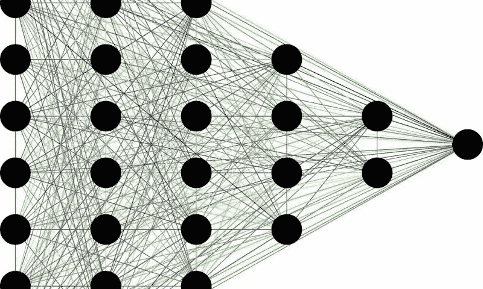
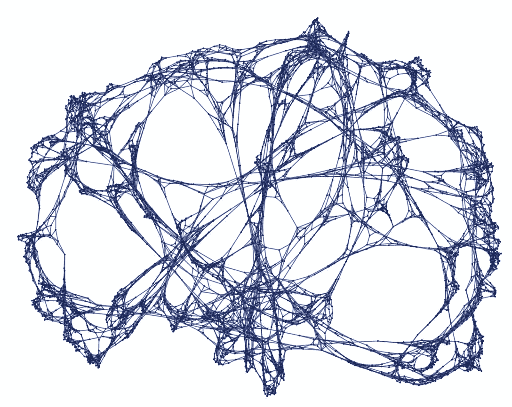

# 史蒂夫·沃尔夫勒姆刚刚发现了生命的意义，没有人在谈论它

> 原文：<https://medium.datadriveninvestor.com/stephen-wolfram-just-discovered-the-meaning-of-life-and-no-one-is-talking-about-it-d571c4846117?source=collection_archive---------6----------------------->

两个周日前，我像往常一样在 Youtube 上花了一整天的时间。然而，不寻常的是我看的一个视频和它所涵盖的内容。

这个名为“[计算和物理学基础理论](https://www.youtube.com/watch?v=qoDZKlcdPNM&t=3299s&ab_channel=TheRoyalInstitution)”的视频由史蒂夫·沃尔夫勒姆——是的，就是负责 Wolfram Alpha 和拯救世界各地工程专业学生 GPA 的同一位 Wolfram——关于他最近在 Wolfram 物理学项目下的研究的演示组成。他在这次演讲中涵盖了广泛的有趣主题，从递归的重要性到超图，再到宇宙是离散的而不是连续的，但他对此的解释比我好得多，所以我建议观看视频。

然而，他简要提到的一个概念确实引起了我的注意，我觉得它值得一谈，因为似乎没有其他人这样做。

支撑沃尔夫拉姆博士新研究的一个关键方面是**计算可归约性**的概念(补充说明:计算可归约性的概念已经存在了一段时间，所以这不是一个新发现，但它在他最近的研究中出现了很多，所以这个概念在这个意义上有了新的含义)。计算可归约性是指某些计算可以被归约或简化成需要较少时间/资源来计算的较小计算。请将此视为一条逻辑捷径，它会带你得出完全相同的结论。

Reducing the amount of time and effort it takes to get to the same destination. You could walk all the way around the mailbox and then turn left, or you could just cut across the grass. This path would then be considered reducible.

Wolfram 网站上提供的例子是 13⁸.手动计算需要将 13 乘以 8 次，这在几次幂之后会变得很乏味。令人欣慰的是，我们知道(n )⁴相当于 n⁸或 n 的 2 乘 4 次方，我们可以将这种简化技术应用于 13⁸:

13⁸ = (((13²)²)²)

现在，我们不必将 13 乘以 8 次，而是简单地计算 13 并乘以 3 次——大约是原来所需计算量的一半。

虽然这听起来像是一个严格的数学概念，但是这些计算的简化可以包括更一般的进步。例如，人类非常善于在逻辑推理中发现新的可归约性，这使得我们能够取得社会和技术进步。我们知道，如果我们把重的东西扔向空中，这个东西最终会落下来，我们知道，纸币可以代表价值，而不需要每次交换现金时有形的珍贵材料或书面的法律协议。

如果你仔细想想，这种可归约性是所有工程的核心，也是我们在生活中所做的大部分事情的核心。如果不存在可归约性，我们将无法做出任何类型的预测，我们的生活将非常混乱和可怕，因为我们永远无法预测事件。我们只能设计桥梁，因为我们知道万有引力定律保持不变，我们可以利用这种一致性来预测哪种桥梁设计效果最好。

This path would be irreducible, because there’s no shortcut you can take to make your trip shorter or easier (unless you invent flight). The only way to get to the end of the bridge is to walk the whole way across.

计算可归约性的对立面或补充是计算不可归约性的概念。这是一个计算不能被简化为更简单的形式的想法，因此找到答案的唯一方法就是简单地进行计算(没有捷径)。一个无聊的例子是 10+2 = 12。我们没有办法简化这种计算，但实际上我们也不需要简化它，因为它太简单了。然而，不可约的计算可能比 10+2 = 12 更复杂和有趣。神经网络可以被认为是计算不可约的，因为到达神经网络输出层的唯一方法是将所有输入馈入输入层，然后通过所有层的计算。这就是为什么我们必须训练我们的神经网络，我们不能通过某种预测性的捷径来放弃训练(即使我们这样做了，它也将违背拥有神经网络的初衷)。

Neural networks have many layers because we believe they function as irreducible computations. If we could reduce the computations needed to reach the output layer, we wouldn’t need all of the nodes (black circles) and layers to begin with.

在 Wolfram 物理学项目中他提出的更伟大的物理学理论中，Wolfram 博士本质上认为，宇宙是一个由相互连接的节点和边组成的超图，这个超图包含了所有可能的计算(既可约又不可约)。我们的生活和我们每天经历的大多数事件都是嵌入在这个超图中的较小的计算可约性口袋。这个理论有点“另类”,远远超出了我想表达的观点，但它同样有趣，并且比我一直谈论的可约性/不可约性得到了更多的媒体关注。

An example of a hypergraph, which just happens to look like a brain (coincidental). Nodes (points) are connected by edges (lines), and if you look closely enough, you can find that certain paths can be reduced and others cannot. Stephen Wolfram argues that our entire universe could be modeled by such a hypergraph of connected points.

随着我们在过去一个世纪看到的指数级科学进步，物理学家和哲学家都开始思考所有这些研究将把我们带到哪里，以及我们是否最终会达到某种进步的上限。换句话说，我们会不会有一天想通了所有的事情，知道了所有的事情，生活不再有趣或有挑战性？

好吧，史蒂夫·沃尔夫勒姆似乎提供了一个令人信服的答案: ***不*** ，我们将永远无法解决“一切”，因为有些计算本质上是不可简化的(见:上面超图的图片)。即使有了巨大的技术进步，计算的不可约性也将始终存在于同一水平。

尽管我们已经通过神经网络、分类器、数学模型和计算机模拟获得了所有的预测能力，但我们仍然无法准确预测谁将赢得篮球比赛，或者两个或更多对手之间的任何类似比赛。我们甚至更接近准确预测天气，但我们仍然不能使用计算机来预测谁将在拳击比赛、象棋比赛或辩论中获胜。找出谁赢了*的唯一方法是玩游戏*。

根据 Wolfram 博士的说法，生活也是如此。显然，要想知道我们的生活、我们的成就和我们的世界在一生之后会变成什么样，唯一的方法就是过好我们的生活。没有捷径或预言，只有必要的时间流逝。本质上，“时间会证明一切”(更微妙的是，由于计算的不可约性，时间可能真的存在。)过我们的生活，无论我们认为它们有多无聊或重复，都是解决这些计算不可约性所必需的，因为我们没有其他方法来发现结果，也永远不会。

所以，从某种意义上说，每个人的生活都有意义，即使是在科学层面上。日、月和不太理想的年份如 2020 年也是如此。

*最后，如果你正在读史蒂夫·沃尔夫勒姆，请让我知道我是否误解了你的想法。*

**访问专家视图—** [**订阅 DDI 英特尔**](https://datadriveninvestor.com/ddi-intel)