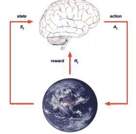

# 迈向强化学习

> 原文：<https://medium.datadriveninvestor.com/stepping-in-to-reinforcement-learning-c6f751bee6df?source=collection_archive---------5----------------------->

RL 的基本介绍

机器学习，是的，它是监督学习、非监督学习和第三强化学习的组合。好了，今天我只是保留我的第一步，去挖掘和探索这个所谓奇妙的强化学习领域。

**强化学习是什么意思？**

强化学习(RL)，也称为机器学习中的半监督学习模型，是一种允许智能体采取行动并与环境交互以最大化总回报的技术。这就像试错学习。代理人将从其环境经验中发现一个好的政策，同时不会失去太多的回报。

 [## DDI 编辑推荐:5 本让你从新手变成专家的机器学习书籍|数据驱动…

### 机器学习行业的蓬勃发展重新引起了人们对人工智能的兴趣

www.datadriveninvestor.com](https://www.datadriveninvestor.com/2019/03/03/editors-pick-5-machine-learning-books/) 

这些是 RL 中的一些关键点

**输入:**输入应该是一个初始状态，模型将从这个状态开始

**输出:**由于特定问题有多种解决方案，因此可能会有多种输出

**训练:**训练基于输入，模型将返回一个状态，用户将根据其输出决定奖励或惩罚模型。

**模型保持持续学习。**

**最佳解决方案是根据最大奖励决定的。**

换句话说，RL 是一种使用奖惩系统训练算法的动态编程。RL 算法或 RL 代理通过与其环境交互来学习。强化学习与监督学习的不同之处在于，它不需要呈现带标签的输入/输出对，也不需要显式纠正次优动作。相反，重点是在探索(未知领域)和开发(现有知识)之间找到平衡。我在这篇文章的后面讨论了这两个术语。

大多数强化学习算法使用动态规划技术。因此，环境通常以马尔可夫决策过程(MDP)的形式来描述。

**强化学习与深度学习、机器学习有什么区别？**

这就是 deepsense.ai 对差异的解释。

Comparison with Machine Leaning

**RL 与其他机器学习范式有何不同？**

以下是答案。

*   没有监督人，
*   只有奖励信号反馈被延迟，而不是瞬时的
*   时间真的很重要(顺序)
*   代理的操作会影响它接收的后续数据

示例:

*   直升机飞行特技表演
*   在双陆棋中击败世界冠军
*   管理投资组合
*   控制发电站
*   让人形机器人行走
*   比人类更好地玩许多不同的雅达利游戏

**强化的种类有哪些？**

有两种类型的强化:

1.**—**
正强化的定义是当一个事件，因某一特定行为而发生时，增加了该行为的强度和频率。换句话说，它对行为有积极的影响。

## *正向强化学习的优势:*

最大化性能

在很长一段时间内保持变化

## 正向强化学习的缺点:

过多的强化会导致状态过载，从而削弱结果

2.**负面–**
负面强化是指因为负面情况被阻止或避免而强化一种行为。

## 负强化学习的优势:

增加行为

无视最低性能标准

## 负强化学习的缺点:

它仅提供足够满足最低行为的能力

**RL 中的奖励是什么？**

奖励 Rt 是一个标量反馈信号，它指示代理在步骤 t 做得有多好。代理的工作是最大化累积奖励。RL 是基于报酬假设的。

**报酬假设** :-所有目标都可以用期望累积报酬最大化来描述

*奖励示例:*

制作一个人形机器人——向前行走奖励——摔倒奖励

驾驶直升机进行特技飞行动作，按照预期轨迹飞行有奖励，坠毁有奖励

**顺序决策**

目标:选择行动以最大化未来总回报

行动可能会产生长期后果

奖励可能会延迟，牺牲眼前的奖励来获得更多的长期奖励可能更好

*顺序决策的例子:*

金融投资(可能需要几个月才能成熟)

给直升机加油(可能会在几个小时内防止坠机)

阻挡对手的移动(可能有助于从现在开始赢得许多移动的机会)

Sequential Decision Making process in RL

**RL 中的历史和状态是什么？**

历史是观察、行动和回报的序列。

History concept in RL

接下来会发生什么取决于历史。因为行动者选择行动，环境选择观察或奖励。

状态是用于确定接下来会发生什么的信息。所以国家是历史的函数。

State is a function of history

**RL 中的环境状态是什么？**

环境状态是环境的私有表示。

这意味着数据环境用来选择下一个观察或奖励。

通常环境状态对代理是不可见的。即使它是可见的，也可能包含不相关的信息。

Environment State in RL

**RL 中的代理状态是什么？**

代理状态是代理的内部表示

这意味着代理用来选择下一个动作的信息。(强化学习算法使用的信息)

这是历史的作用。

Agent state is a function of the history

Agent State in RL

**RL 中有哪些完全可观测的&部分可观测的环境？**

**完全可观测性**:智能体直接观测环境状态

Full Observability in RL

代理状态=环境

状态=信息状态

形式上，这是一个马尔可夫决策过程(MDP)

**部分可观察性**:智能体间接观察环境。

*部分可观察性的例子:*

一个有摄像头的机器人不会被告知它的绝对位置

交易代理只观察当前价格

玩扑克的代理人只观察公共牌

代理州！=环境状态

形式上，这是一个部分可观测的马尔可夫决策过程(POMDP)

代理必须构造自己状态表示，

1.完整历史:

2.环境状态的信念:

3.递归神经网络:

**RL 代理的主要组成部分是什么？**

它们是政策、价值函数和模型。

***策略*** :代理的行为功能

***价值函数*** :每个状态和/或动作有多好

***模型*** :代理人对环境的再现

**政策**

策略是代理的行为

这是从国家到行动的地图，

例如，确定性策略:

随机政策:

策略是学习代理在给定时间的行为方式。策略是从感知的环境状态到处于这些状态时要采取的行动的映射。策略可能是一个简单的函数或查找表，而在其他情况下，它可能涉及大量的计算，如搜索过程。策略是强化学习代理的核心。

**价值函数**

价值函数是对未来报酬的预测

用于评估状态的好/坏

因此，为了在动作之间进行选择，

**型号**

一个模型预测环境下一步会做什么

p 预测下一个状态

r 预测下一个(直接)奖励，

例如

**RL 代理**

**基于值的**

无策略(隐含)

价值函数

**基于策略**

政策

无价值函数

**演员评论家**

政策

价值函数

**型号自由**

政策和/或价值功能

没有模型

**基于模型的**

政策和/或价值功能

模型

**RL 代理分类**

RL Agent Taxonomy

**什么是 RL 中的探索与剥削？**

探索发现更多关于环境的信息

利用已知信息来获取最大回报

探索和利用通常都很重要。

*勘探开发实例:*

**餐厅选择**

剥削:去你最喜欢的餐馆

探索:尝试一家新餐馆

**什么是 RL 中的预测和控制？**

预测:评估给定政策的未来

控制:通过寻找最佳策略来优化未来

**什么是 RL 算法？**

一些流行的 RL 算法有:

蒙特卡洛

q 学习

萨尔萨

q 学习—λ

萨尔萨—拉姆达

DQN

DDPG

A3C00

NAF

TRPO

聚苯醚（Polyphenylene Oxide 的缩写）

TD3

袋

这是对维基百科中所述 RL 算法的一个很好的比较。

Comparison of RL algorithms

**RL 有哪些实际应用？**

RL 可用于工业自动化的机器人技术。

RL 可用于机器学习和数据处理

RL 可用于创建培训系统，根据学生的要求提供定制的指导和材料。

**RL 的成功案例**

Deepmind 的 DQN 突围

Deepmind 的 AlphaGo

Deepmind 使用 RL 在 Mujoco 的模拟模型上模拟运动行为

从这篇基础文章中，我希望你迈向 RL 的第一步会成功。强化学习，无疑是一项尖端技术，有潜力改变我们的世界。它将使机器在寻找新的、创新的方法来执行任务时具有创造性。毫无疑问，这个领域将在未来的人工智能范式中取得巨大的里程碑。然而，RL 将在机器学习、深度学习的基础上，在大规模的人工智能父性下成长。法国著名科学家、脸书研究负责人 Yann LeCun 开玩笑说，强化学习是人工智能蛋糕上的樱桃，机器学习是蛋糕本身，深度学习是糖衣。如果没有前面的迭代，cherry 将一无所获。

*让我们深入挖掘，寻找 AI 之家的强化学习舞者。*

**参考文献:**

[https://towards data science . com/reinforcement-learning-demystified-36 c 39 c 11 EC 14](https://towardsdatascience.com/reinforcement-learning-demystified-36c39c11ec14)

[https://www . geeks forgeeks . org/what-is-reinforcement-learning/](https://www.geeksforgeeks.org/what-is-reinforcement-learning/)

[http://www0.cs.ucl.ac.uk/staff/d.silver/web/Teaching.html](http://www0.cs.ucl.ac.uk/staff/d.silver/web/Teaching.html)

[https://en.wikipedia.org/wiki/Reinforcement_learning](https://en.wikipedia.org/wiki/Reinforcement_learning)

 [## 什么是强化学习？完全指南- deepsense.ai

### 人工智能预计市场规模为 73.5 亿美元，正在突飞猛进地发展…

deepsense.ai](https://deepsense.ai/what-is-reinforcement-learning-the-complete-guide/)