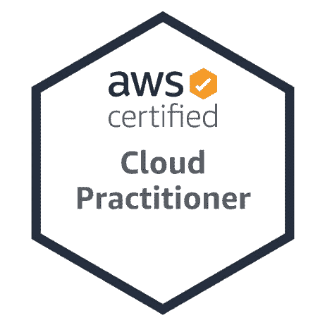
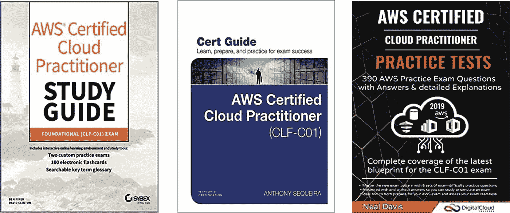

# 通过 AWS 认证云从业者(CCP)考试的步骤— CLF-C01

> 原文：<https://medium.datadriveninvestor.com/steps-to-acing-the-aws-certified-cloud-practitioner-ccp-exam-clf-c01-ef5ada8f0912?source=collection_archive---------4----------------------->

我最近通过了 AWS- Cloud 从业者认证考试——2020，并想分享我的经验和我完成这一考试的途径。AWS —认证云从业者(CCP) — CLF-C01 是基础级别的 AWS 认证。我相信证书只是现有技能的一种验证方法，但同时它帮助你从大众中分离出来(要积极！！！！)尤其是所有简历看起来都差不多的时候。在为此做准备时，我了解了 AWS 平台的工作方式及其背后的基本构件。我学到了小型 AWS 服务的大部分关键知识。我的背景:我是一名生物技术博士(不是计算机科学相关学科),热衷于数据科学，但没有云计算方面的实际经验。

## **考试快速笔记—**

**[**考试详情**](https://d1.awsstatic.com/training-and-certification/docs-cloud-practitioner/AWS-Certified-Cloud-Practitioner_Exam-Guide.pdf) **可登陆** [**AWS 网站**](https://aws.amazon.com/certification/certified-cloud-practitioner/) **。以下是一些快速笔记—****

*   **没有先决条件**
*   **费用-100 美元**
*   **问题— 65(多项选择和多项回答)**
*   **尝试——你想要多少就尝试多少，记住,( I)每次都要付费,( ii)必须等 14 天才能进行下一次尝试**
*   **交付方式—考试中心或在线监考**
*   **时间—完成考试需要 90 分钟**
*   **及格分数-70 分**

> **P **以前的知识和经验** —在开始准备认证之前，我没有任何 AWS 方面的经验。我想准备这个考试，以便在某种程度上在就业市场中脱颖而出，因为至少有一半的工作会询问云体验。**

# **学习资料**

## **1.AWS 网站—**

**亚马逊网站有学习资料和培训，我相信这是准备认证的良好开端。**

**[AWS 云从业者必备(第二版)](https://www.aws.training/Details/Curriculum?id=27076)**

**AWS-白皮书(如[Web 服务概述、](https://d1.awsstatic.com/whitepapers/aws-overview.pdf) [定价](http://d1.awsstatic.com/whitepapers/aws_pricing_overview.pdf)、[AWS 支持计划对比](https://aws.amazon.com/premiumsupport/plans/))和常见问题解答**

**[AWS 培训课程——向 AWS 专家学习](https://aws.amazon.com/training/path-cloudpractitioner/)(说实话，我并没有探索太多)**

**[AWS-认证云-从业者 _ 样本-问题](https://d1.awsstatic.com/training-and-certification/docs-cloud-practitioner/AWS-Certified-Cloud-Practitioner_Sample-Questions.pdf)(提供 10 个样本问题)**

## **2.书籍—**

**这是我为了准备和清除认证而学习的三本书。**

****

## **3.在线视频—**

**为了实践，我在 youtube 或其他网站上看了一些视频(你可以很容易地谷歌它)，但主要依赖于上述书籍。**

## ****付费练习资源—****

**你可以探索一些其他的资源——**

1.  **[Whizlabs 3 模拟考试试卷](https://www.whizlabs.com/aws-certified-cloud-practitioner/practice-tests/)，由大约 200 道实时模拟考试题组成**

**2.Udemy 模拟考试。有 6 次模拟考试**

****积极向上，不断学习！！！****

**祝你好运！！！**