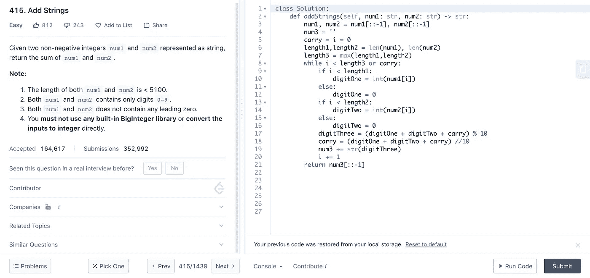

# 开始软件工程职业生涯的步骤

> 原文：<https://medium.datadriveninvestor.com/steps-to-start-a-career-in-software-engineering-36da39d8a81d?source=collection_archive---------20----------------------->

This Could Be You At Your Tech Company

与普遍的看法相反，成为软件工程师并不需要成为数学奇才或天才。自从我开始全职做软件工程师(SWE)以来，已经有相当多的人联系我，问我在这个领域起步需要什么。

 [## 软件开发过程:如何选择正确的过程？数据驱动的投资者

### 软件是任何企业组织成功的生命线。没有软件的帮助，一个…

www.datadriveninvestor.com](https://www.datadriveninvestor.com/2020/01/16/software-development-process-how-to-pick-the-right-process/) 

作为一名本科生，我的专业是电气工程，坦率地说，因为我不想再成为精算专业的学生，我不知道还能做什么。从选修必修的 C++编程入门课程开始，我就迷上了这门课程。

## 编程基础

我收到的最常见的第一个问题是，“我应该学习什么编程语言？”。我的回答通常是，这取决于你想做什么。如果你想构建 iOS 应用(苹果 iPhone & iPad)，那就学 Swift 或者 Objective C，如果你喜欢 Android 那就学 Java。然而，为了给出一种既易于初学者理解又在就业市场上有用的具体语言，我建议学习:Python。 Python 是一种通用编程语言，使用它不需要特殊的软件开发工具包(SDK)。开始学习 Python 的一个很好的课程是:[**Python 中的计算 I:基础和过程化编程**](https://www.edx.org/course/computing-in-python-i-fundamentals-and-procedural?source=aw&awc=6798_1588544397_7c0886b0442440e83a369a651077515c&utm_source=aw&utm_medium=affiliate_partner&utm_content=text-link&utm_term=301045_https%3A%2F%2Fwww.class-central.com%2F) **，**它是佐治亚理工学院教授的免费在线课程。

GitHub

与此同时，你将需要开始建立一个代码组合，向世界展示。此外，开始与广大开发人员社区互动。那是通过注册 [**GitHub**](http://www.github.com) **完成的。**使用 GitHub，您可以:

*   发布你的代码，让全世界都能看到，但更重要的是潜在的雇主或项目合作者。
*   学习 Git 的基础知识，并与代码仓库团队合作。
*   访问开源项目，这对显示你关心开发世界和回馈社区是很重要的。查看 [**本页**](https://github.com/firstcontributions/first-contributions) 做出你的第一份贡献。此外，看看 [**第一次只有**](https://www.firsttimersonly.com/) 为寻找一个开源项目作出贡献。

## 技术面试

我希望我们我第一次开始学习计算机科学(CS)，我被警告要参加技术面试。那本专题书籍专门讨论诸如 [**破解编码面试**](https://www.amazon.com/Cracking-Coding-Interview-Gayle-McDowell/dp/0984782850/ref=as_li_ss_tl?ie=UTF8&linkCode=sl1&tag=careercup-ctciwebsite-20&linkId=173f3d8878a1d7f0d131a85fbfc9f67f) 之类的必备。说白了，在 FAANG(脸书，亚马逊，苹果，网飞，谷歌)等主要技术公司的面试中，你将被要求使用你的数据结构和算法知识来解决白板上的问题。在我看来，练习这些面试必须要有一个在线平台，即 [**Leetcode**](http://www.leetcode.com) 。

问题出现在下面的大纲中:左边的问题以及如何解决问题的注释。下面的选项，看看哪些公司在真实的面试中使用过这个问题，相关的话题和类似的问题。右边是您实际开发和运行解决方案的地方。当您相信您的解决方案将适用于所有的测试用例时，您就提交以供评审。

Example Leetcode Problem

杨顺和他的 [**科技面试手册**](https://yangshun.github.io/tech-interview-handbook/) 对科技面试做了更好更深入的解释。

## 潜在补偿

诚然，这是一条职业道路，即使在获得工作或实习后，也需要大量的工作和数小时的学习。人们为什么这么做？坦率地说，因为目前对 SWEs 的补偿是荒谬的。亚马逊的初级软件工程师每年的年薪约为 151，000 美元。这是美国平均家庭收入的三倍。人们为了技术面试而学习，并在这个领域投入时间，首先是为了激情，但不可否认的是，也是为了经济激励。[**levels . FYI**](http://www.levels.fyi)**是显示不同公司对各种技术岗位的薪酬的网站。**

## **最后一个音符**

**我热爱软件工程领域，尽管有这样的误解:你可能会成为一只“代码猴子”,永远不会涉足其他领域，但这不是真的。我有幸从 SWE 实习变成了风险投资实习。现在我开始了全职工程师的职业生涯。我正在寻找产品管理角色的支点。我的观点是，对我来说，我们打开了通往其他职业道路的大门，而我可能无法进入这些道路。我希望这个简短的指南对人们有用。请留下任何资源或评论。**

**我的临别礼物是一个链接，链接到许多目前正在 COVID19 疫情期间招聘的初创公司: [**初创公司积极招聘**](https://docs.google.com/spreadsheets/d/15vTgoKSDjOsyvyh_MMHyPN1kUBdkUlZFV_mQCmfF89Y/edit#gid=1959851791) **。****