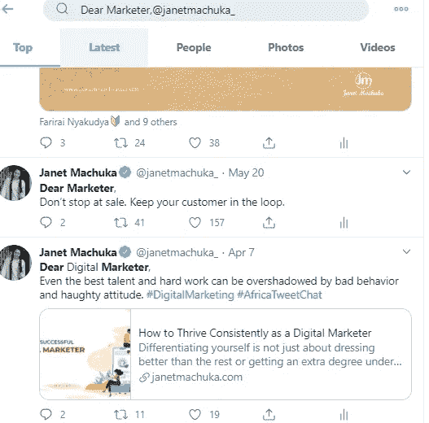
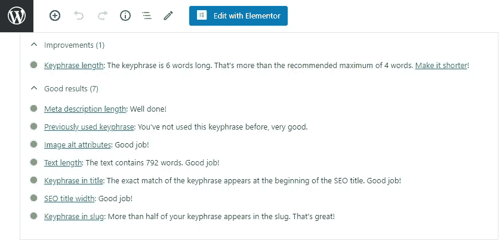

# 优秀的内容反映了最好的你

> 原文：<https://medium.datadriveninvestor.com/sterling-content-reflects-the-best-of-you-1182f2913a48?source=collection_archive---------15----------------------->

## 品牌定位帮助你避免在所有的噪音中大喊大叫

Photo by Trent Szmolnik on Unsplash

你能读懂你吗？在任何冠冕堂皇或花哨的指标中，这个基本问题触及了任何品牌优秀内容的核心。

这是数字营销培训师 [Janet Machuka](https://twitter.com/janetmachuka_) 的强项，她被评为 2019 年肯尼亚 25 大数字女性之一。

在一次[非洲推特聊天](https://twitter.com/AfricaTweetChat)中，她解释了品牌定位如何帮助你避免在喧嚣中大喊大叫。然后突破，直接轻松地与你的目标受众交流。

要想知道你分享的内容是否物有所值，最好的方法就是有勇气去分享。让人们批评它，与它互动。最后，检查你的分析。

 [## 从内心创造，而不是分析

### 那些窥视分析魔力的人有被数据催眠的风险。搜索引擎优化规则为…

medium.com](https://medium.com/datadriveninvestor/create-from-your-heart-not-the-analytics-4b3807d057c4) 

要判断你是否创造了优秀的内容，首先要相信你的直觉，确保你的内容讲述了你的故事。用热情和真诚的感情写作。

“你的内容让你兴奋吗？”马楚卡说。“在你选择的平台上分享它，听听人们如何与它互动。在推特上发布这些内容。

“问问你的观众，他们是如何看待内容的，”她说。"对于博客，插入一个搜索引擎优化工具，如 Yoast，来帮助你识别你的 SEO 见解."

 [## 对于搜索引擎优化，文字是关键|数据驱动的投资者

### 搜索引擎优化可以恐吓未经训练。从一开始，它有助于获得正确的缩写…

www.datadriveninvestor.co](https://www.datadriveninvestor.com/2018/12/29/for-seo-the-words-are-key/) 

然后是测试，看看什么成功了。

“除非你尝试一下，否则你无法判断什么类型的内容最适合你的品牌，”马楚卡说。“创建视觉效果，共享音频和文本，同时分析哪一种消费最大。

“让情感流动起来，”她说。“如果你不能表达爱，你就无法知道你是否被爱。让参与建立个人对话。不要强迫人们消费你不愿意消费的东西。”

# **日常增强功能**

伟大的内容是建立追随者的基石。

“选择一个特定的目标受众，准备内容类型，一个特定的平台来分享内容，并能够不断创造和分享到你的平台上，”马楚卡说。

“利用你的内容吸引观众的最好方法是每天都让它变得更好，”她说。"不断寻找新的创造性的方法来增加活力."

马楚卡建议品牌只依靠内容，通过几种方式来建立受众:

*   准备一个记录在案的内容策略，并致力于它。
*   分享内容时保持一致。
*   讲述你独特的品牌故事。别说得像其他人一样。
*   分享超越你的品牌销售的东西，关注顾客——他们的体验和他们需要从品牌中得到的动力。
*   请随意参与、互动和分享您现有受众的内容。

“最重要的是，始终花时间研究你的受众，以了解他们最喜欢什么类型的内容，他们是如何消费的，在哪个平台上，”马楚卡说。"然后，当你和他们建立关系时，坚持分享它."

她推荐了一本内容营销学院的电子书，[*《10 个最常见的内容营销问题:企业营销人员的真实世界洞察》*](https://contentmarketinginstitute.com/wp-content/uploads/2017/07/CMI_EntprEbook_Final.pdf)

“这本电子书将帮助你学习如何利用内容建立读者群，”马楚卡说。

即使内容看起来很棒，结果也可能令人失望。马楚卡提出了几种可能性:

*   你发帖平台不对。
*   你没有向思想领袖和有影响力的人寻求帮助来分享内容。
*   发布内容时时机不佳。在不同的平台上发布有最佳的日期和时间。

 [## 掌握生产力可以缓解焦虑

### 社交媒体上的生产力需要大量的策略和工具。时间管理和自动化起着至关重要的作用，但是…

medium.com](https://medium.com/datadriveninvestor/mastering-productivity-eases-anxiety-97bb78e776fa) 

# **声称拥有一些特别的东西**

阐述独特性将使一个品牌从竞争者中脱颖而出。这包括划定一个利基市场，并坚持分享。

“不要试图像所有人一样或做所有的事情，”马楚卡说。"花时间去研究，而不是匆忙去做错误的事情."

根据她多年的经验，她已经看到了常见的内容错误，幸运的是，这些错误都有解决方案:

*   缺乏专业知识:如果你对它没有热情，你永远也不能创造出好的内容。
*   创造力知识不足:用不同的主题测试你的内容。
*   缺乏一致性:一切都是一个过程。如果你要开始一件事，就要坚持到底。

一篇或她的文章指出了大量的[内容错误以及如何解决它们](https://janetmachuka.com/key-fatal-content-marketing-mistakes-on-digital-platforms-and-smart-solutions/)。

“不要在你的社交媒体平台上用你的内容做青蛙跳，”马楚卡说。"为个人而不是群体创造内容."

她的一个视频讲述了[如何让内容有用](https://twitter.com/janetmachuka_/status/1273322970002456578?s=20)。

她有一个简单的解决方案来鼓励人们参与内容。

“先和他们接触，”马楚卡说。“你使用的文字和视觉效果不应该是冒犯性的，而应该对目标受众有吸引力。和有很多约会的人交朋友。请他们帮助你转发、评论或分享你的内容给他们的观众。

“更多地使用视觉效果，因为它们能增加参与度，”她说，并补充了以下基本原则:

*   喜欢你的内容。
*   回复任何评论它、喜欢它或转发它的人。
*   分享有行动号召的内容。
*   学会展示你的内容。如果有人提问，请回答。

# **饮用不老泉**

很久以前有价值的旧内容可能会有新鲜感的重生。

 [## 常青树发芽新生命|数据驱动的投资者

### 对艾米·伍兹来说，“老歌但好歌”不仅仅是一句怀旧的话。这是她一生的工作，捕捉到伍兹的内容…

www.datadriveninvestor.com](https://www.datadriveninvestor.com/2019/02/01/evergreens-sprout-new-life/) 

“如果它仍然相关，并且抓住了你的听众的精神，那就改进它，”马楚卡说。“这让我的观众想起了我之前分享的内容。虽然你已经获得了追随者和越来越多的观众，他们中的一些人可能已经错过了你分享的一些金块。

“我已经转发了很多次我的大部分推文，”她说。“我只是在 Twitter 搜索部分写下‘亲爱的营销人员，@ janetmachuka _’这样的词，然后查看过去最适合我当前受众的推文。我选择它，重新发布。”

这也打破了慢日子里的创造力障碍。

为了给品牌创造优秀的内容，Machuka 认为有一个战略将引导成功。计划可以是每天、每周或每月。

“对于博客内容，利用搜索引擎优化工具来看看你是否掌握了大部分技巧，”她说。“因为我的 Yoast 工具分析我的 SEO，我可以检查 SEO 标题长度，图像描述，元描述等等。”

她的首要建议之一是加入 Twitter 聊天，向专家学习。

“做品牌倾听，”马楚卡说。“使用像 [Brand24](https://twitter.com/brand24/) 这样的工具和你的账户洞察来分析你的观众是如何消费内容的。然后你可以生产更多。我总是查看我的推特分析。”

危机期间的沟通需要不同的心态和内容方法。

 [## 你的用词可以拯救一条生命

### 人很重要，同事很重要，团队很重要，最重要的是，语言很重要。每个人如何交流有助于人们了解…

medium.com](https://medium.com/datadriveninvestor/your-choice-of-words-can-save-a-life-fa6bc0866268) 

“在这个特殊的时刻，用移情来传递信息，”马楚卡说。“视觉作品之所以胜出，是因为它们很容易描绘出人们容易理解的感觉、情感和身体表情。

“一张照片胜过千言万语，”她说。“想象一下视频能做什么。”

**关于作者**

吉姆·卡扎曼是拉戈金融服务公司的经理，曾在空军和联邦政府的公共事务部门工作。你可以在[推特](https://twitter.com/JKatzaman)、[脸书](https://www.facebook.com/jim.katzaman)和[领英](https://www.linkedin.com/in/jim-katzaman-33641b21/)上和他联系。