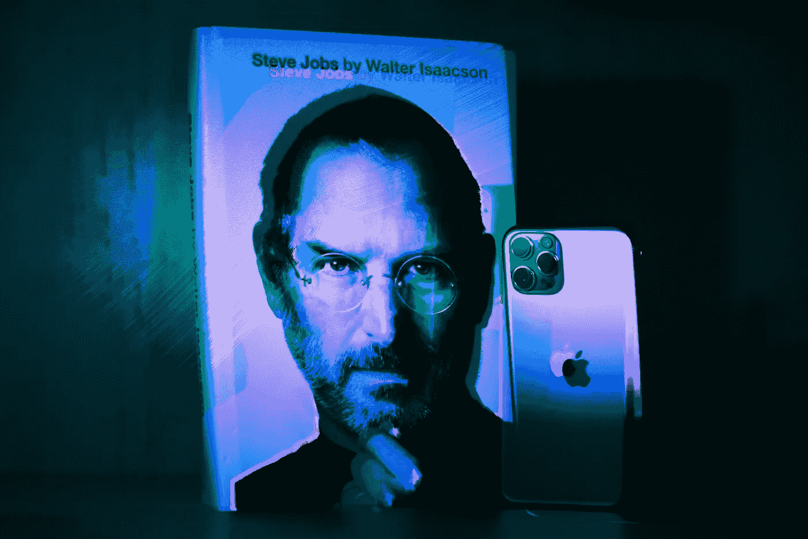

# 如何像史蒂夫·乔布斯一样思考

> 原文：<https://medium.datadriveninvestor.com/steve-jobs-the-greatest-visionary-of-our-time-1d31be867ba2?source=collection_archive---------12----------------------->

成为伟大领导者和创新者的 10 堂远见卓识的课程

Photo courtesy of Unsplash

史蒂芬·保罗·乔布斯于 1955 年出生于加利福尼亚州的三藩市，他彻底改变了现代社会的数字时代，他不仅仅是一个领导者、设计师和商人。他的简历包括麦金塔电脑、iMac、iPod、iPhone、iPad 和手表。史蒂夫·乔布斯被广泛认为是我们这个时代最有远见的人。让乔布斯与众不同的是他预见未来和人类未来的能力。这里有 10 个最好的教训，可以帮助你变得像他一样思考。

## ***1。“你周围的世界是由不比你聪明的人设计的，你可以重新设计它。”***

史蒂夫·乔布斯因重新想象我们生活的世界和寻找创造新事物的方法而闻名于世。不要只看到事物的本来面目，相反，想象它是不同的，因此，思考是不同的。

## 2."你只能向后看，而不能向前看，才能把点点滴滴联系起来。"

你生活中的重大决定总是会有结果的。你可能没有意识到或者不知道它有多有用，但是总有一天，一切都会变得有意义。不要强迫自己认为你现在做的任何事情都是无用的，相反，要认为你是在为你的未来投资。

## 3.“伟大的人足够疯狂，认为他们可以改变世界，他们就是这样做的人。”

这可能是一个偶然的想法，疯狂的人只是有时疯狂。然而，我们应该问自己这个问题，是什么让他们疯狂？

## 4."对自己的工作有激情的人比没有激情的人走得更远."

如果你对你所做的事情有热情，你总是会额外努力，如果没有热情，每当你累了或筋疲力尽时，你就会停下来。找到生活中爱在做什么，你的激情在哪里，你肯定会在生活中得到一份让你独一无二的礼物。一份直到死亡才会给每个人的礼物。

## 5."思想家和实干家是推动世界前进的人."

俗话说，“知道是成功的一半”，光有知识是不够的。你必须采取行动，不要想太多，只管去做。采取行动而犯错总比什么都不做而犯错好。如果你是一个实干家，你已经走在了潮流的前面。

## 6."在最广泛的意义上，目标是寻求开悟——然而，你定义它."

有很多方法可以看到这一点，但最重要的事实是，你要成为一个看透一切、看透不同角度的人。意识到生命短暂，在这个世界上没有什么是真正重要的。所以，用这些作为动力去做你梦想做的事情。

## 7.“我觉得你一生中最后悔的事情，就是你没有做的事情。”

第一步总是最可怕的。这就像邀请你的大学恋人出去约会一样。不管你有多害怕，问她总比 90 年后后悔好。我们都犯了那个熟悉的错误，对吗？

## 8.“记住你将死去是我所知道的避免陷入认为你会失去什么的陷阱的最好方法。”

因为不必失去的人是那些在世界上创造不可思议的影响的人。此外，表演你没有什么可以失去的礼物，你有一种世界都是你的心态，你只需要决定如何利用它。所以，不要成为你认识的那个整天除了消费什么都不做，没有为他或她的未来做任何事情的人。

## 9.“有时候当你创新时，你会犯错误。最好尽快承认它们，并继续改进你的其他创新。”

创新和领导力的代价是错误、糟糕的决策和仇恨。你见过被所有人百分百爱戴的领导吗，大概不是吧？如果你想成为一名伟大的领导者，就要学会接受你不会让每个人都满意。坚持你的愿景，有一天他们可能会改变你对你的看法。

 [## 2020 年最佳短期投资选择精选资源|数据驱动型投资者

### 投资是增加你净财富的一个好方法。如果你通过遵循一个严格的…

www.datadriveninvestor.com](https://www.datadriveninvestor.com/2020/03/28/handpicked-resources-for-the-best-short-term-investment-options-of-2020/) 

我个人最喜欢的…排在第十位。

## 10.“我们是来给宇宙留下印记的。否则，为什么会在这里？”

我们每个人都被赋予了同样的力量。我们生来就有。
让世界变得更好的力量。为什么不用呢？

*感谢您的阅读！如果你对这个故事的内容有任何意见或反馈，请随时告诉我你的想法，并与我联系。所有的观点都是我自己的，并不反映任何上帝(耶稣基督)的观点。*

# 如果你喜欢这个故事，请随意点击下面的按钮👏帮助其他人找到它。谢谢大家！