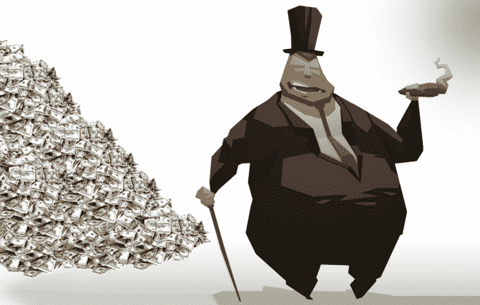
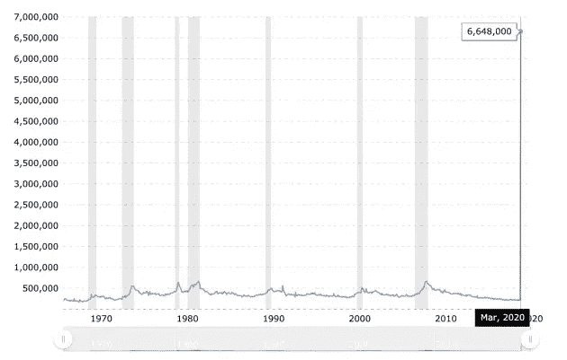
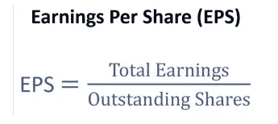
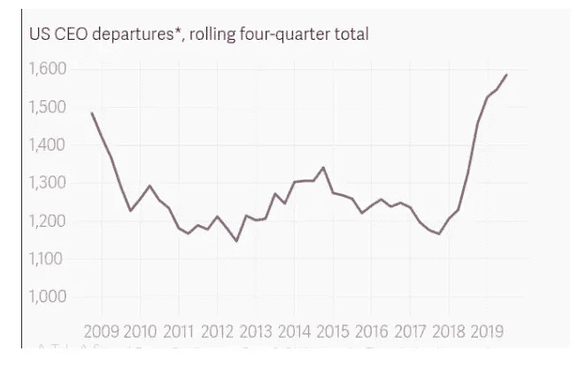
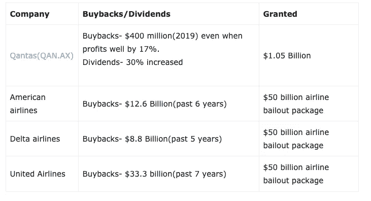

# 股票回购以及为什么我们都要为此买单。数据驱动的投资者

> 原文：<https://medium.datadriveninvestor.com/stock-buybacks-and-why-we-all-pay-for-them-data-driven-investor-32b0e86aee84?source=collection_archive---------8----------------------->

我们在创纪录的债务负担、地缘政治紧张局势、选举和气候战争的背景下进入 2020 年。不到 3 个月，我们就经历了石油价格战、需求冲击和供应冲击。然而，当尘埃落定，疫情消失，所有这些事件都将归咎于病毒。该系统对任何催化剂都是敞开的。

直升机撒钱、刺激、救市方案、经济补贴是最近媒体上经常出现的标题。这听起来好得令人难以置信。那是因为它是。在危机中，政府扔掉厨房的水槽，竭尽所能刺激经济，别无选择。主要受益者之一是那些被认为“大到不能倒”的公司。

你的自动取款机是安全的。你的银行是安全的。金融系统有足够的现金。美联储有无限的现金。我们将尽我们所能确保银行系统有足够的现金。”—尼尔·卡什卡利

# 救助的历史

2008 年，杠杆过高的银行获得了 7000 亿美元的救助，并建立了问题资产救助计划(TARP)。[美国政府购买高盛、摩根士丹利、摩根大通、美国银行等 8 家银行的优先股](https://projects.propublica.org/bailout/list)。美国国际集团(AIG)、花旗集团(CitiGroup)、通用汽车(General Motors)和克莱斯勒(Chrysler)是众多接受救助资金的公司中的几家。

全球金融危机对主要金融市场造成的破坏，促使国际机构团结起来，通过重大改革建立更具弹性的金融机构。事后看来，我们都应该感谢它的发生。一个不可持续的体系持续的时间越长，痛苦和负面后果就越严重。

对银行来说，最显著的变化是《T4 协议》中的资本和流动性改革。《巴塞尔协议 III》是继《GFC 协议》之后由 G20 国家建立的一项国际协议，旨在改善金融领域的监管、监督和风险管理。由于这些改革和许多其他改革，金融机构在面对当前危机时处于更有利的地位。理想情况下，当前 2020 年危机后发生的改革将在未来几年的其他危机中帮助我们。

# 救助的必要性

疫情引发的经济危机仍处于初期阶段。美国刚刚报道头两周内有 1000 万人失业，这将对我们所有人造成痛苦。美联储估计，危机导致的失业率为 32%，超过了大萧条时期的 25%。请记住，全世界的交易都是用美元进行的，无论美国发生什么，都会对全球经济产生影响。毫无疑问，没有预先定义何时恢复正常的标准的无限期关闭将会导致许多企业破产。政府正通过各种方案尽最大努力，但他们能做的也就这么多。

没有一家足够大的公司能够为这种事件的发生做好准备，平心而论，它们应该得到某种形式的政府帮助。但是从现在开始，公司的运作方式需要有重大的改变。

*Initial jobless claims: 3.3 million in the first week and 6.6 million in the week after totalling of up to 10 million jobless claims. This figure dwarfs that of the jobless claims during the Global financial crisis.*

# 公司债务和股票回购

创纪录的低利率和廉价信贷鼓励了企业借贷，尽管它们并不需要。如果一家公司陷入困境，或者与借贷成本相比，该公司回报的价值更高，那么债务可能非常有益。然而，甚至一些坐拥大量现金和留存利润的盈利公司也利用债务为股票回购、合并和收购提供资金(M&A)。

除了廉价债务，2017 年公司税从 35%降至 21%也促进了公司回购更多股票。企业减税的目的是提高工资、生产率、国内生产总值，最终提高经济。

股票回购是指公司回购自己的股票，从而提高每股收益(EPS)、资产回报率(ROA)和股本回报率(ROE ),因为回购减少了股票总数。每股收益是影响股价的一个重要因素。每股收益的增加可能会导致股价上涨，从而为股东带来资本收益。基本上，一家公司的每股收益和股价可以在不增加收益的情况下增加，因为股票回购可以用来人为地抬高每股收益。股票回购在 1982 年之前也是非法的。

Earnings per share formulae

除了回购之外，2019 年还促成了创纪录数量的首席执行官离职。它被称为“2019 年伟大的首席执行官外流”。他们显然有先见之明，知道经济发展过头了，早该回调了。它所需要的只是一种催化剂。下图不言自明。

*The 2019 CEO departures: higher than that of 2008–2009 CEO departures.*

# 回购和救助

航空公司多年来一直报告利润下降，但它们仍继续通过廉价信贷回购股票，以提振股价。

Summary of Airline stock buybacks/dividends with their respective buyback package.

显示了截至 2020 年 4 月 3 日的救助方案。这只是即将发生的事情的一小部分。回到 2008 年，GFC 开始后 9 个月，雷曼兄弟倒闭了。

*US airlines spent as much as 96% of their free cash flow on share buybacks instead of improving customer service, employee remuneration and productivity.*

# 回购的理由

*   增加股东价值的工具，通过超额现金和提高收益来实现。通过提高生产率来提高利润率的公司可以利用部分现金储备回购股票，尤其是在股票被低估的时候。
*   避免囤积过多的现金
*   股票回购给股东带来的税收优惠按资本利得税率征税。股息按普通所得税税率征税。

# 反对回购的理由

*   预示着未来增长的乏力。无法利用留存利润通过再投资于公司运营来进一步改善公司。
*   人为抬高股价，因为高管薪酬的大部分与股价挂钩。
*   将高管从改善公司基本面和盈利能力转移到提高股价上。
*   没有为公司并最终为经济提供生产能力。
*   通过回购实现的股价上涨只会增加“感知财富”，而不是真正的财富。

# 结论

凭空产生的数十亿美元支出将通过更高的通胀率、公众税收的增加和生活水平的下降来支付。航空公司对全球化、旅游、货运和经济增长至关重要。一个没有政府干预的理想自由市场将导致没有竞争力和财政不负责任的公司倒闭，新的创新公司出现。但允许这种情况发生的短期痛苦过于严重，因此，应该拯救那些将在危机后重振经济的重要企业。

2008 年，全球银行法规进行了修改，以增强弹性。在医疗危机得到解决后，如果股票回购和其他导致人为高估值的工具得不到解决，我们都应该感到担忧。然而，将竞争力下降和缺乏创新归咎于“前所未有的事件”要容易得多。

这个疫情有潜力将人类创新和生产率再次推至前所未有的高度，但前提是我们允许它这么做。

[*我第一次股灾时的想法和情绪*](http://Thoughts and emotions during my first market crash,2020.) *我*

[*回顾过去的新闻:我第一次股灾时的想法和情绪*](https://medium.com/@ashainperera/looking-past-the-news-thoughts-and-emotions-during-my-first-market-crash-ii-1fa1c0e573ee?source=friends_link&sk=5115f275e4c1eeda34733dd00359381e) *II*

[*杯子还半满吗？我第一次市场崩盘时的想法和情绪 III*](https://medium.com/@ashainperera/is-the-glass-still-half-full-thoughts-and-emotions-during-my-first-market-crash-iii-d4eadd9aa00a?source=friends_link&sk=89bcd2e62f4cdeb84ced874f1b8d860c)

## 资源

阮，p . 2020。 [*救助追踪者，*](https://projects.propublica.org/bailout/list) ProPublica。

尤克塞尔，硕士，2019。 [*后危机十年 G20 金融部门改革*](https://www.rba.gov.au/publications/bulletin/2019/jun/a-decade-of-post-crisis-g20-financial-sector-reforms.html) 。澳大利亚储备银行。

[*买回来，咬回去——一个简单的例子*](https://www.livewiremarkets.com/wires/buy-back-bite-back-what-s-wrong-in-one-simple-e-g) 怎么了。在线市场。

Macrotrends.net 2020 年。 [*首次申领失业救济金历史图表*](https://www.macrotrends.net/1365/jobless-claims-historical-chart) 。

*原载于 2020 年 4 月 8 日*[*https://www.datadriveninvestor.com*](https://www.datadriveninvestor.com/2020/04/08/stock-buybacks-and-why-we-all-pay-for-them/)T22。