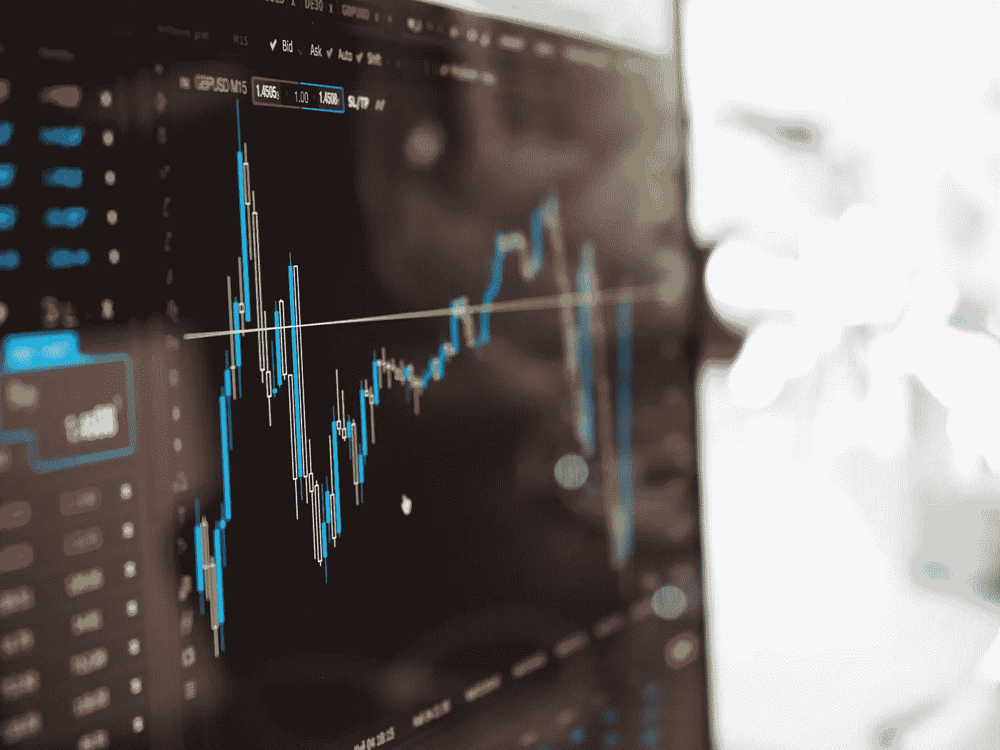
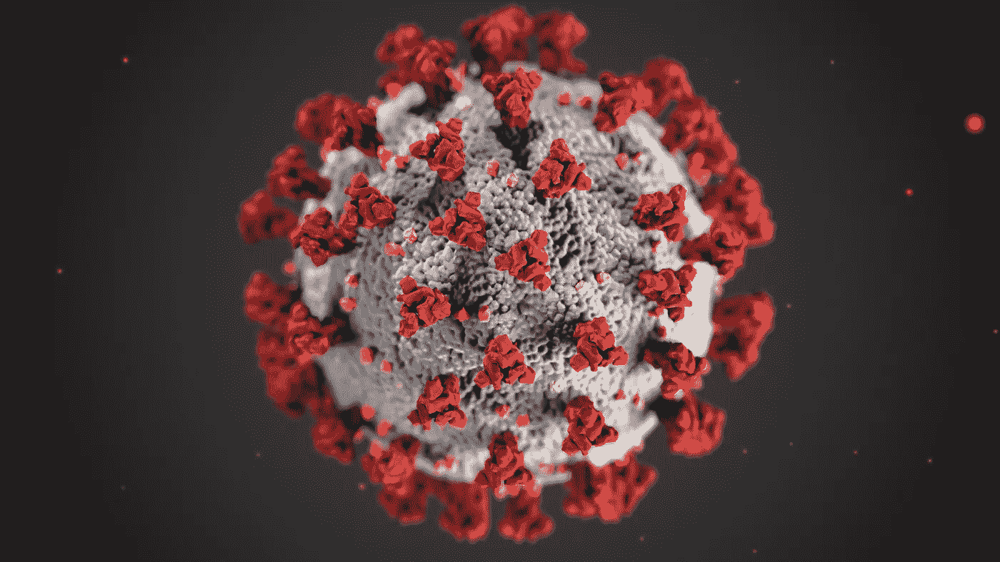
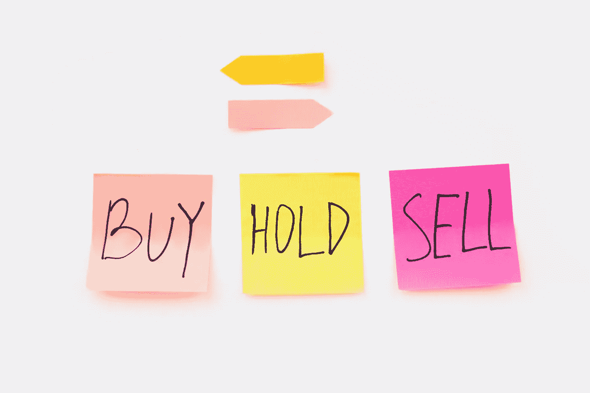

# 股票市场:股票能持续上涨还是即将下跌？

> 原文：<https://medium.datadriveninvestor.com/stock-market-can-stocks-keep-gaining-or-is-a-dip-imminent-56dbcb40a04f?source=collection_archive---------19----------------------->

## 股市的牛市可能即将结束

Photo by [energepic.com](https://www.pexels.com/@energepic-com-27411?utm_content=attributionCopyText&utm_medium=referral&utm_source=pexels) from [Pexels](https://www.pexels.com/photo/blue-and-yellow-graph-on-stock-market-monitor-159888/?utm_content=attributionCopyText&utm_medium=referral&utm_source=pexels)

今天投资者的一个常见问题:*市场会出现重大调整吗？*

看起来最近整个市场都在执行一项任务——股票继续无情地攀升！

> 今年迄今，道琼斯指数上涨了 2.9%，标准普尔 500 上涨了 5.76%，纳斯达克指数上涨了 9.19%。

随着市场趋势走高，散户投资者的兴趣增加，许多人会认为趋势线只指向一个方向——上涨！

**但是股票市场并不遵循投资者认为可能发生的事情；它以自己的方式表现得不可预测。当你认为事情再好不过的时候，你却发现自己的投资遇到了麻烦。**

虽然你可能认为整体市场将继续走高，但它可能另有打算。

在这篇文章中，我们将看看一些可能导致股票在几个月的上涨趋势后下跌的因素。

# 情感投资可能导致内爆

Photo by [AlphaTradeZone](https://www.pexels.com/@alphatradezone?utm_content=attributionCopyText&utm_medium=referral&utm_source=pexels) from [Pexels](https://www.pexels.com/photo/man-people-woman-laptop-5833244/?utm_content=attributionCopyText&utm_medium=referral&utm_source=pexels)

最近几周，我们都看到了当散户带着情绪开始交易时会发生什么。

你要么运气好，赢了，要么输得很惨。

> Reddit 华尔街赌注的散户投资者决定走到一起，不仅购买股票，还买入一些被严重做空的知名股票的期权。

当他们涌入 GameStop 这样的股票时，他们创造了一个短暂的挤压，使股价飙升。

尽管这看起来像是一个稳赚数千的方法，但还是有投资者损失惨重。

> 事实上，从 1 月下旬 347.51 美元的峰值开始，GameStop 的股价现在仅为 41.10 美元，并呈下降趋势。

这些都是巨大的损失，尤其是如果你没有从一开始就参与其中的话。

基于情绪的投资是很棘手的，因为 A)股票可以在一毛钱的时候改变方向，B)投资者经常会过度上涨。

当这些散户投资者从一只股票转向另一只股票时，他们可能会导致大范围的波动，因为某只股票的价格会在最初的买入热潮中飙升，然后在兴趣消退后大幅下跌。

随着社交媒体上的论坛、聊天室和私人投资团体继续获得更多的兴趣，可以肯定地说，GameStop 的惨败只是一种新投资的开始(如果你称之为投资的话)

当我们看到发生在 GameStop 股票上的事情开始发生在其他股票上时，整个市场可能会开始清算他们的头寸，而不知道哪只股票是下一个被砍掉的股票。这反过来会导致市场调整的形成。

# **冠状病毒可能威胁牛市(再次)**

Photo by [CDC](https://www.pexels.com/@cdc-library?utm_content=attributionCopyText&utm_medium=referral&utm_source=pexels) from [Pexels](https://www.pexels.com/photo/white-red-and-blue-flower-petals-3993212/?utm_content=attributionCopyText&utm_medium=referral&utm_source=pexels)

除非我们提到冠状病毒在整体下跌中扮演的角色，否则关于市场调整的讨论永远不会完整。

> 你应该记得 2020 年 2 月至 3 月市场发生了什么，当时冠状病毒的消息刚刚开始传播。

它造成了如此大的恐慌，以至于市场因跌落悬崖而崩溃。

尽管我们已经看到股市回升，实际上还在走高，但一种新的冠状病毒变种可能会再次引发恐慌性抛售。

毫无疑问，最近几周围绕冠状病毒的讨论更加积极，因为许多公司发布了疫苗，每天都向公众提供疫苗。

然而，随着关于一种新的冠状病毒变种及其如何影响当前疫苗接种工作的消息流传开来，人们再次开始紧张起来。

随着感染率上升，这种变异传播到美国的消息开始对人们的生活产生影响。

这可能迫使许多投资者开始撤回他们的头寸，为冠状病毒引发的另一波抛售压力做准备。

# **上升的必然下降**

Photo by [Anna Nekrashevich](https://www.pexels.com/@anna-nekrashevich?utm_content=attributionCopyText&utm_medium=referral&utm_source=pexels) from [Pexels](https://www.pexels.com/photo/businessman-internet-luck-business-6801651/?utm_content=attributionCopyText&utm_medium=referral&utm_source=pexels)

一个有经验的投资者知道，在调整到来之前，市场只能上涨这么多。

> 事实上，调整对整体上升趋势至关重要，因为当投资者买入下跌时，调整会带来大量现金流。

自 2020 年 3 月以来，我们已经看到市场上涨背后有很大的力量。许多公司的股价已经达到或超过了 52 周的高点，许多公司的估值也在飙升。

**这些在 2020 年 3 月回调期间建仓的投资者可能会在市场开始小幅波动时减少仓位**或获利了结。

尽管柱状图[认为道指目前强劲，但其趋势观察指标确实指向疲软方向。](https://www.barchart.com/stocks/quotes/$DOWI/opinion)

> **“我们必须承认，美国股市的‘风险回报’已经大幅恶化，市场已经到了下跌的时机，”—摩根士丹利(Morgan Stanley)的迈克·威尔逊(Mike Wilson)。**

我们都明白“有涨必有跌”的逻辑，我相信市场已经接近下跌的阶段。

尽管这种调整可能不会像我们在 2020 年 3 月看到的那样是抛售，但下跌可能会导致市场在未来几周或几个月内努力寻求牵引力。

# 最后的想法

虽然没有人能预测市场的走势，但你可以利用自己掌握的信息，对你已经或正在考虑进行的投资做出明智的决定。

**你最不想做的事情就是进行情感投资，从长远来看，这可能会让你走上一条崎岖不平的道路。**

相反，考虑所有你能得到的信息，以保护你的投资不被接下来几个月可能发生的大抛售或市场调整所套牢。