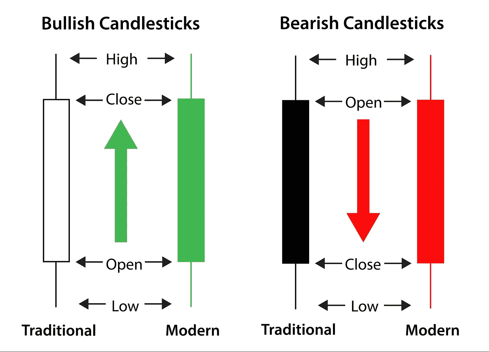
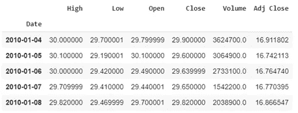

# 股市数据分析:用 Plotly 和 Python 构建烛台互动图表

> 原文：<https://medium.datadriveninvestor.com/stock-market-data-analysis-building-candlestick-interactive-charts-with-plotly-and-python-bd7866dcb4c1?source=collection_archive---------1----------------------->

**金融交易分析和故事讲述的强大工具**

Photo by [Jason Briscoe](https://unsplash.com/@jsnbrsc?utm_source=medium&utm_medium=referral) on [Unsplash](https://unsplash.com?utm_source=medium&utm_medium=referral)

本文是金融数据分析系列文章的第一篇，在这篇文章中，我将展示股票市场专业人士、数据分析师和交易员使用的一些有用的工具。由于 Python 在各个领域的使用和适用性不断增加，所以整个方法都是使用 Python 完成的。

# 烛台诠释

也许是显示给定时间框架内商品价格行为的最常见的图形方式，**蜡烛图让我们对股票的表现有一个快速而直观的感知**。每根蜡烛线代表一个特定的分析周期(本文将使用日周期),并显示开盘价和收盘价，以及最高价和最低价。

所谓的**“蜡烛体”**，由开盘价和收盘价之间较厚的区域表示，以两种不同的颜色显示——通常的方法:**绿色/白色表示*看涨*行为**，收盘价高于开盘价，**红色/黑色表示*看跌*行为**，价格跌至低于开盘价。第三种可能的情况是被称为**“多吉蜡烛”**的“扁平体”类型。当活跃收盘价格与开盘价相同(或非常接近)时，这种形状的烛台出现。

 [## 使用谷歌搜索趋势预测首次申请失业救济人数|数据驱动的投资者

### 几年来，我的重点一直是使用多种替代数据来预测宏观经济统计数据…

www.datadriveninvestor.com](https://www.datadriveninvestor.com/2020/03/25/using-google-search-trends-to-predict-initial-jobless-claims/) 

最后，蜡烛的**【影子】**是一条线，可以显示在蜡烛体的上部和/或下部。当它出现在主体上方时，它代表该时期的最高实现价格。如果低于烛台主体，阴影表示该时期的最低价格。

# 什么是 Plotly，为什么有用？

Python 的库，如 **matplotlib** 和 **seaborn** 经常被用于数据可视化相关的工作，然而，技术和基本面股票市场分析师通常需要大量的指标和动态可视化工具。在这个场景中，Plotly ( [plotly.py](https://plotly.com/python/) )作为一个免费的开源图形 python 库，能够制作交互式的、出版物质量的图形。

[https://plotly.com/python/getting-started/](https://plotly.com/python/getting-started/)

> “plotly.py 构建在 Plotly JavaScript 库(plotly.js)之上，使 Python 用户能够创建漂亮的交互式基于 web 的可视化效果，可以在 Jupyter 笔记本中显示，保存到独立的 HTML 文件中，或作为使用 Dash 的纯 Python 构建的 web 应用程序的一部分。”

除了图形工具之外，金融分析主要需要长时间序列和特定数据片段的可视化，这些都可以通过 plotly.py 特性轻松处理，例如范围滑块和选择器。

# 构建图表(循序渐进)

首先，我们将导入**熊猫**来设置我们的数据框架，导入**来构建图表。**

请注意，如果您希望在 plotly 的 dash 中保存您的图形，使用 plotly chart-studio 的库可能会很有用(这样做还可以更容易地共享和编辑您的图形)。

接下来，我们将使用 pandas " **datareader** 函数从[雅虎财经](https://finance.yahoo.com/)收集我们所选股票的数据。在这个练习中，我们将与 Banco do Brasil S/A 合作，它是巴西最传统的公司之一，普通股的符号为“BBAS3”。

熊猫。head()方法返回给我们下表:

.head() return top n (5 by default) rows of a data frame or series.

我们可以看到‘date’列已经被设置为我们的数据库索引，并且已经采用了 **datetime 格式**，所以我们可以开始了！

关于图表的情节和支线剧情，我们需要定义轨迹。第一个踪迹应该建立我们的情节的主要设定，如下:

从那里，我们随后的跟踪将绘制出我们选择的所有分析工具。最常见的指标之一是移动平均值，在我们的示例中，它将被设置为 30 和 50 个周期。

需要注意的是，平均值是在收盘价的基础上计算的，而“window”属性接受我们想要求和以提取平均值的周期数。

从这里，我们可以定义轨迹 2 和 3 中的移动平均线的子图，使用一个简单的散点图并通过颜色区分彼此。另外，默认情况下会显示图例。

到目前为止，我们已经得到了绘制蜡烛图的所有信息，它给出了每根日线的开盘价、收盘价、最高价和最低价，同时也给出了两条移动平均线。

我们快到了！下一步是将所有的轨迹聚集到一个“数据”变量中，这个变量将包含所有的支线剧情。然后，我们可以随心所欲地设置图表的布局。

现在，作为有趣的最后一部分，我们将创建图的图形并调用 show 函数。

搞定了。结果如下:

# 结论

Plotly library 只需几行代码，甚至允许初级 python 用户定制和绘制一个装备良好的交互式烛台图表，用于股票市场分析。

如有任何更正或反馈，请发表评论或通过 [linkedin](https://www.linkedin.com/in/caio-milani-correa-87b00b17a/) 联系我。