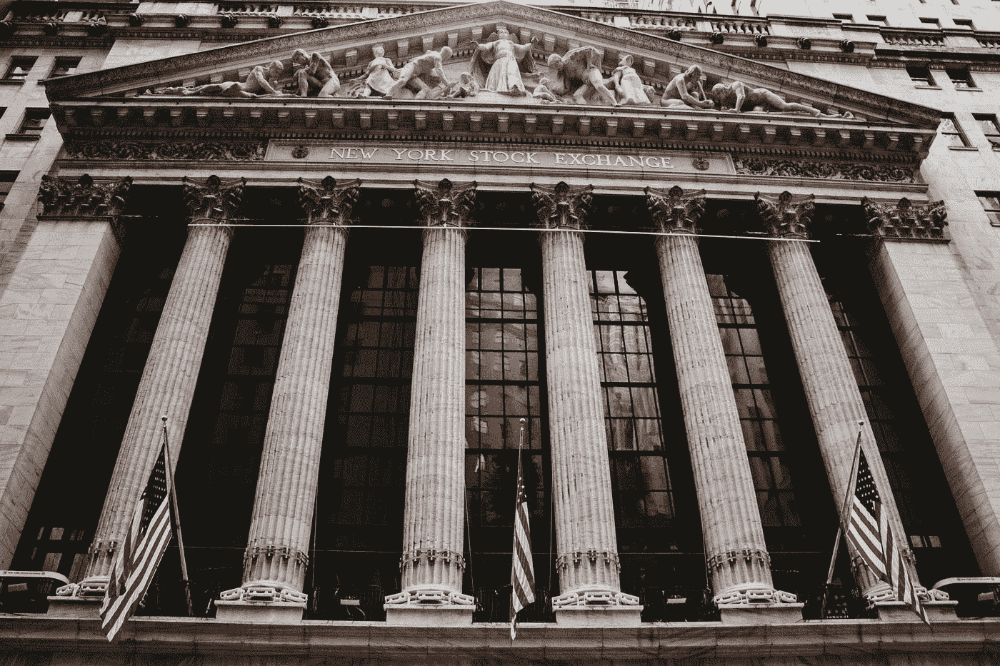
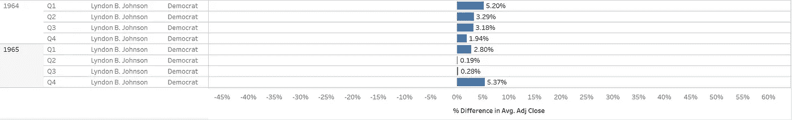
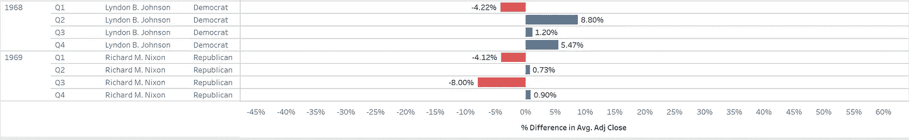
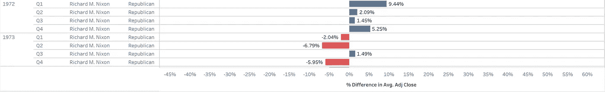
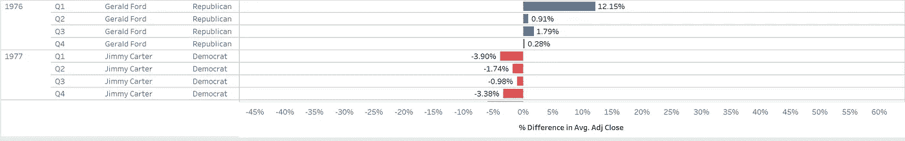
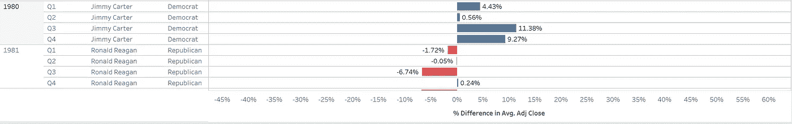
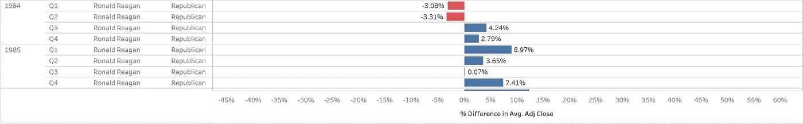
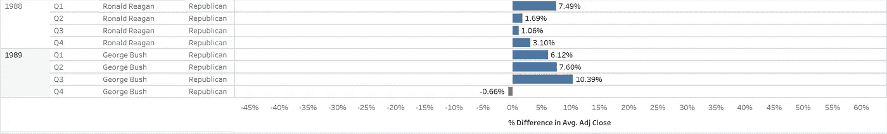
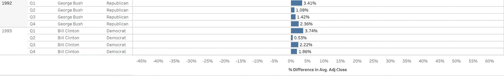
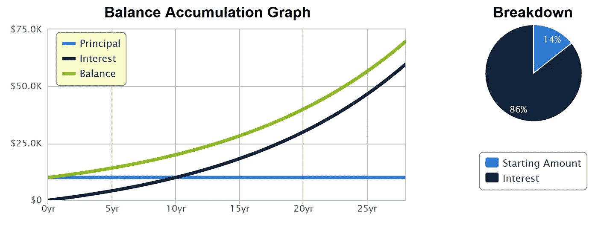

# 如果民主党获胜(1964-1992)，股市会崩盘吗？

> 原文：<https://medium.datadriveninvestor.com/stock-market-reactions-to-presidential-elections-1964-1992-af1fa8fce975?source=collection_archive---------32----------------------->

## 寻找股票市场崩溃和美国总统政治(1964-1992)之间的相关性的历史。

Photo by [Aditya Vyas](https://unsplash.com/@aditya1702?utm_source=medium&utm_medium=referral) on [Unsplash](https://unsplash.com?utm_source=medium&utm_medium=referral)

本文是评估股票市场对总统选举反应系列文章的第三部分。如果民主党获胜，股市会崩盘吗？如果共和党获胜，股市会崩盘吗？我们将关注历史上的标准普尔 500 指数走势、美国和世界历史事件以及美国总统选举。

*第一部分——“如果川普输了，股市会崩盘吗？”*

*第二部分——“历史股票市场对总统选举的反应(1932-1960)”*

*第三部分——评估 1964 年至 1992 年期间的平均月度成交。*

在今天的短途旅行中，我们将回到 60 年代、70 年代、80 年代和 90 年代初，记录每个选举年的时事，并考察标准普尔 500 指数如何反应:在总统选举之前、期间和之后。

*   我们将揭开什么样的趋势？
*   第二部分的观察成立吗？
*   美国总统大选是市场表现的可靠指标吗？

在我们的旅行中，我们将通过 1964 年在标准普尔 500 投资 10，000 美元并在 1992 年再次投资来考察买入并持有策略。在没有任何干扰的情况下，我们的投资会有怎样的表现？

事不宜迟；以下是我们今天的行程:

# 美国总统选举

*   1964 年:**林登·约翰逊(民主党)**对巴里·戈德华特(共和党)
*   中途停留:1964 年在标准普尔 500 投资 10，000 美元
*   1968 年:**理查德·尼克松(共和党)**对休伯特·汉弗莱(民主党)对乔治·华莱士(民主党)
*   1972 年:理查德·尼克松(共和党)对乔治·麦戈文(民主党)
*   1976 年:吉米·卡特(民主党)对杰拉尔德·福特(共和党)
*   1980 年:罗纳德·里根(共和党)对吉米·卡特(民主党)对约翰·安德森(共和党)
*   1984 年:罗纳德·里根(共和党)对沃尔特·蒙代尔(民主党)
*   1988 年:老布什(共和党)对迈克尔·杜卡基斯(民主党)
*   1992 年:比尔·克林顿(民主党)对乔治·h·w·布什(共和党)对罗斯·佩罗(共和党)
*   最后一站:重温我们 1992 年在标准普尔 500 的 10，000 美元投资

# 1964 年:林登·约翰逊(民主党)对巴里·戈德华特(共和党)

Data: Yahoo Finance, Chart: KR

今年美国和世界大事

*   约翰·肯尼迪总统在 1963 年 11 月 22 日遇刺身亡。林登·约翰逊宣誓就任美国总统。
*   林登·约翰逊(现任民主党)以压倒性优势击败巴里·戈德华特(共和党)。约翰逊获得了 486 张选举人票，拿下了 44 个州，并获得了 61.1%的普选票数。
*   1964 年的民权法案被林登·b·约翰逊签署成为法律。这一里程碑式的法案禁止公共场所的种族隔离、选民限制和工作场所的歧视。这项法律有效地结束了所有的种族歧视法。
*   美国宪法的第 24 次修正案被通过。这项修正案取消了人头税。
*   随着国会批准战争并增派军队，越南战争愈演愈烈。

基于图表的结论:林登·约翰逊(D)的当选恰逢标准普尔 500 指数连续 12 个月呈上升趋势。

# 中途停留:示例场景—1964 年在标准普尔 500 投资 10，000 美元

Photo by [John Matychuk](https://unsplash.com/@john_matychuk?utm_source=medium&utm_medium=referral) on [Unsplash](https://unsplash.com?utm_source=medium&utm_medium=referral)

如前所述，我们将尝试买入并持有的策略。

我们将于 1964 年 1 月 1 日在标准普尔 500 投资 10，000 美元，并于 1992 年 12 月 31 日再次投资。这一战略将允许 28 年的不间断增长。

 [## 利用股市相关性的最佳方式|数据驱动的投资者

### 当阿尔弗雷德·温斯洛·琼斯开创了世界上第一个“对冲”基金(后来“d”被去掉了)时，他让其他投资者大吃一惊…

www.datadriveninvestor.com](https://www.datadriveninvestor.com/2020/02/02/the-best-way-to-use-stock-market-correlations/) 

**以下是我们 1964 年指数投资中包含的一些公司:**通用汽车、埃克森美孚、福特、美国钢铁、AT & T、杜邦、联合碳化物公司、IBM、Esmark、RCA，还有 488 家公司。

我们的投资将如何表现？最终报告将在文章末尾提供。

上船啦

# 1968 年:**理查德·尼克森(共和党)**对休伯特·汉弗莱(民主党)对乔治·华莱士(共和党)

Data: Yahoo Finance, Chart: KR

今年美国和世界大事

*   林登·约翰逊退出总统竞选——尽管他是现任总统。
*   1968 年 6 月 5 日，美国参议员罗伯特·F·肯尼迪在赢得加利福尼亚州和南达科他州的民主党提名初选后遇刺身亡。休伯特·汉弗莱获得民主党提名。
*   理查德·尼克松(右)击败休伯特·汉弗莱(右)和乔治·华莱士(上)。尼克松获得了 301 张选举人票，拿下了 32 个州，并获得了 43.4%的普选票数。
*   1968 年 4 月 4 日，小马丁·路德·金遇刺身亡。随着非裔美国人民权运动哀悼金的逝世，非暴力(金倡导签名)和民间抗议的呼声仍在继续。
*   随着英国发生暴力反战抗议，反越南抗议蔓延到世界各地。反战情绪开始在全球蔓延。

基于图表的结论:理查德·尼克松(右)的当选对标准普尔 500 指数不利，导致其连续 3 个月下跌 4.12%。

# 1972 年:理查德·尼克松(共和党)对乔治·麦戈文(民主党)

Data: Yahoo Finance, Chart: KR

今年美国和世界大事

*   理查德·尼克松(右)以压倒性胜利击败乔治·麦戈文(右)。尼克松获得 520 张选举人票，拿下 49 个州，并获得 60.7%的普选票数。
*   水门丑闻:1972 年，多名白宫官员闯入民主党全国委员会办公室。这只凉鞋导致了一项调查和理查德·尼克松在 1974 年 8 月 8 日的辞职。副总统杰拉尔德·福特宣誓就任美国总统。
*   美国和苏联签署反导条约(反弹道导弹)，限制弹道导弹和其他武器的使用。
*   慕尼黑奥运会袭击:1972 年 9 月 6 日，持枪歹徒在慕尼黑奥运会上谋杀了 11 名以色列运动员。

根据图表得出的结论:尼克松再次当选恰逢标准普尔 500 指数出现两个负季度。

# 1976 年:**吉米·卡特(民主党)**对杰拉尔德·福特(共和党)

Data: Yahoo Finance, Chart: KR

今年美国和世界大事

*   吉米·卡特以微弱优势击败杰拉尔德·福特。卡特获得 297 张选举人票，拥有 23 个州(少于福特的 27 个州)，获得 50.1%的普选票数。
*   美国的通货膨胀问题开始恶化——上升到 5.75%。按照这个速度，日常商品的价格每 12.5 年就会翻一番。
*   一场地震袭击南美洲，造成 22，000 人死亡。受影响的国家包括危地马拉和洪都拉斯。
*   史蒂夫·乔布斯和史蒂夫·沃兹尼亚克于 1976 年 4 月创建了苹果电脑公司。

**基于图表的判断:吉米·卡特的当选恰逢标准普尔 500 指数连续四个季度出现负回报。**

# 1980 年:罗纳德·里根(共和党)对吉米·卡特(民主党)对约翰·安德森(共和党)

Data: Yahoo Finance, Chart: KR

今年美国和世界大事

*   罗纳德·里根(共和党)以压倒性的胜利击败吉米·卡特(现任民主党)和约翰·安德松(民主党)。里根获得了 489 张选举人票，拿下了 44 个州，并获得了 50.7%的普选票数。
*   美国的通货膨胀问题达到了可怕的境地——上升到 13.58%。按照这个速度，日常用品的成本每 5.3 年就会翻一番。
*   独裁者萨达姆·侯赛因进攻伊朗西部，伊朗和伊拉克战争开始。战斗持续了八年，估计夺去了 800 万人的生命。
*   一场严重的热浪袭击美国，造成 1117 人死亡。
*   由于苏联入侵阿富汗，美国抵制莫斯科夏季奥运会。

基于图表的结论:里根(右)的当选与标准普尔 500 指数中四分之三的负回报相吻合。

# 1984 年:罗纳德·里根(共和党)对沃尔特·蒙代尔(民主党)

Data: Yahoo Finance, Chart: KR

今年美国和世界大事

*   罗纳德·里根(右)以压倒性胜利击败沃尔特·蒙代尔(右)。里根获得 525 张选举人票，拿下 49 个州，获得 58.8%的普选票数。
*   美国的通货膨胀降温了。美联储主席保罗·沃尔克通过提高利率来减缓失控的通货膨胀趋势。目前的通货膨胀率稳定在 4.3%。
*   印度总理:英迪拉·甘地于 1984 年 10 月 31 日遇刺身亡。
*   联合王国和中国同意在 1997 年与 mainland China 重建香港特别行政区。这项协议被称为中英联合声明。
*   台风袭击菲律宾，造成 3000 人死亡。

**根据图表得出的结论:罗纳德·里根(右)的连任恰逢标准普尔回报率连续四个季度正增长。**

# 1988 年:老布什(共和党)对迈克尔·杜卡基斯(民主党)

Data: Yahoo Finance, Chart: KR

今年美国和世界大事

*   老布什(右)击败迈克尔·杜卡基斯(右)。布什获得 426 张选举人票，拿下 40 个州，并获得 53.4%的民众选票。
*   美联储设定的利率为 10.5%。房屋抵押贷款的利率在 10-15%之间。
*   中导条约:美国和苏联同意消除短程和中程核导弹。
*   独裁者萨达姆·侯赛因对伊拉克的库尔德人实施毒气攻击。
*   亚美尼亚地震夺去了 6 万人的生命。

基于图表的判断:乔治·h·w·布什(右)的当选导致标准普尔的繁荣——持续了三个季度。

# 1992 年:**比尔·克林顿(民主党)**对老布什(共和党)对罗斯·佩罗(民主党)

Data: Yahoo Finance, Chart: KR

今年美国和世界大事

*   比尔·克林顿(民主党)击败老布什(现任共和党)和罗斯·佩罗(民主党)。克林顿获得了 370 张选举人票，拿下了 32 个州，并获得了 43%的普选票数。
*   随着独裁者巴雷被驱逐，索马里内战爆发。25，000 名美国士兵被派往该国以恢复和平并缓解极度饥荒。
*   1992 年 12 月 17 日，老布什签署 NAFTA(北美自由贸易协定)成为法律。
*   芝加哥洪水:由于芝加哥隧道工程中的错误安装和管理不善，大规模洪水导致近 20 亿美元的损失。
*   美国第 27 次宪法修正案被通过。这项修正案限制了国会议员的薪水。

**根据图表得出的结论:比尔·克林顿的当选导致标准普尔 500 指数连续四个季度上涨。**

# 最后一站:在 1992 年 12 月，重温我们从 1964 年开始的 10，000 美元投资

Photo by [Precondo CA](https://unsplash.com/@precondo?utm_source=medium&utm_medium=referral) on [Unsplash](https://unsplash.com?utm_source=medium&utm_medium=referral)

我们在标准普尔 500 的初始投资 10，000 美元已经增长到 46，987 美元。这一增长不包括任何股息，仅反映了标准普尔 500 的增长。

*   28 年来，我们的投资以 5.68%的年复合增长率增长。

然而，如果我们加上 2.5%的年股息:

*   我们的新余额:69，692 美元
*   包括股息在内，我们的投资增长率为 7.18%(年复合增长率)。

Source: Calculator.net

# 评价

与 1932 年至 1960 年之间的 28 年相比，1964 年至 1992 年之间的时期并不富有成果。此外，在美国总统大选后，我们看到标准普尔 500 出现了更多波动:

*   一个 9 个月的正增长期(共和党总统)
*   三个为期 12 个月的正增长期(民主党、共和党、民主党总统)
*   一个 3 个月的负增长期(共和党总统)
*   一个 6 个月的负增长时期(共和党总统)
*   一个 9 个月的负增长时期(共和党总统)
*   为期 12 个月的负增长(民主党总统)

总体而言，S&P 和各政党的正增长和负增长之间没有关联。根据政治来选择市场时机不会有效。

然而，购买和战略奏效了——实现了 7.18%的复合增长率。这一策略经受住了无数次战争、股市崩盘、经济衰退、通货膨胀和其他经济灾难。

这是真正的无忧策略！

**阅读更多来自 KR 的中型故事**

 [## 如果特朗普输了，股市会崩盘吗？

### 标准普尔 500 的历史数据支持股市崩盘吗——如果川普输掉大选的话？

medium.com](https://medium.com/datadriveninvestor/will-the-stock-market-crash-if-trump-loses-7ca1e6cb0e1a)  [## 历史上股票市场对总统选举的反应(1932-1960)

### 如果你遵循这个简单的投资策略，你的投资将在 28 年内增长超过 13 倍。

medium.com](https://medium.com/datadriveninvestor/historical-stock-market-reactions-to-presidential-elections-1932-1960-d699dff10419) 

**进入专家视角—** [**订阅 DDI 英特尔**](https://datadriveninvestor.com/ddi-intel)