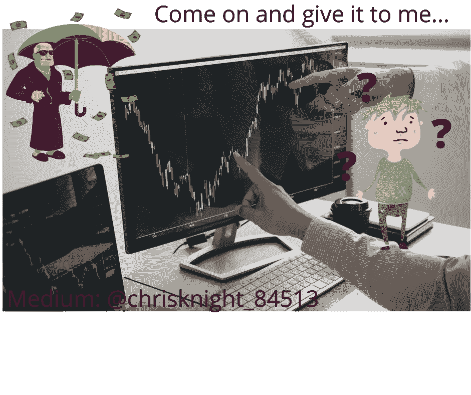
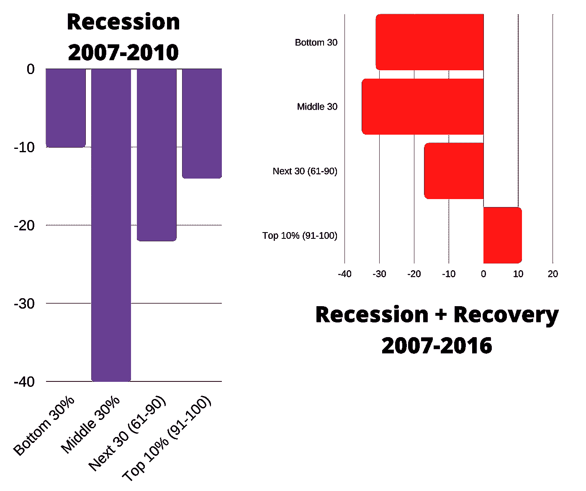

# 股市上涨加剧了贫富差距

> 原文：<https://medium.datadriveninvestor.com/stock-market-rise-is-rising-the-gap-between-rich-poor-4e6b13177f49?source=collection_archive---------11----------------------->

## 通过税收死亡，通过自动化交易胁迫，通过强大的购买力堕落。富人可以获得的工具保证以你为代价获得收益。

Source: Self Created Image with Canva

财富管理公司区别对待收益，让它们留在那些财大气粗的人的钱包里。

虚假的希望继续吸引反向贸易的输家。对销贸易的输家是你 Reddit 先生的追随者。

研究表明，股票所有权高度集中在富人手中。2016 年，最富有的百分之十(10%)美国家庭拥有 80%的总财富。这是美联储报告的最近一年的数据。

上一次金融崩溃有一次反弹。在这次上涨中，大约百分之二十(20%)的家庭财富化为乌有。(来源:[美联储](https://www.federalreserve.gov/econres/notes/feds-notes/asset-ownership-and-the-uneven-recovery-from-the-great-recession-20180913.htm))

**为了理解统计的真正含义，我们需要分析适当的抽样**。*总括数字是巨大的，但有时你不会得到全部真相。假设你从纽约召集一百万击球手，每个人都被三振出局。你可能会说纽约人不会击球。然后你发现每个人都只有一只手。在这个例子中，基于 1 毫米参与者的结论，说纽约人不能用球棒是非常不准确的。*

让我们来看看富人在上次衰退中的表现。在上一次经济衰退期间，富人使用了独家的“财富管理”工具。富人总是有工具来提供洞察力、杠杆、对冲和购买力。散户投资者通常无法获得这些工具。为了理解财富对业绩的影响，我们需要回顾一下。“美联储委员会三年一次的消费者金融调查”或(SCF)。SCF 的目的是对富裕家庭进行过度抽样。过采样让美联储能够对富人的财富进行广泛深入的分析。

**图胜千言**

我可以跳到数学上这意味着什么。我可以解释分布，分布的平均值，误差幅度，以及很多东西。我可以写一些关于这些数字如何相加以及它们的含义…

让我们来看看每个人都能理解的最小公分母。

> 在上一次衰退反弹期间，唯一赚钱的群体是美国前 10%的人。

这些数字取自美联储三年一度的 SCF[捕捉到的美联储。](https://www.federalreserve.gov/econres/notes/feds-notes/asset-ownership-and-the-uneven-recovery-from-the-great-recession-20180913.htm)

**为什么这些数字是它们现在的样子**

许多因素支持这些统计发现。富人往往受教育程度更高。富人不经常生病。富人有更多时间关注市场动向。富人有专门的客户经理，他们会在周日接听他们的电话。富人可以从侧门进入银行。富人会……嗯，我想你开始明白我的意思了。

这些数字之所以如此，是因为富人受到的待遇不同于正常人。对待富人的方式与公平无关。金钱只会留在它自己赚得更多的地方。因此，最优秀、最聪明的人会竭尽全力为他们的消费者赚更多的钱。

这篇文章不是关于理财经理歧视、不道德或不道德。

对于管理钱的人来说，钱是一门生意。富人是好消费者。穷人没有资格成为理财者的消费者。这个显而易见的事实意味着对大多数美国人来说，专业帮助是不存在的。

指数产品、共同基金和人寿保险产品是为普通人设计的。行情不好的时候拿个保底的 0.5%。行情好的时候最多 8%。**其他一切都是为富人设计的游戏。**

> 一个 90 磅重的零售人员出现在美国财富足球赛的进攻线上。你猜怎么着？零售先生将有一个几乎不可能的时间玩这个游戏。

**灾难期间的市场反弹**

所有人都容易受到财富、舒适和地位提升的欲望的影响。当市场开始飙升时，人们很容易参与其中。市场一直在上涨…你能成为其中的一部分吗？

简短的回答是…很可能不会。

**数字不会说谎**。参与投机性股票市场交易的普通人在绝大多数情况下都会赔钱。我不需要引用统计数据来证明我的立场。刚看了你的开户文件“高风险。你可能会失去所有的钱。不保证。废话，废话，废话。”

**在关闭时**

短期模式的市场运动不是为 2000 美元的交易账户设计的。杠杆消灭了大多数人。E-Mini 期货的单一期权合约可能只需要 3850 美元，但期货交易商会将它们分成很多手。有些人选择每 20，000 美元一份合同。更保守的交易者选择每 35，000 美元一份合约。

基本前提是“有经验的人不会为了一个期权合约投入足够的钱来交易期权”。

你有 20，000 美元吗？你有多余的 35，000 美元吗？

不要相信市场炒作，用你的最后一毛钱交易股票。很有可能你的最后一毛钱也就这么多了。最后一毛钱。本文旨在对两个要点提供一些见解。

第一点——市场给与富人交易的散户投资者披上了虚假的希望，让他们变得越来越穷。

**第二点**——由于虚假的媒体希望和未受过教育的人相信他们应该为富人的锅贡献一点点，贫富差距正在扩大。

**聪明点，玩一个你能赢的游戏。** *交易是一种柜台交易系统*。要获得你必须采取。很难从那些拥有一大批财富经理的人那里得到什么。批量买些洗手液再转卖。至少你可以提前看到你的利润率。不要在股票市场赌博，因为恐惧让你呆在家里。勇气是通过克服恐惧去做你害怕的事情来衡量的。勇敢点。

祝你知识成功！

****

关于 Christopher:Christopher Knight Lopez 是一名职业骗子，在他的职业生涯中，他与职业企业家进行了广泛的合作。在他 14 年的职业生涯中，Christopher 已经开了超过 7 家公司。克里斯托弗的目的是利用各种市场驱动的机会。Christopher 是注册项目经理(MPM)和认证财务分析师(AFA)。Christopher 之前通过了 65 系列证券执照考试。克里斯托弗也有他的总路线——人寿、意外、健康和健康维护组织。Christopher 已经管理了总计 2 . 86 亿美元的报告管理资产和建议资产。Christopher 在 29 个国家有工作经验，为各种业务筹集了超过 5000 万美元，在他的个人职业生涯中总收入超过 1300 万美元。Christopher 曾在高科技行业工作:生物技术、金融、证券、制造、房地产和住房抵押贷款。克里斯托弗是一名美国空军老兵。克里斯托弗热爱家庭、竞技体育、钓鱼、武术，并倡导企业家精神。克里斯托弗为崭露头角的企业家提供自助课程。克里斯托弗对导师的热情来自于企业家和骗子需要指导的信念。这个世界充满了关于企业家身份的相互矛盾的信息。在[www.christopherklopez.com 看更多。](http://www.christopherklopez.com.)

免责声明:这些信息并不意味着是一种投资建议或财务建议。不要把这种情况应用到你自己的个人环境中。各种风险包括商业风险、投资风险、政治风险和其他风险。此信息仅用于信息和教育目的。请不要向作者寻求任何投资策略或哲学。针对自己的情况，请咨询自己的理财顾问或法律顾问。不是任何形式的推荐或认可。