# 股票市场估值和 2020 年的 R

> 原文：<https://medium.datadriveninvestor.com/stock-market-valuation-and-the-2020s-in-r-188a3746c790?source=collection_archive---------3----------------------->

我最近一直在思考估值的问题。如果你最近几个月一直在关注股市，那么你无疑会意识到，在过去的 6 个月里，全球股市出现了历史性的 44%的上涨。这波涨势引起了特别的关注，因为它是由科技股主导的，这些股票巧妙地摆脱了锁定和随后的衰退。估值过高和科技主导地位的结合迫使一些人将当前时代与 90 年代末的科技泡沫时代进行比较，后者的崩溃开启了失去的十年，并在 2008 年金融危机中达到高潮。

像任何优秀的投资者一样，我密切关注估值，并一直在想，所有这些对未来几年的资产配置意味着什么。这次真的不同吗？技术在我们日常生活中的无处不在似乎是不可否认的，传统行业似乎越来越过时，宏观大环境迫使人们对技术的偏好超过了其他任何东西。或许这些因素确实证明了更高的估值是合理的。

为了回答这些问题，我从罗伯特·希勒的工作中找到了灵感，他在 1998 年[和 2001 年](https://jpm.pm-research.com/content/24/2/11)[发表了一系列极具煽动性的论文，结论是股票市场被历史性地高估了，接下来的 10 年将产生非常低的回报。](https://www.nber.org/papers/w8221)

在接下来的分析中，我将对这些先见之明进行更新，以研究当前的估值对未来收益和回报的前景意味着什么。在这个过程中，我包含了我用来生成结果的所有 R 代码，供您复制自己。

# 财务比率理论

金融分析师通常使用市盈率(PE)、市净率(PB)和企业价值/EBITDA (EV/EBITDA)等财务比率来衡量股票的相对价值。例如，15 的 PE 比率告诉我们，为了获得 1 美元的收益，我们需要预先支付 15 美元。高市盈率可能意味着一家公司预计将积极增长，而低市盈率可能告诉我们一家公司的价值具有吸引力。

财务比率可以用追溯性或前瞻性来表示。远期市盈率的计算方法是将当前价格除以未来 12 个月的预期收益。更常见的是，市盈率是在跟踪的基础上表示的，即当前价格除以过去 12 个月的收益。

在 100 多年的历史中，标准普尔 500 的市盈率平均约为 16 倍，但任何一年都可能大幅偏离。看看下图，1926 年至 2000 年的市盈率。平均水平可能是 16，但这个比率很少会保持很长时间，而且每年(或每个季度)都很不稳定。

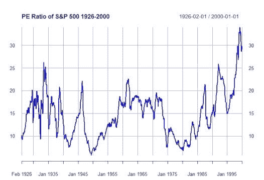

我在之前的图表中排除了 2010 年是有原因的。2008 年的金融危机和大衰退如此严重，以至于在一段时间内，S&P 过去 12 个月的收益为负，这产生了奇怪的效果，使得股票看起来非常昂贵，而实际上它们非常便宜。你可以在 1926-2020 年的 PE 图中看到这种动态。在这段时间内，PE 的长期动态被扭曲，混淆了我们对股票相对估值的理解。

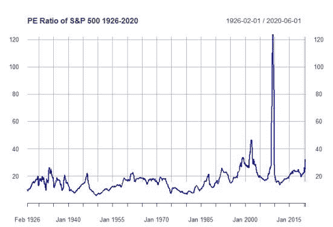

为了消除作为商业周期一部分的企业利润波动，降低估值的波动性，希勒开发了周期调整市盈率(CAPE ),该比率以经通胀调整的前 10 年平均收益为分母。

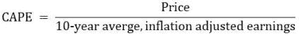

您可以在下图中看到这种影响，该图描绘了 1926 年至 2020 年的 CAPE 比率。该比率的波动性显著降低，2010 年的奇怪现象被我们预期的行为所取代(即经济衰退后的廉价估值)。关于 CAPE 图的一个特别有用的特征是，它证明了比率是*稳定的。*

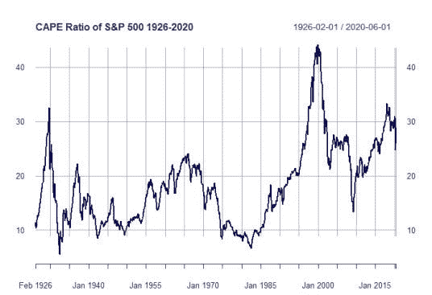

## 稳定性、均值回归和估值比率

理解估值比率的稳定性对均值回复意味着什么是必要的。如果我们接受这样的假设，即估值比率(如 CAPE)实际上是稳定的，并将继续在其历史范围内波动，而不会永久超出或“停留”在历史极端水平，那么我们就声称估值正在*均值回归*。因此，当估值比率处于极端水平时，最终必须发生一些事情来恢复长期均衡。在 CAPE 比率处于历史高位的情况下，要么分子(即价格)必须下降，要么分母(即 10 年平均收益)必须增长，以使该比率回到正常水平。

如果是这种情况，那么*某个东西*一定是基于这个比率可预测的；分子或者分母。如果我们使用市盈率，那么市盈率必须能够预测股价的未来轨迹或未来的收益路径。

随机游走假说认为，股票价格本质上是随机的，只是随着时间的推移缓慢上升。如果这是真的，那么我们应该发现 CAPE 没有预测未来股票价格的能力。另一方面，分析师在基于传统基本面分析预测收益方面有着良好的记录，我们可能希望我们的分析能够证实这一点。

这将是接下来研究的重点:**通过使用 CAPE 比率，我们是否能够预测股票价格或收益？**

本研究中使用的所有数据都可以从 Robert Shiller 的网站[这里](http://www.econ.yale.edu/~shiller/data.htm)获得。我在 Excel 中创建了一些变量，你可以在这里下载电子表格。

# CAPE 比率和盈利预测

我们将考察的时间跨度为 1980 年至 2019 年。为了评估使用 CAPE 预测收益的相对能力，我们将分别考察 1 年内的收益增长和 5 年内的年化收益增长。这是通过一个简单的线性回归模型完成的，该模型将 CAPE 的季度值作为自变量，随后的 1 年/5 年收益增长作为因变量。

我们从 1 年预测开始。下面的 R 代码显示了模型，并用 [ggplot2](https://cran.r-project.org/web/packages/ggplot2/index.html) 绘制了图形。

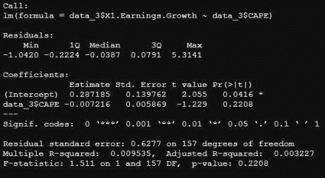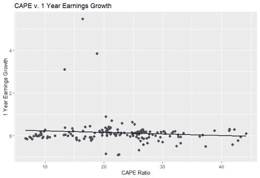

模型的初步结果表明 CAPE 几乎不能预测下一年的收益增长。CAPE 的系数在统计上并不显著，调整后的 R 平方只有微不足道的 0.003。然而，对图表的检查显示了一些不规则性。虽然大多数收益增长率紧密地分组在-1 和 1 之间，但有 3 个观察结果基本上位于主要分组之外，这可能会影响结果。让我们通过在图表上标出这些点来研究它们。

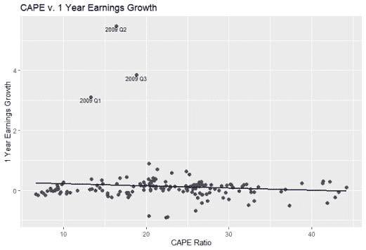

我们看到这 3 点发生在 2009 年的前 3 个季度。正如我上面提到的，2008 年的情况如此糟糕，以至于标准普尔 500 的收益一度为负，这是(现在仍然是)前所未有的。因此，盈利在未来几个季度出现大幅反弹是有道理的，这主要是由于经济活动的恢复，与估值关系不大。

为了纠正这一点，我们可以 *winsorize* 数据。Winsorization 是一种处理异常值的技术，它用不太极端的值代替极端值，而不是完全删除它们。在我们的例子中，我们将把 2009 年 Q1 第三季度的值替换为其余数据的 97.5%。这样做仍将反映强劲的收益增长，但更“典型”的增长符合大多数数据。

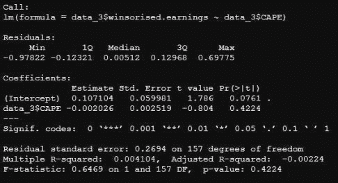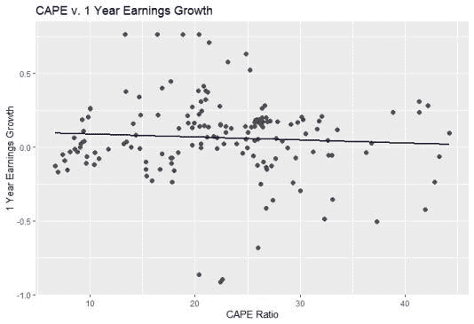

重新运行该模型，您可以看到调整后它实际上做得稍微差了一点。回归的结果表明，CAPE 比率仍然不重要，调整后的 R 平方实际上已经变为负值；表明将 CAPE 比率作为解释变量比采用简单的平均值更糟糕。图形结果直观地描述了这一点。该图显示了收益增长的点云，无论 CAPE 如何，收益增长都可能低或高，因此暗示 CAPE 和 1 年收益增长之间没有系统关系。

也许我们不应该对 CAPE 比率无法预测 1 年的收益增长感到惊讶。正如我们所见，收益增长可能相当不稳定。此外，CAPE 比率平滑了 10 年的收益，以揭示估值的长期趋势。或许，CAPE 比率在更长的时间范围内比 1 年的预测更好。让我们来看看 CAPE 比率对 5 年期年化收益增长的预测有多好。

该模型的结果显示，CAPE 对 5 年收益增长的预测略好于 1 年增长。CAPE 的系数在统计上非常显著，这意味着估值在未来的收益增长中发挥了一定的作用。然而，这是一个小角色(就像一个临时演员或舞台工作人员)，因为调整后的 R 平方保持在适度的 7%。从图形上看，我们再次观察到这两个变量之间没有明显的关系。

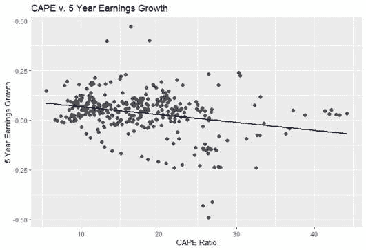

到目前为止，我们已经研究了 CAPE 和收入之间的关系。简而言之，CAPE 似乎与有意义地预测 1 年和 5 年期的收益增长没有关系。对我自己来说，这个结果是有意义的。如果我们从基本层面考虑估值比率，它本质上是一个由市场决定的价格，除以一个由公司控制的基本变量。估值比率是投资者用来确定一只股票是否是好投资的东西。另一方面，不清楚估值比率对管理有什么用；当然，他们不会为了降低估值而设定公司的优先级。

考虑到这一点，让我们转向价格升值，看看我们是否可以使用 CAPE 比率来预测未来的回报。

# CAPE 比率和回报预测

正如我们对收益所做的那样，我们将分别探讨 CAPE 是否能够预测 1 年和 5 年的回报。

以下是一年预测的结果:

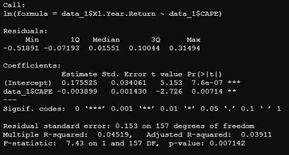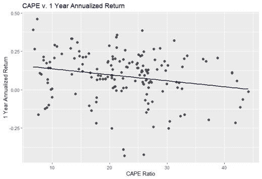

不幸的是，海角似乎对预测下一年的回报没有什么价值。CAPE 的系数为负，这意味着高估值与未来较低的价格回报相关，这与我们的预期一致。该系数非常显著，表明估值的影响是有意义的，但在 R 平方为 4%的情况下，该比率仅占回报变化的一小部分。

我们最后来看 5 年回报预测。正如我在引言中所说的，如果我们接受估值不仅仅是随机噪音的概念，那么它们一定能够预测一些东西。到目前为止，我们已经确定 CAPE 不能预测未来的收益增长，并且只能很微弱地解释下一年观察到的回报。CAPE 比率能预测长期回报吗？以下是五年预测的结果:

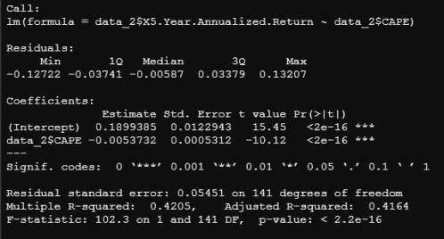

回归结果显示，CAPE 比率是一个非常好的预测 5 年价格回报的指标。如我们所料，该系数为负，且非常显著。此外，超过 40%的回报差异可以用这个单一变量来解释。

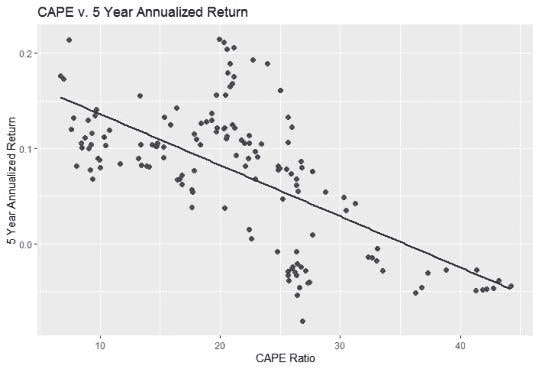

从图表上看，我们可以看到好望角和回报率之间明显的下降关系。CAPE 的低值(即股票便宜)与未来 5 年的可观回报密切相关。相反，高估值与糟糕的未来回报相关。事实上，在 19 次 CAPE 超过 30 的情况中，有 16 次，未来 5 年的回报实际上是负的…

# 那么，这意味着什么呢？

*从这些发现中有什么收获？*

这项研究的结论与 Shiller 在 90 年代所展示的一致。估值对未来短期或长期的收益增长毫无意义。尽管从经验上来看，估值很重要，但它与预测短期回报的相关性有限。从长期来看，估值证明了它们的效用，并成为预测市场未来走向的一个主要因素。

*这对我们当前和未来的回报意味着什么？*

截至 10 月 23 日至 20 日收盘时，席勒角指数的当前读数为 31.69。鉴于以上对 CAPE 超过 30 时的回报的讨论，这个数字非常令人不安，并预示着未来 5 年的低回报和不稳定的回报。

# 结束语

我希望这篇文章能让你对股票估值有更多的了解:它们能告诉我们什么，不能告诉我们什么。现在，使用我的 R 代码，并将其应用到您自己的投资组合中。

下次见，感谢阅读！

王高·莱克丝。

*原载于 2020 年 10 月 25 日*[*http://light finance . blog*](http://lightfinance.blog/stock-market-valuation-and-the-2020s-in-r/)*。*