# 股票市场估值和波动率与 R

> 原文：<https://medium.datadriveninvestor.com/stock-market-valuation-and-volatility-with-r-61997f13b9db?source=collection_archive---------5----------------------->

Photo by [hao wang](https://unsplash.com/@danranwanghao?utm_source=medium&utm_medium=referral) on [Unsplash](https://unsplash.com?utm_source=medium&utm_medium=referral)

在 Robert Shiller 的工作基础上，在最近的文章中，我研究了 CAPE 比率在预测未来股票市场表现中的应用，并研究了市场估值随时间的结构性变化。这项工作揭示了股票市场的回报在很大程度上取决于估值，而且基于这些简单的衡量标准，股票市场的回报在长期内是可以预测的。

虽然估值和回报之间的关系在金融文献中有很好的记录，但人们对估值和回报波动性之间的关系了解不多。正如我们在“[股票市场估值和 2020 年的 R](https://medium.com/datadriveninvestor/stock-market-valuation-and-the-2020s-in-r-188a3746c790) 中观察到的那样，高估值与低未来回报密切相关，通常会持续数年。人们还普遍认为，低回报与较高的波动性有关。因此，有理由认为，更高的估值也应该与更不稳定的回报相关联。如果这是真的，那么高估值意味着低且不稳定的未来回报；投资者的完美风暴！

在这篇文章中，我将探讨 CAPE 比率(作为我们首选的估值指标)和回报波动性之间的关系。在此过程中，我将展示我所有的 R 代码，供您遵循。这项研究中使用的所有数据都可以从罗伯特·希勒的网站[免费获得。考虑中的时间段和频率是从 1970 年 1 月到 2020 年 6 月的每月。](http://www.econ.yale.edu/~shiller/data.htm)

# 定义波动性

首先，定义被调查的波动性的性质是很重要的。在我之前关于业绩和估值的文章中，我们将业绩指标定义为未来 3 年或 5 年内股票的年化几何回报率。事实上，我们使用的是几何回报，而不是更常见的算术平均回报，这是一个重要的区别。让我们快速回顾一下区别。

## 算术回报

算术平均值就是一系列数字的总和除以该系列数字的个数。这是大多数人都知道的平均值的概念。平均值的公式定义如下:

其中:

*   N =周期数
*   Ai =第 I 阶段的回报率

## 几何回报

一系列数字的几何平均值是通过取这些数字的乘积并将其提升到该系列长度的倒数来计算的。几何平均数的使用不太统一，但(正如我们将看到的)通常更能反映现实。公式如下:

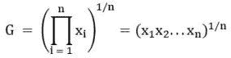

其中:

*   N =周期数
*   Xi =第 I 阶段的回报率

## 例子

为了说明这种差异，我将使用下面这个极端的、相当不现实的、但很有启发性的例子来说明 2 期收益的情况。

让我们假设你已经在你的投资组合中持有 TSLA 股票 2 个月了，在这两个月的时间里，你有以下回报序列:

*   第 1 个月:100%
*   第 2 个月:-50%

仔细想想，在 TSLA 的例子中，也许这个例子并不像我想的那样不现实！现在让我们来计算你持有期的算术平均回报率。

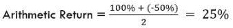

如果你使用算术回报，那么看起来你做得很好:你的投资在短短两个月内上涨了 25%!现在让我们来看看你的几何回报:

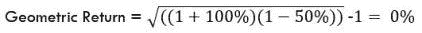

基于几何回报，你做了很多更糟的事情:你没有赚到任何钱，又回到了起点！

对于如何衡量回报，金融领域没有固定的标准，但你可以看到它带来的巨大差异。不幸的是，在这种情况下，几何回报代表了现实。

## 波动性

总而言之，在以前的帖子中，我们的重点是使用今天的 CAPE 比率来预测未来 3 年或 5 年的 T2 回报率。我将在这里采取同样的方法:使用*今天的*现货价格来预测*未来*的已实现波动率。波动性将被定义为年化几何收益率的标准差。

投资者显然对投资的波动性感兴趣，我们在这里使用的波动性概念描述了未来一个月到下一个月的平均回报波动情况。考虑下面的例子:

你期望一项投资在未来 3 年产生 5%的平均年回报率。考虑一下这 5%可能会给你带来什么。它每年可以产生 5%的收益，没有偏差，所以你的几何平均收益将如下所示:

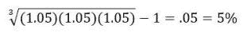

或者，你可以在第一年赚取 10%，第二年赚取 8%，第三年赚取 14%，你的几何平均回报率如下:

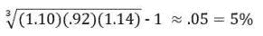

最终结果是一样的，但实现的途径却不同。

考虑第二个例子，这是我们研究背后的动机。假设现在是 1998 年 3 月，你正在考虑投资股市。科技股一直做得很好，你想参与行动！然而，你不知道你是否应该一次性投资你的钱，未来几个月的平均成本，还是在未来的某个时间投资。

如果你在 1998 年 3 月投资了所有的钱，那么在接下来的 3 年里，你的平均年回报率是 7.33%。没有什么疯狂的，但确实是一笔可观的利润。现在，让我们假设你决定等待，并尝试在低点买入。今年 3 月，标准普尔 500 指数为 1074 点，并在夏季继续稳步攀升，7 月底达到 1156 点，然后在 8 月份回落至 1076 点。完美，这基本上是 3 月份的水平，你决定买入。如果你这么做了，你未来 3 年的平均回报率将只有微不足道的 0.38%。

这是一个很大的差异，在实现回报只是等待几个月购买！将 1998 年的经历与以下情况进行对比:2003 年 10 月的一项投资在随后的 3 年中会产生 8.31%的平均回报率。几个月后的 2004 年 3 月，同样的投资在接下来的 3 年里会有 7.58%的回报。这两个回报非常接近，投资者不会因为等待或时机选择错误而受到惩罚。

量化月与月之间的未来回报差异应该是任何投资者都感兴趣的，也是我们研究的重点。使用 CAPE 比率，我们将尝试预测标准普尔 500 未来几何收益率的波动性。通过这样做，我们希望更好地了解投资市场的“时间点”风险/回报权衡。

# CAPE 比率与波动性预测

下图显示了标准普尔 500 从 1970 年 1 月到 2020 年 6 月的 1 年、3 年、5 年和 10 年的滚动年化波动率。我们观察到，每年的回报率会有很大的变化，但随着我们将时间窗口扩大到 3 年、5 年或 10 年，波动性会稳步下降。这一观察为我们的假设提供了一些证据，即从长远来看，回报更可预测。

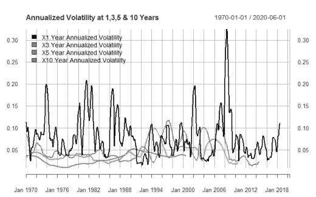

在这项研究中，我将重点预测未来 3 年和 5 年的波动性。一般模型规范如下，并将使用简单的线性回归:

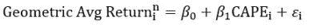

# 3 年预测

以下 R 代码运行模型，构建预测间隔，并用 ggplot2 绘制结果。

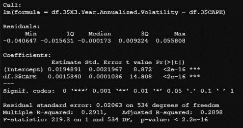

我们可以看到 CAPE 比率的系数为正，这意味着估值的增加与未来波动性的增加相关。此外，该系数非常显著，表明当前估值是未来回报的重要决定因素。这两个结果都符合我们的预期(谢天谢地！).R 平方约为 29%，这表明估值能够解释已实现波动性总可变性的合理百分比。单变量模型的解释力相当不错，但显然还有很多东西没有解释清楚。

下面是结果图和预测区间图:

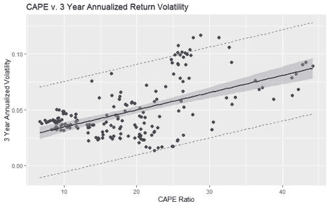

回归线显示，随着 CAPE 的增加，波动性普遍增加。然而，预测间隔相当宽，表明有相当大的差异。奇怪的是，在“极端”估值(即<15 and > 30)下，估值对波动性的影响似乎更加一致，并且在均值附近更加“紧密”。在平均估值水平上，这种影响似乎更为缓和。按平均估值计算，未来已实现波动率介于 2%至 10%之间。这是一个非常广泛的范围，还不清楚我们将如何在实践中使用这些信息。

 [## 收盘，但没有雪茄-股票市场目标在停滞的 COVID 救济中创新高|数据驱动…

### 专家聊天程序:一个协作市场，在这里人们可以和能够解决他们问题的专家聊天。是……

www.datadriveninvestor.com](https://www.datadriveninvestor.com/2020/08/18/close-but-no-cigar-stock-market-targets-record-highs-amidst-stalled-covid-relief/) 

# 五年预测

谈到五年预测:

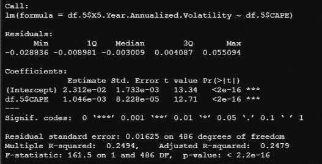

回归的结果非常令人鼓舞。此外，CAPE 比率为正且具有高度的统计显著性，但此外，系数 0.001046 非常接近 3 年模型的估计值。～0 . 25 的 R 平方也类似于 3 年模型的估计值。综上所述，这些结果证明了两个不同时期的模型之间的一致性，并表明了我们的结果的稳健性。

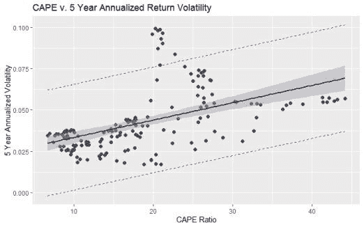

看一下这个图，我们观察到波动性和估值之间同样的总体上升趋势关系。类似的模式也很明显:在极端情况下，这种关系似乎更紧密，低估值与低波动性密切相关，高估值与高波动性相关。在中间，画面更加混乱。事实上，存在着一簇看起来与该组的其余部分不同的点。让我们给这些点贴上标签:

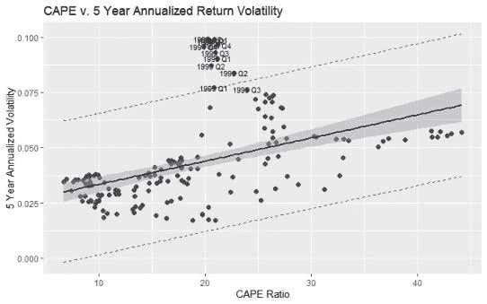

我们观察到所有这些时间点都在 1993 年和 1995 年之间。任何优秀的市场历史学家都知道，5 年后是科技泡沫的顶峰和随后的崩溃；事实上，在此期间出现了大幅波动。

# 这对今天的股票意味着什么？

虽然不是唯一的因素，但我们模型的结果表明，当前市场估值是预测未来市场波动的重要决定因素。特别是，当以 CAPE 比率衡量的估值“极端”时，该模型似乎会产生比估值更接近其长期平均水平时更严格的预测。这些结果对于需要决定未来资本配置的投资者来说显然是有用的。

也就是说，这个模型对今天有什么看法？在 33.5，海角比肯定是接近极端范围。我们的 5 年远期预测计算如下:

如果以历史为鉴，那么未来 5 年的平均成交量水平相当高。从 2015 年 1 月开始，实际波动率为 2.3%，因此我们预测波动率将是过去 5 年的两倍以上，这在许多方面都不是一帆风顺的。

结合[“股市估值的结构性变化”](https://medium.com/datadriveninvestor/structural-change-in-stock-market-valuations-1cf35c87f22f)1.8%的业绩预测，投资者可以预期未来 5 年的低回报和波动性。

这并不意味着 2021 年对股票来说不是一个好年景。随着宽松的货币政策、疫苗分发和大规模经济重新开放，我认为 2021 年很有可能成为一个好年景。在我看来，我们应该关心的是十年的中期。

# 结束语

在这篇文章中，我为投资者构建了一个案例，让他们在做出投资决策时考虑未来年化几何回报的波动性。为此，我建立了一个简单的模型，提出当前估值是未来股市波动的一个重要因素。使用 CAPE 比率，我们发现估值确实部分解释了未来的 vol。此外，当估值接近极端水平时，这种关系很强。然而，该模型未能解释实际产量的显著变化，这为研究提供了丰富的基础。

我希望你们都和我一样发现了这些有趣的发现！下次见，感谢阅读！

王高·莱克丝。

*原载于 2021 年 1 月 2 日*[*https://light finance . blog*](https://lightfinance.blog/stock-market-valuation-and-volatility-with-r/)*。*

**访问专家视图—** [**订阅 DDI 英特尔**](https://datadriveninvestor.com/ddi-intel)