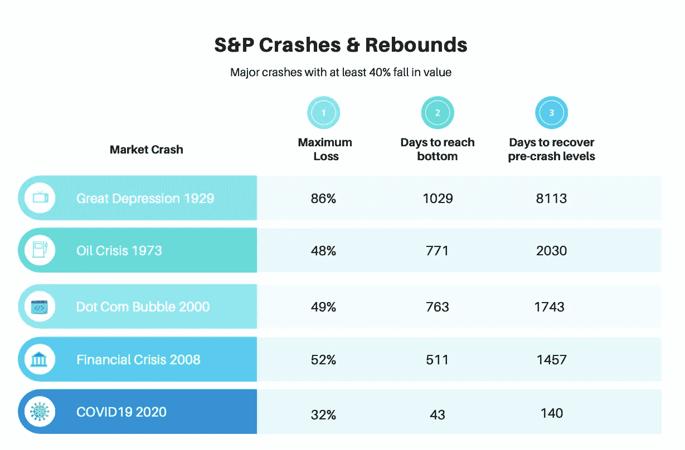

# 千禧一代正在改写股票市场的规则

> 原文：<https://medium.datadriveninvestor.com/stock-markets-are-crashing-fast-rebounding-faster-a297728514e1?source=collection_archive---------15----------------------->

Image by [Adeolu Eletu](https://unsplash.com/@adeolueletu) on [Unsplash](https://unsplash.com)

## 更聪明、更有经验的投资者正在为熊市设定新规则

在过去的一百年里，世界经历了 5 次大的市场崩溃，1929 年的大萧条，1973 年的石油危机，2000 年的网络泡沫，2008 年的金融崩溃，以及 2020 年的疫情铅崩溃。

如果我们比较这些崩盘的标准普尔 500 数据，就会发现一个有趣的趋势。

随着随后的每一次崩盘，不仅市场下跌得更厉害，市场也以更快的速度复苏。

> 随着时间的推移，崩盘-复苏周期变得越来越短，尤其是在跌幅较大的时候。

1929 年的市场崩盘始于 9 月，用了近 1029 天才触底。然后，它花了痛苦的 8113 天才恢复到崩溃前的水平。

相比之下，2020 年的崩盘始于 2 月份，仅用了 43 天就触底，随后在创纪录的 140 天内迅速反弹。

当然，与大萧条时期 85%的修正相比，2020 年 32%的跌幅就相形见绌了。但是，即使在市场调整的其他重大事件中，更剧烈的下跌和更快的复苏的趋势也是明显可见的。

Image by Author

随着崩盘间隔时间的缩短，市场崩盘的严重程度也降低了。自 1929 年以来，不仅市场崩溃在百分比下降方面不那么严重，而且市场恢复得更快，恢复到崩溃前水平所需的天数也更少。

 [## 后疫情经济中的基本 GTM 变革策略|数据驱动的投资者

### 新冠肺炎以一种新的不可想象的方式开展业务。这个疫情甚至强迫…

www.datadriveninvestor.com](https://www.datadriveninvestor.com/2020/08/11/an-essential-gtm-change-strategies-in-the-post-pandemic-economy/) 

# 这到底是怎么回事？

实验经济学是经济学的一个分支，它试图复制自然科学的技术。例如，如果你想弄清楚是什么让老鼠变胖，你就把它们关在笼子里，强迫它们吃各种东西，比如麦当劳汉堡。而在另一个笼子里，你把其他基因相同的老鼠放在一起，喂它们地铁三明治，然后比较结果。这是实验方法。

2003 年，诺贝尔奖获得者弗农·L·史密斯进行了一系列模拟股市泡沫的实验，并在一篇研究论文中发表了他的发现。

在他的实验中，史密斯创造了一种人造资产，它的价值是每个人都知道的，然后允许人们在这个人造市场中进行交易。作为一种激励，参与者能够在实验结束时将他们虚构的利润转换成真钱。

这个想法是创造一种资产，它有一个有限的生命周期，在它的生命周期中会产生红利，然后它就不存在了。最后，获胜者领取他们的支票，实验结束。

在模拟过程中，史密斯观察到，参与者很快创造了一个资产泡沫，价格远高于基本价值，即使影响股票价值的信息是所有投资者都知道的。

更有趣的是，当在相同的参与者中第二次运行模拟时，资产泡沫开始得早一点，结束得早一点，泡沫也小一点。第三次模拟运行时，泡沫几乎消失了。实验表明，交易者的经验在决定他们如何应对市场波动方面起着至关重要的作用。

> 当同一群人回到第三个交易时段时，这些泡沫随着经验而减少。

最近的数据显示，千禧一代已经在 2020 年决定性地进入了股市。根据美国消费者新闻与商业频道的说法，主要的在线经纪商——查尔斯·施瓦布、TD Ameritrade、Etrade 和 robin hood——在第一季度新账户增长了 170 %( T1 ),当时股市经历了历史上最快的熊市和最糟糕的第一季度。

千禧一代最喜欢的“罗宾汉”应用程序仅今年就有超过 300 万个新账户。其中一半以上属于开立第一个经纪账户的客户，他们的平均年龄在 31 岁左右。

> 市场的行为受到交易者特征的影响。

可以有把握地假设，这些市场新进入者已经暴露于 2000 年和 2008 年的市场崩盘以及随后的反弹。最终，年轻投资者肯定会明白，在恐慌时期买入是正确的。

如果我们借鉴史密斯的研究结果，数据表明，市场反弹可能是由经历过以前市场崩盘和反弹的年轻投资者推动的。这可能给了他们在 2020 年投资股市的必要信心。

与史密斯的实验类似，千禧一代投资者生命中的第三次市场崩盘持续时间最短，波动性最小。说到把握市场时机，第三次可能真的是幸运符。

## 获得专家视图— [订阅 DDI 英特尔](https://datadriveninvestor.com/ddi-intel)